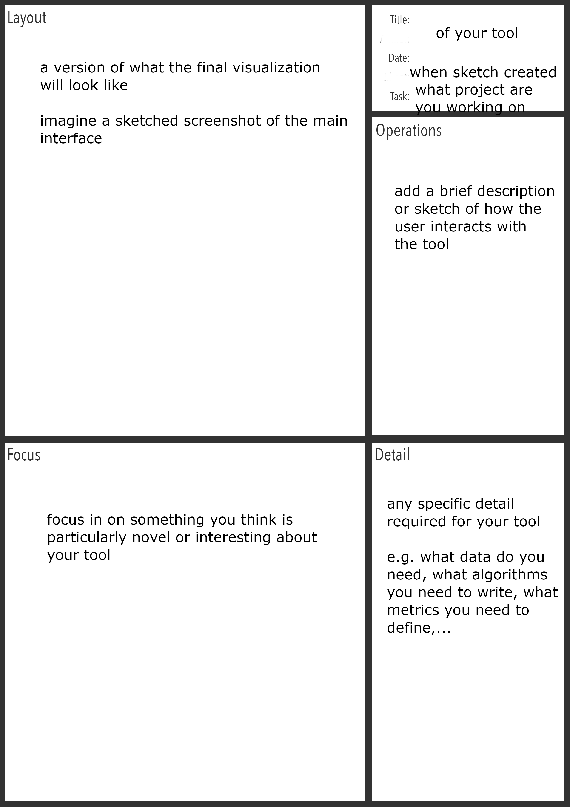
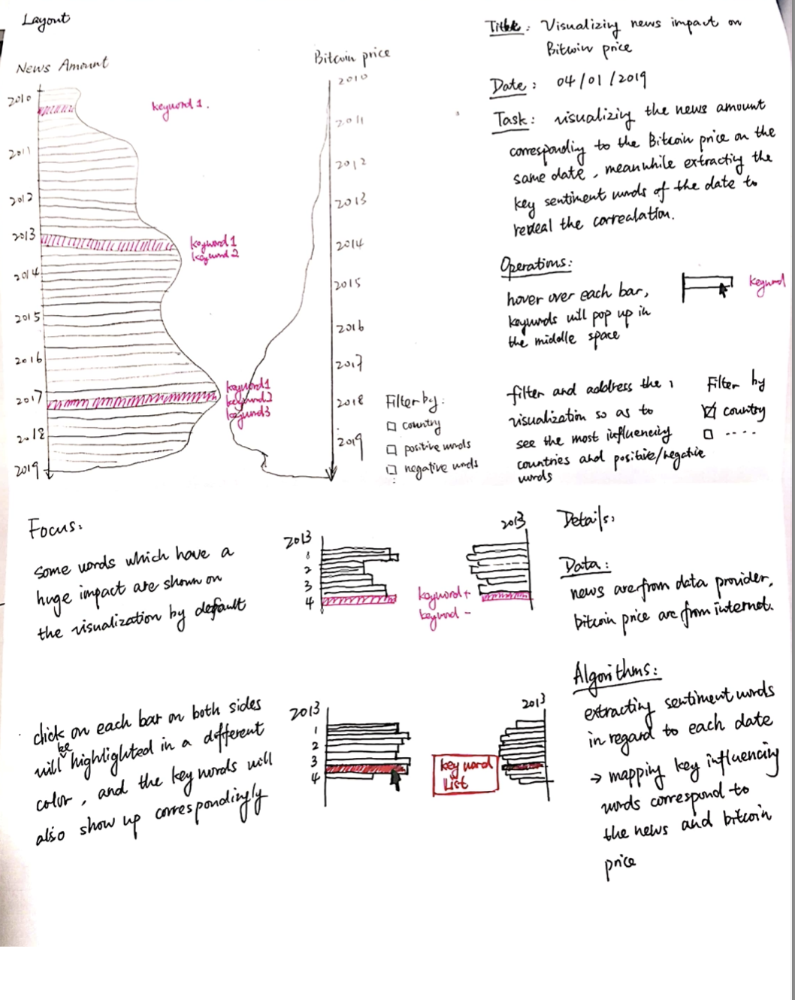
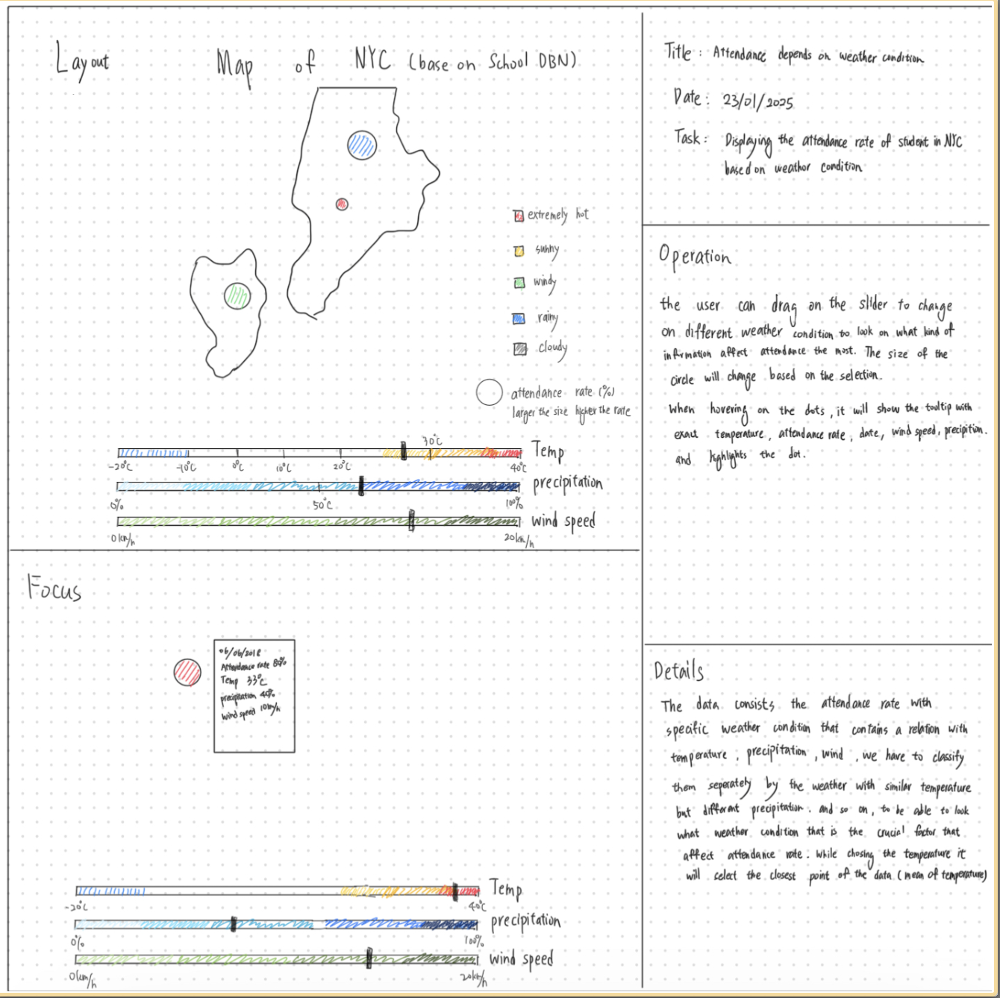
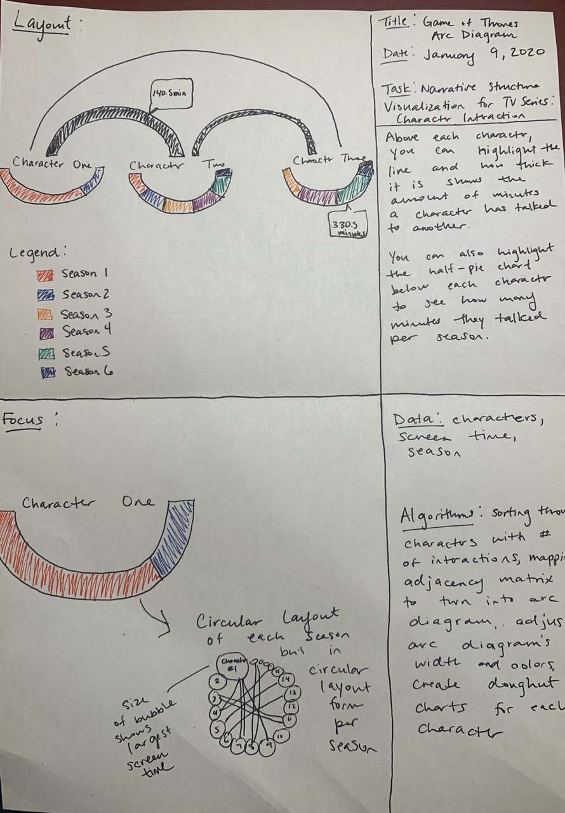

# Sketching Assignment
**Due: lundi 30 mars 2026, 23:59**
- Late penalties explained in main section

This is an **individual** assignment, but you need to coordinate with your team. Now that you have feedback about your project research question and you have your data, your job is to choose one question and brainstorm designs that help other people to explore the data according to your question.   
For now, imagine that the data visualization website you build has a title that corresponds to your overarching research question.  

As we said in class, the best way to come up with a good idea is to first have lots of them, and then narrow down. Your task in this assignment is to brainstorm many designs, and then use some basic criteria to filter and select the best ideas. You will then hand in a polished version of the final designs that you chose.  

The goal of this exercise is to show you that if you have an open mind, your first idea is (unlikely) to be your best idea. Instead, the process of brainstorming, discussing and grouping ideas can help you find good ideas that you had not considered before.  

Important:
- do not limit yourself to things you know how to build yet

## Your Mission
In this exercise go through the following steps:
- **Brainstorm session**. With your group, schedule a mutual time that you can get together and work for at least an hour together. Brainstorm and sketch several ideas -- put each idea on a single sheet of paper. The goal here is to sketch as many distinct ideas as you can -- you should aim for at least five sketches a person. Anything goes: crazy or boring, whole system or even just a small piece of the system. You are aiming for variance: the ideas should be different from one another. You are allowed to build off of one another's ideas, but make sure that they're different. If you end up with a bunch of sketches that are essentially variations on the exact same idea, try again, because you didn't do it right. You can use card decks we show in class to come up with meaningfully different ideas.
- **Discussion**. This can be part of your brainstorming session, or a different one altogether. As a group, go through each of the sketches one by one, discussing the main idea of the sketch. Group your sketches or the ideas extracted from the sketches. At the end of this, you will have several different groups of ideas. Discuss each of these groups in relation to your project, their weaknesses, strengths, feasibility and originality. 
- **Select and polish ideas**. From your discussion session, select the most promising ideas (at least one per team member present), discuss them. Designing variations of these ideas (5 variations for each member of the team). 
- **Re-sketching your most promising ideas**: Re-sketch the most promising sketches neatly on a piece of paper, each student needs to sketch one sketch (we refer to this as the final sketch)!
- Your final sketch needs to be understandable by others, so add legible annotations and/or provide descriptions where appropriate.
- Each person needs to submit **one final sketch** as well as a **zip** folder of their brainstorming attempts.
- Don't put any names on the final sketch. Name the digital file.

## Final Sketch
For your final sketches you can follow the following structure:

&nbsp;  
Here are examples from another class (on different topics): 

&nbsp;  
## Grading scheme
The grading scheme will look similar to the one below but small modifications to the grading are always possible:  

| Requirements | Points |
| ------------ | ------- |
| **Brainstorming archive**| |
| brainstorming sketches | 1 |
| variation sketches | 1 |
| **Final sketch** | |
| Design choices (effective, easy to read and understand) | 1 |
| Creativity and diversity of visualization | 1 |
| Clarity of the presentation | 1 |

&nbsp;  
## Deliverables
- Digitize your sketches (you can photograph them, if you don’t have a scanner at hand) as .jpg/.png images. We are expecting the following deliverables : 
  1. One zip file with all sketches (for each team member 5 brainstorming sketches and 5 redesign sketches). Name this **YOURNAME-brainstrom.zip**. These don't have to be very high resolution. 
  2. One digital image of your FINAL sketch. It should be at least 2000px resolution on the shorter side. The text and details of your final sketch need to be clearly visible. Name each image **YOURLASTNAME-FINAL-Sketch.jpg** or **YOURLASTNAME-FINAL-Sketch.png**. Make sure your name does not appear on the sketch itself. 
- **SUBMIT** - Each student should submit 1 final sketch they re-sketched via the course website, as well as a zip file with brainstorming attempts.

