# Ressources
> Listes de ressources que j'ai trouvé moi même

## Best practices
[Chartosaur](https://www.instagram.com/chartosaur):  
- Highlight the Signal
- Show the forecast and its confidence (with a highlighted area around the forecast line)
- Show the standout
- Show the breakpoints in the trends
- Show the groups
- Show the area difference
- Show the target (on bar charts)
- Narrative: Zoomed in vs Zoomed out, How much history, CherryPicking
- Multiline horizontal labels
- Reduce clutter, Increase spacing
- Use dashed lines for interpolated data (if data is missing)
- Add explanations for very bizarre data points/segments
- SOURCES
- start axis at 0 (for bar charts)
- Sort bars in descending order (for bar charts)
- Use a log scale when the data is skewed (for bar charts)
- Analysis: seasonal, market wide, just noise, anomaly, structural change, ...
- Don't break axis
- Use the right chart: difference = Dumbbell plot (data plot, with lines), totals = bar chart, composition = stacked bar chart, distribution = histogram, relationship = scatter plot, ...
- labels in front end of the lines
- dashed lines to explain inflexion points (on line charts)
- waffle charts instead of pie charts
- gray highlighted area to show the forecast part
- stacked bar charts for percentage
- add regions to scatter plots to show the different groups
- normalize data (for instance inflation, population, ...)
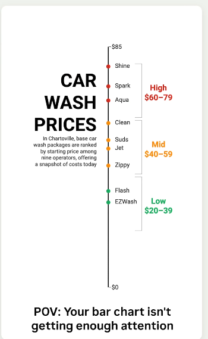
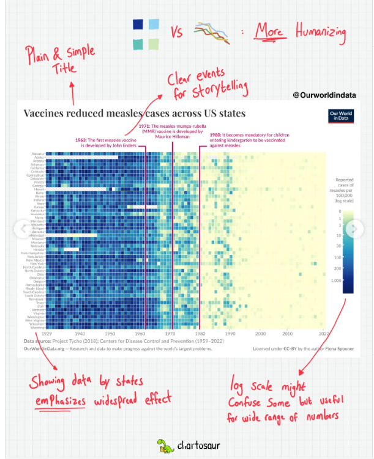
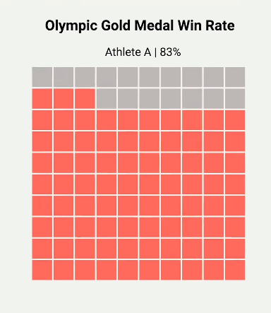
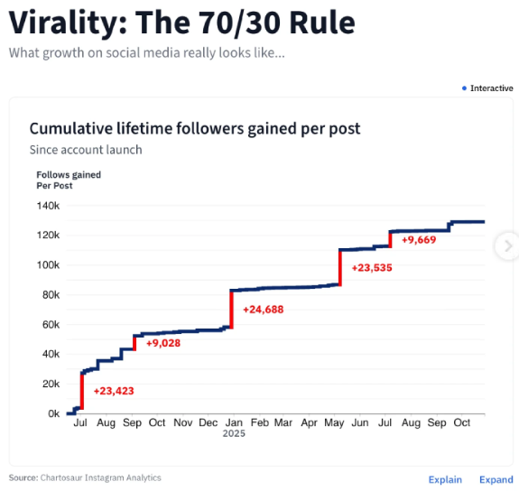
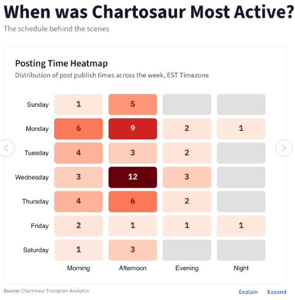
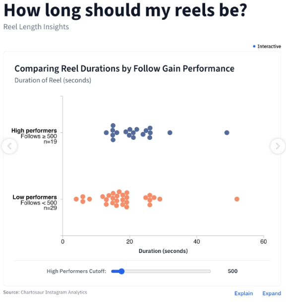
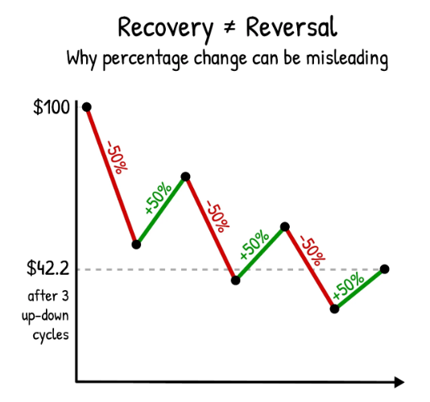
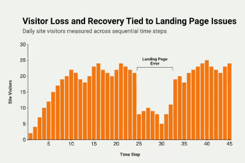
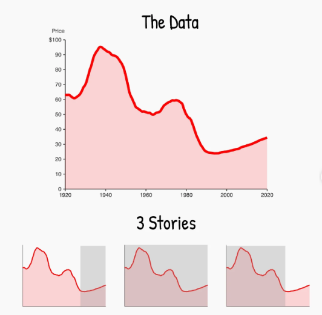

&nbsp;  
## People
[Giorgia Lupi](https://www.instagram.com/giorgialupi/)
[Laurie Frick](https://www.instagram.com/lauriefrick/)
[Mona Chalabi](https://www.instagram.com/monachalabi/)
[Antoine Corbineau](https://www.instagram.com/antoine_corbineau/)
[Sarah Illenberger](https://www.instagram.com/sarahillenberger/)
[Valentin Loellmann](https://www.instagram.com/valentinloellmann/)
[Francesco Muzzi](https://www.instagram.com/francesco_muzzi/)

&nbsp;  
## Examples
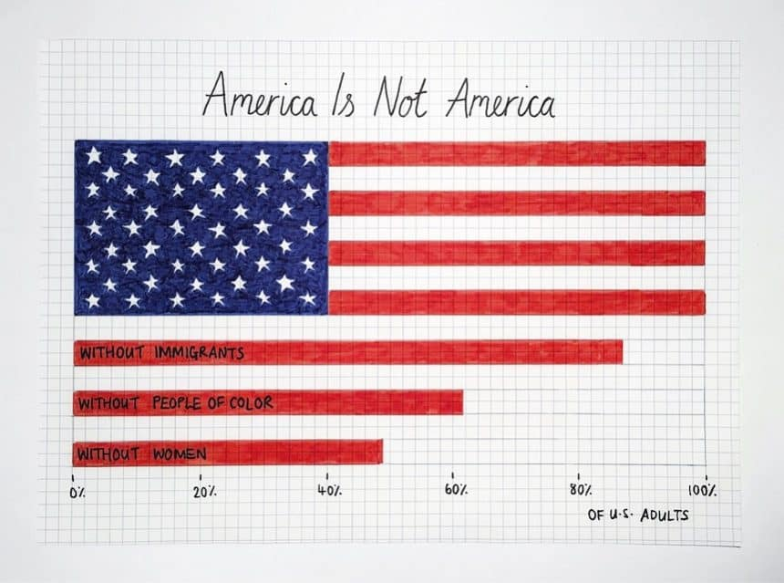
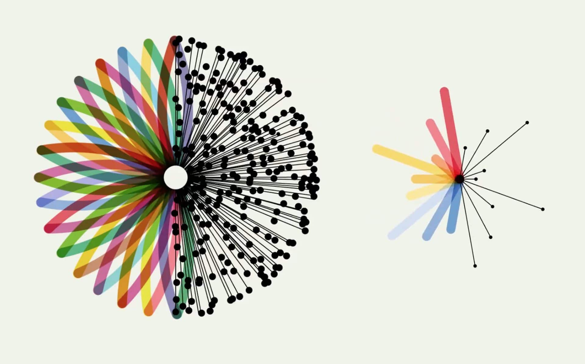
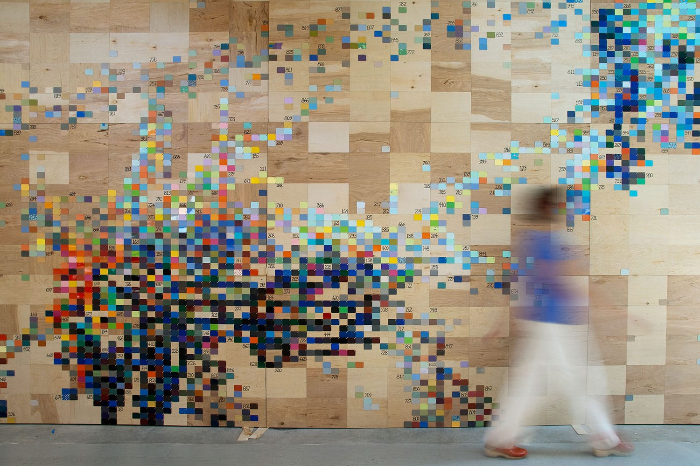
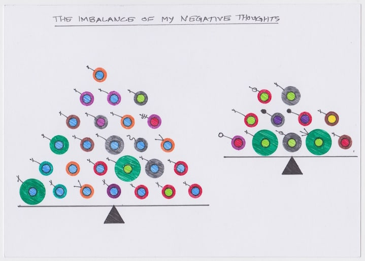
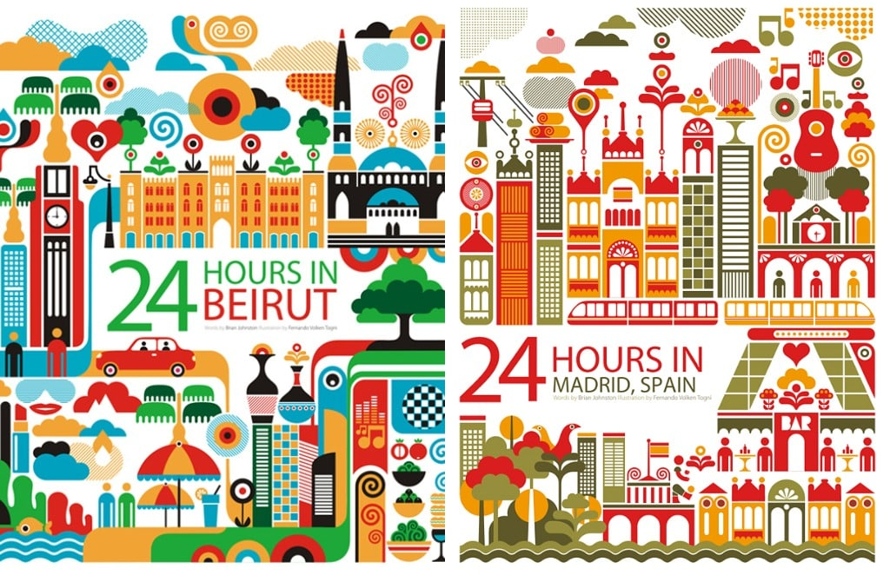
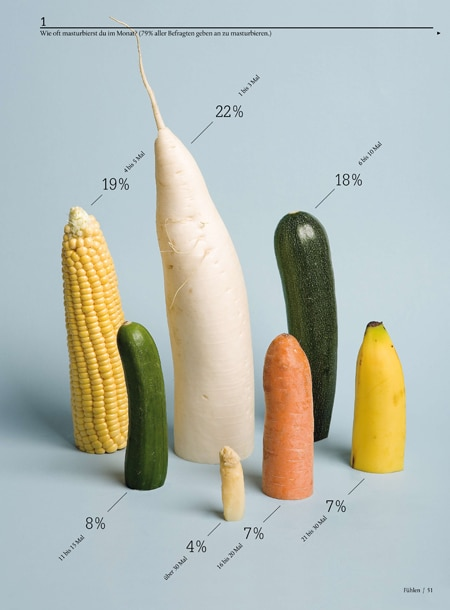
&nbsp;  
## Ideas
- animation between different viz (the charts stay at the place)