# TP Noté, Filtre de détection de contours - Calcul Hautes Performances
**Mathieu Waharte**, APP5 IIM - 07/11/2025

## I. MPI
1) Le problème avec les tableaux à 2 dimensions alloués dynamiquement est que les lignes du tableau ne sont pas contiguës en mémoire, du coup on ne peut pas juste donner un pointeur de début pour la communication MPI. Pour régler cela, on peut utiliser un tableau 1D (qui sera lui contiguë) avec des functions comme on a déjà avec IDX. On pourrait aussi allouer un tableau 2D de manière contiguë à l'aide de fonctions personnalisées, mais c'est plus compliqué (on pourrait free avec le free normal et non le spécifique, on ne peut pas faire d'overload comme en C++).

2) Mon implémentation est bonne, il ne semble pas qu'on processus doive attendre plus que les autres puisque tous les processus envoient et reçoivent des données de manière synchronisée (ce qui du coup n'est pas optimal). Une amélioration possible serait d'utiliser des communications non bloquantes (MPI_Isend et MPI_Irecv) pour permettre aux processus de continuer à travailler pendant qu'ils attendent les données. Cela veut dire aussi qu'il faut revoir le calcul pour ne faire la somme sur les pixels loin des bords en premier et checker que les données sont reçues avant de faire le calcul sur les bords, ce qui rendrait le calcul aléatoire en temps mais plus efficace (on peut s'attendre à avoir reçu les données après qu'on ait traité l'ensemble du reste).
Sur une autre note, avoir 2 SendRecv qui se suivent peut être optimisé par 2 Isend/Irecv suivis d'un MPI_Waitall, mais l'impact serait plus faible je pense.


&nbsp;  
## II. OpenMP
Il est impossible d'optimiser l'initalisation aléatoire en la parallélisant, car dans la spécification de rand() (trouvable en ligne ou avec `man rand`) on trouve:  
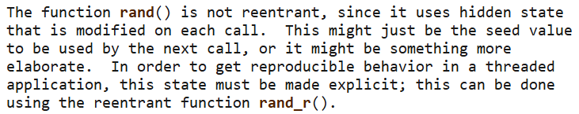  
Ce qui signifie que l'utilisation de rand() dans une région parallèle peut causer des problèmes de concurrence et des résultats imprévisibles. Pour contourner ce problème, on pourrait utiliser rand_r() qui est une version réentrante de rand() et permet de gérer l'état de manière explicite pour chaque thread. Mais sinon on ne peut pas utliser rand() dans une région parallèle donc on ne peut pas paralléliser cette partie du code.  


&nbsp;  
## III. Performances
1-2)&nbsp;  &nbsp;  Après mesure, on obtient les résultats suivants:  
|                     | Temps     | Accélération | Efficacité |
|---------------------|-----------|--------------|------------|
| Séquentiel          | *16.02s*  | *1x*         | 100%       |
| MPI (1 thread)      | 14.81s    | 1.08x        | 108.2%     |
| MPI (2 threads)     | 7.56s     | 2.12x        | 106%       |
| MPI (4 threads)     | 3.95s     | 4.06x        | 101.5%     |
| MPI (8 threads)     | 2.19s     | 7.32x        | 91.5%      |
| MPI (16 threads)    | X         | X            | X          |
| OpenMP (1 thread)   | 13.96s    | 1.15x        | 114.8%     |
| OpenMP (2 threads)  | 6.97s     | 2.30x        | **114.9%** |
| OpenMP (4 threads)  | 3.50s     | 4.58x        | **114.4%** |
| OpenMP (8 threads)  | 1.91s     | 7.32x        | **104.8%** |
| OpenMP (16 threads) | **1.28s** | **12.5x**    | *78.1%*    |

(en gras les meilleurs résultats pour chaque catégorie et en italique les moins bons)

&nbsp;  
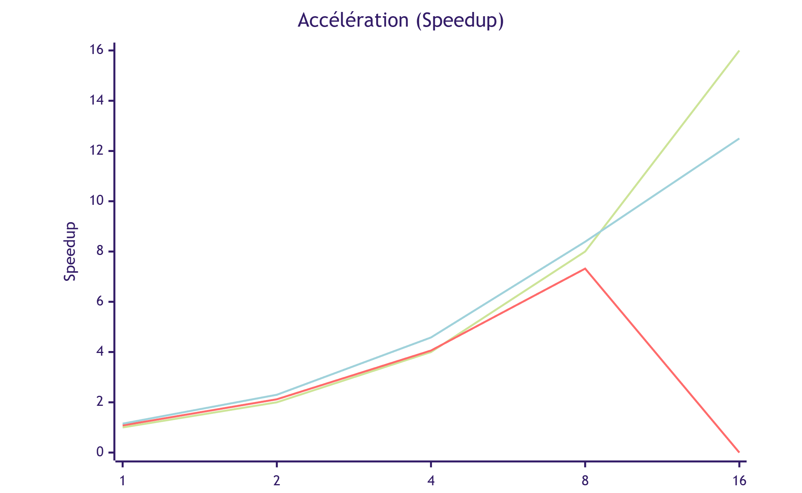
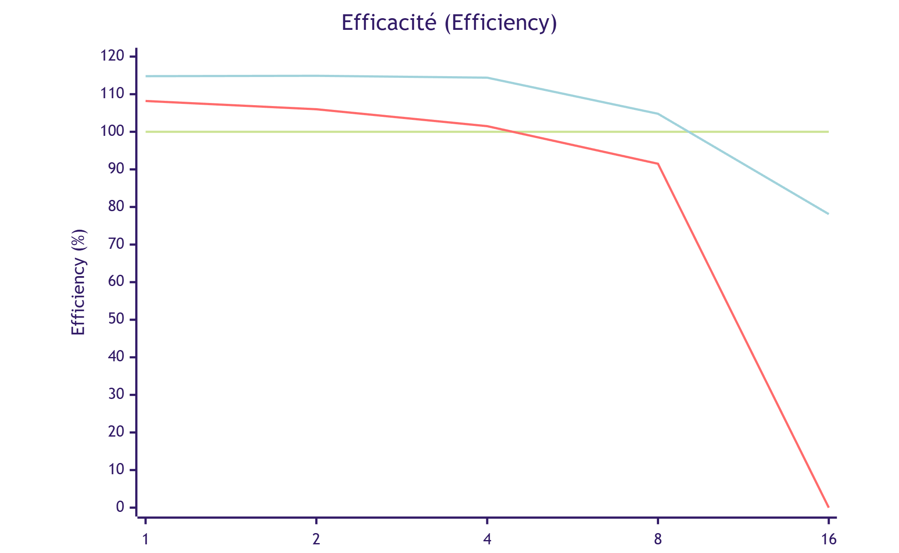
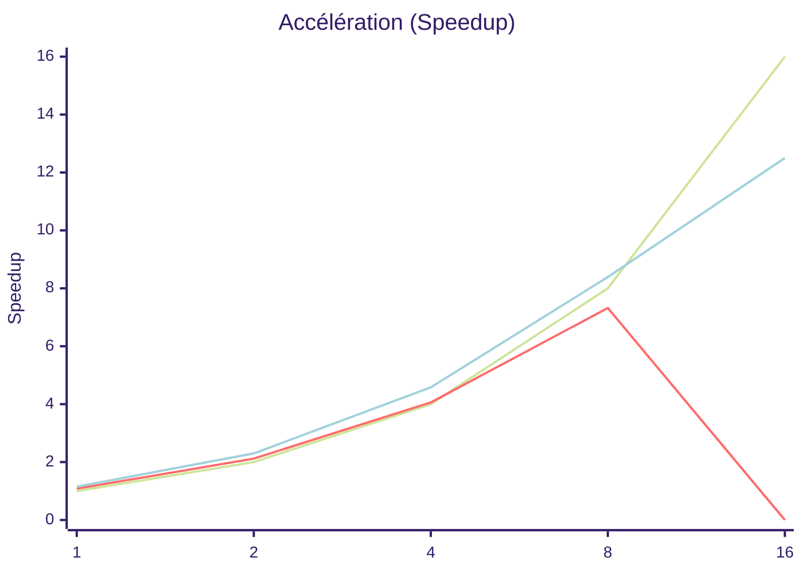

````mermaid
%%{init: {'theme':'forest'}}%%
xychart-beta
    title "Efficacité (Efficiency)"
    x-axis [1, 2, 4, 8, 16]
    y-axis "Efficiency (%)" 0 --> 120
    line [100, 100, 100, 100, 100]
    line [108.2, 106, 101.5, 91.5, 0]
    line [114.8, 114.9, 114.4, 104.8, 78.1]
````

&nbsp;  
On remarque que les performances d'OpenMP sont légèrement meilleures que celles de MPI, probablement à cause de la surcharge de communication entre processus dans MPI. On remarque aussi une bonne scalabilité jusqu'à 8 threads, mais à 16 threads l'efficacité diminue, probablement à cause de la surcharge de gestion des threads et des limites du partage des ressources. On déduit que ici, il vaut mieux utiliser OpenMP plutôt que MPI pour ce type de calcul et se limiter à 4 ou 8 threads pour un bon compromis entre temps de calcul et efficacité.  


&nbsp;  
2) On obtient les gains attendus (efficacité > 100% donc superlinéaire) grâce à:
   - meilleure localité cache (car chaque thread / processus travaille sur une portion plus petite de l’image, donc les données sont plus susceptibles de rester dans le cache entre les accès)
   - réduction du stress sur la mémoire (car les accès mémoire sont répartis entre plusieurs threads) 

 Mais on a aussi des pertes d’efficacité dues à:
   - Dans MPI, la chute d’efficacité à 8 threads (≈91.5%) vient ensuite de la saturation du débit mémoire à cause du coût des communications synchrones
   - Dans OpenMP, c'est la synchronisation par des barrières implicites aux fins de boucles qui limite les amélioration et au delà de 8 threads l’efficacité chute (78.1% à 16 threads) car le coût de gestion des threads et de synchronisation devient significatif par rapport au temps de calcul.


3) Si l’on incluait l’initialisation (rand() de toute l’image + construction du filtre) dans le temps mesuré:
   - Séquentiel: le temps total augmenterait, mais le speedup resterait le même (tout est séquentiel).
   - OpenMP: cette phase est séquentielle (à cause du rand non thread compatible) donc le temps total augmenterait beaucoup et l'efficacité plongerait très vite (l'augmentation du nombre de processeur augmente vite le dénominateur mais ne diminue pas le numérateur de manière significative dans la formule d'Amdahl).
   - MPI: similairement, même si seul le processus 0 initalise l'image, les autres l'attendent (barrier) donc le temps total augmenterait aussi et l'efficacité diminuerait rapidement avec le nombre de processus.
   
  On en conclut que la prise en compte d'une partie non parallélisable (ici l'initialisation) dans le temps mesuré fausse les résultats de scalabilité. La paralléliser avec rand_r rendrait sa mesure logique dans le calcul de la scalabilité et de l'accélération. Cela permettrait une mesure complète du temps de traitement, on ne compte que le temps de calcul du filtre et de l'analyse actuellement.


&nbsp;  
#### Sources des mesures
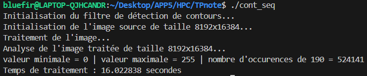

**MPI:**
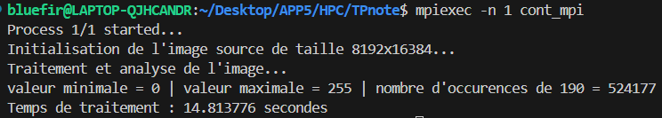
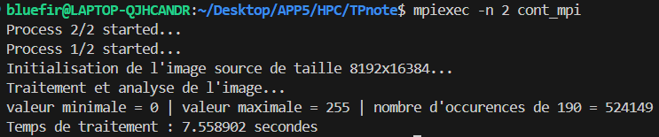
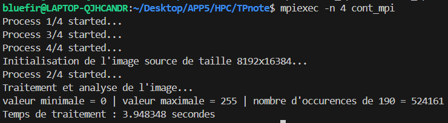
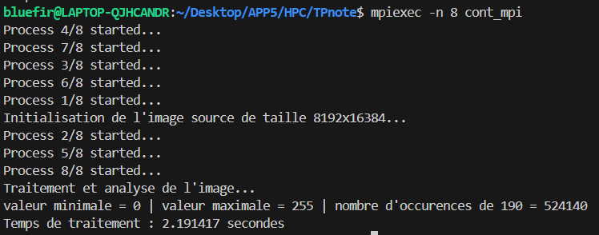

**OpenMP:**
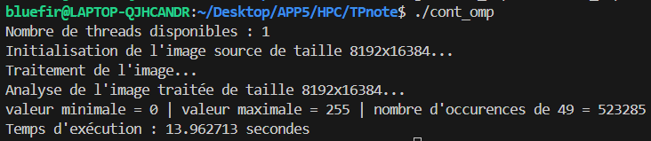
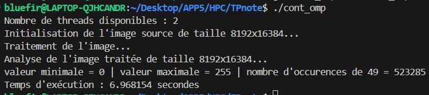
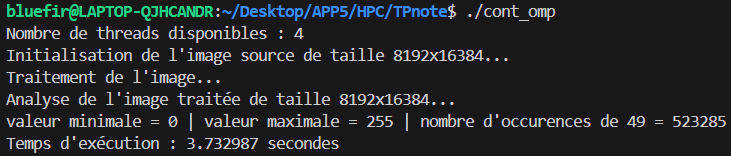

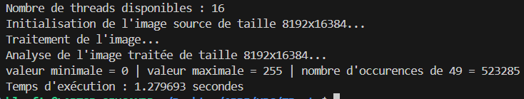
