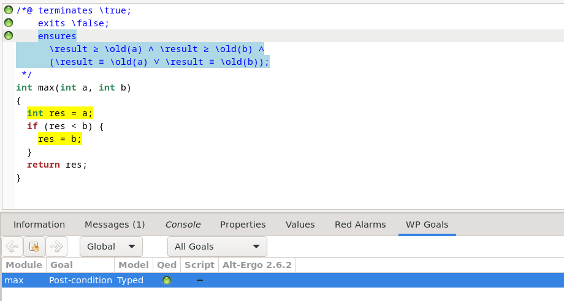
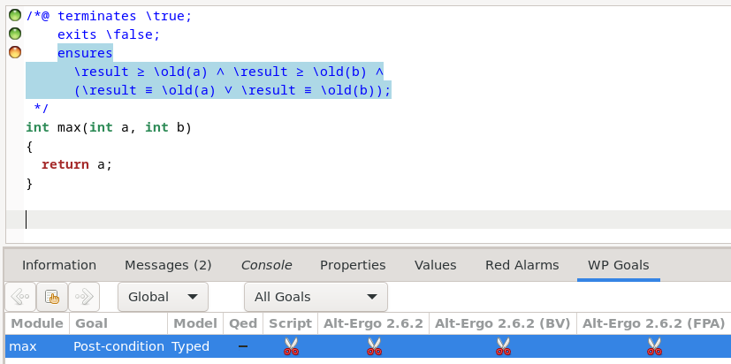
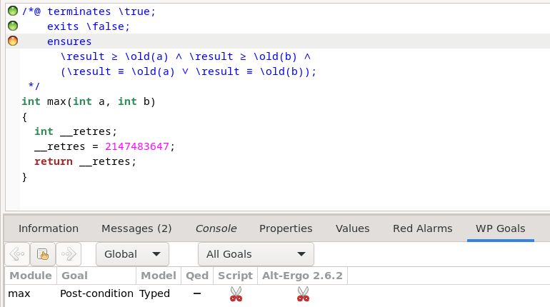
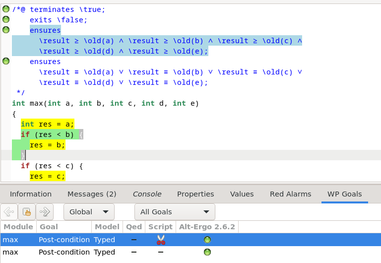
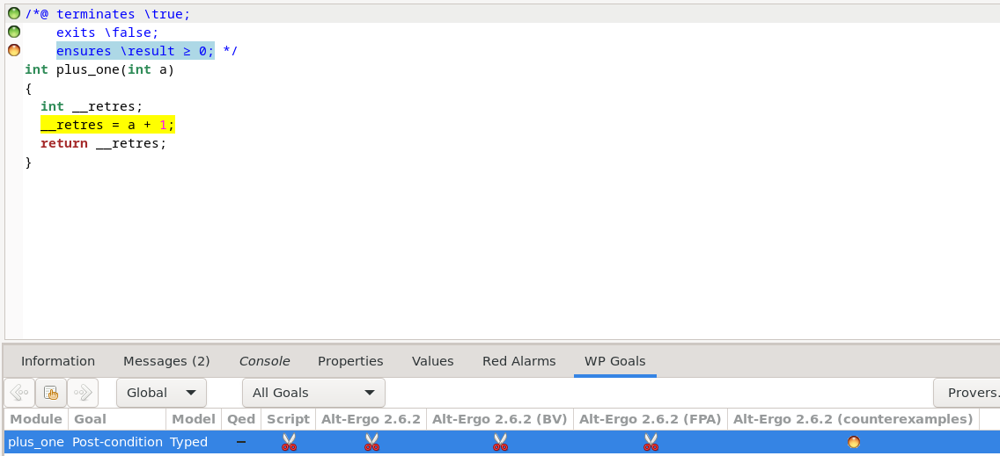

# TP1
**Mathieu WAHARTE** - 10/09/2025

&nbsp;  
&nbsp;  
## Exercice 1
5. Aucune des spécifications n'est correcte, pour abs, si l'on fait abs(-INT_MAX), on va avoir de l'overflow (du fait de la représentation binaire des entiers). Pour add, on peut avoir de l'overflow si on additionne deux entiers très grands. Pour div, on peut avoir une division par zéro ou par un très grand nombre qui donnera un overflow. Les spécifications ne prennent pas en compte ces cas.
6. Les WP-rte guards générés sont:
   - Pour abs:
    ```c
    /*@ assert rte: signed_overflow: -2147483647 ≤ val; */
    ```
    - Pour add:
    ```c
    /*@ assert rte: signed_overflow: -2147483648 ≤ a + b; */
    /*@ assert rte: signed_overflow: a + b ≤ 2147483647; */
    ```
   - Pour div:
    ```c
    /*@ assert rte: division_by_zero: b ≢ 0; */
    /*@ assert rte: signed_overflow: a / b ≤ 2147483647; */
    ```
  On pourra deviner que "rte" signifie "runtime error".


&nbsp;  
&nbsp;  
## Exercice 2
1. Ma spécification pour max:
  ```c
  /*@ 
    ensures \result >= \old(a) && \result >= \old(b) && ( \result == \old(a) || \result == \old(b)); */
  ```
  Résultat de Frama-C qui valide la spécification:
  

2. Résultat de ma spécification sur `max_wrong1.c`:
  
    Frama-C détecte que la spécification n'est pas respectée, car le code renvoie toujours `a`, même si `b` est plus grand.
    Résultat de ma spécification sur `max_wrong2.c`:
  
    Frama-C détecte que la spécification n'est pas respectée, car le code renvoie toujours `INT_MAX` qui n'est pas forcément la valeur de `a` ou `b`.

3. Ma spécification pour max de 5 entiers:
  ```c
  /*@ 
  ensures \result >= \old(a) && \result >= \old(b) && \result >= \old(c) && \result >= \old(d) && \result >= \old(e);
  ensures  \result == \old(a) || \result == \old(b) || \result == \old(c) || \result == \old(d) || \result == \old(e); */
  ```
  Résultat de Frama-C qui valide la spécification:
  
  J'ai découpé la spécification en 2 ensures pour simplifier le travail du prouveur.


&nbsp;  
&nbsp;  
## Exercice 3
1. La spécification de `plus_one` donne:
  