# TP1
**Mathieu WAHARTE** - 10/09/2025

&nbsp;  
&nbsp;  
## Exercice 1
5. Aucune des spécifications n'est correcte, pour `abs`, si l'on fait `abs(-INT_MAX)`, on va avoir de l'overflow (du fait de la représentation binaire des entiers). Pour `add`, on peut avoir de l'overflow si on additionne deux entiers très grands. Pour `div`, on peut avoir une division par zéro ou par un très grand nombre qui donnera un overflow. Les spécifications ne prennent pas en compte ces cas.
6. Les WP-rte guards générés sont:
   - Pour abs:
    ```c
    /*@ assert rte: signed_overflow: -2147483647 ≤ val; */
    ```
    - Pour add:
    ```c
    /*@ assert rte: signed_overflow: -2147483648 ≤ a + b; */
    /*@ assert rte: signed_overflow: a + b ≤ 2147483647; */
    ```
   - Pour div:
    ```c
    /*@ assert rte: division_by_zero: b ≢ 0; */
    /*@ assert rte: signed_overflow: a / b ≤ 2147483647; */
    ```
    On pourra deviner que "rte" signifie "runtime error".


&nbsp;  
&nbsp;  
## Exercice 2
1. Ma spécification pour max:
    ```c
    /*@ 
      ensures \result >= \old(a) && \result >= \old(b) && ( \result == \old(a) || \result == \old(b)); */
    ```
    Résultat de Frama-C qui valide la spécification:
    

2. Résultat de ma spécification sur `max_wrong1.c`:
  
    Frama-C détecte que la spécification n'est pas respectée, car le code renvoie toujours `a`, même si `b` est plus grand.
    Résultat de ma spécification sur `max_wrong2.c`:
  
    Frama-C détecte que la spécification n'est pas respectée, car le code renvoie toujours `INT_MAX` qui n'est pas forcément la valeur de `a` ou `b`.

3. Ma spécification pour max de 5 entiers:
    ```c
    /*@ 
    ensures \result >= \old(a) && \result >= \old(b) && \result >= \old(c) && \result >= \old(d) && \result >= \old(e);
    ensures  \result == \old(a) || \result == \old(b) || \result == \old(c) || \result == \old(d) || \result == \old(e); */
    ```
    Résultat de Frama-C qui valide la spécification:
    
    J'ai découpé la spécification en 2 ensures pour simplifier le travail du prouveur.


&nbsp;  
&nbsp;  
## Exercice 3
1. La spécification de `plus_one` donne:
  
  Frama-C détecte que la spécification n'est pas respectée, car on ajoute juste 1 à un nombre mais la spécification demande que le résultat soit positif, elle ne correspond pas à la fonction.

2. $WP(plus\_one, res>=0) = WP(a+1, res>=0) = (a+1 >= 0) = (a >= -1)$
  Donc la précondition minimale de `plus_one` pour la postcondition que `resultat >= 0` est `a >= -1`.

3. Fram-C a généré le WP-rte guard suivant:
  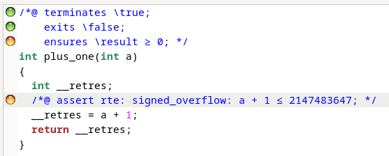
  Cette assertion est là pour éviter un overflow lors de l'addition `a + 1`. En effet, si `a` est égal à `INT_MAX`, alors `a + 1` va provoquer un overflow. De prime ce résultat serait en plus négatif, ce qui viole la postcondition `resultat >= 0`.  
  L'option `-rte` de Frama-C permet d'ajouter des assertions pour vérifier que le code ne provoque pas d'erreurs d'exécution (comme des overflows, divisions par zéro, etc.).

4. Ma spécification corrigée de `plus_one`:
    ```c
    /*@ requires a < 2147483647 && a >= -1;
        ensures \result >= 0; */
    ```
    Résultat de Frama-C qui valide la spécification:
    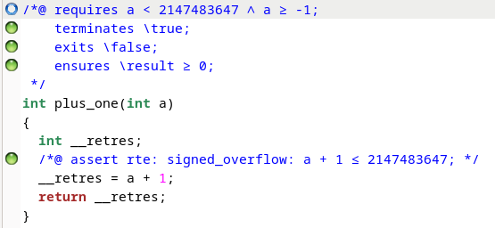
    J'ai ajouté une précondition pour éviter l'overflow lors de l'addition `a + 1`. `INT_MAX` vaut `2147483647` en C sur une architecture 32 bits. J'ai aussi ajouté `a >= -1` pour respecter la postcondition.

5. Pour `div`, Frama-C génére les WP-rte guards suivantes:
    ```c
    /*@ assert rte: division_by_zero: b ≢ 0; */
    /*@ assert rte: signed_overflow: a / b ≤ 2147483647; */
    ```

    Je propose donc la spécification suivante:
    ```c
    /*@ requires b != 0 && (a != INT_MIN || b != -1);
        ensures \result == a / b; */
    ```
    Résultat de Frama-C qui valide la spécification:
    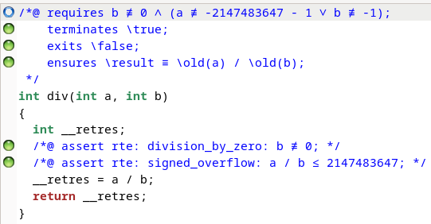
    J'ai ajouté une précondition pour éviter la division par zéro. La deuxième partie de la précondition évite l'overflow qui peut arriver si on divise `INT_MIN` par `-1` (le résultat serait `INT_MAX + 1`, ce qui provoque un overflow).

6. L'affichage du retour des "bad-calls" dans calling-functions donnent:
    ```
    Result of bad_call_1: -344 => valide mais ne respecte pas la postcondition
    Result of bad_call_2: -2147483648 => overflow
    Result of bad_call_3: Floating point exception (core dumped) => div by zero
    Result of bad_call_4: Floating point exception (core dumped) => overflow
    ```
    Frama-C donne:
     - `bad_call_1`: 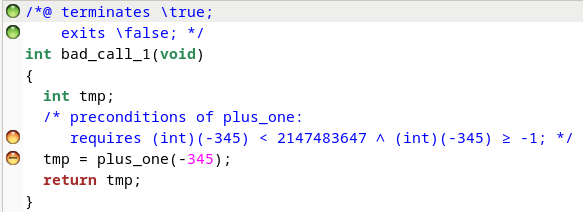
       Frama-C détecte que la postcondition n'est pas respectée, car le résultat est négatif.
     - `bad_call_2`: 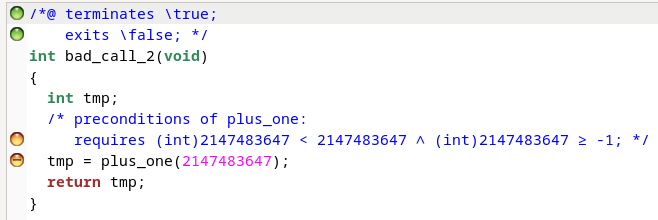
       Frama-C détecte que la précondition n'est pas respectée, car `a` est égal à `INT_MIN` et `b` est égal à `-1`, ce qui provoque un overflow.
     - `bad_call_3`: 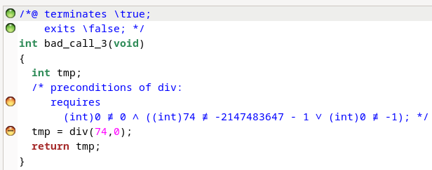
       Frama-C détecte que la précondition n'est pas respectée, car `b` est égal à `0`, ce qui provoque une division par zéro.
     - `bad_call_4`: 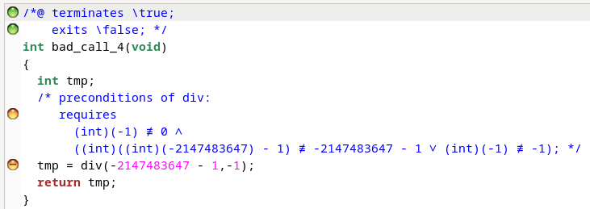
       Frama-C détecte que la précondition n'est pas respectée, car `a` est égal à `INT_MIN` et `b` est égal à `-1`, ce qui provoque un overflow.
     - `good_call_1`: 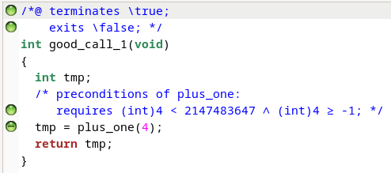
       Frama-C valide la précondition et la postcondition.
     - `good_call_2`: 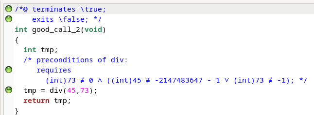
       Frama-C valide la précondition et la postcondition.
     - `good_call_3`: 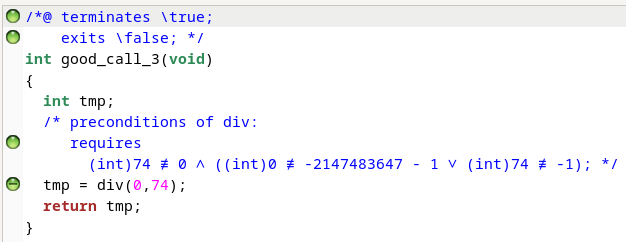
       Frama-C valide la précondition et la postcondition.
     - `good_call_4`: 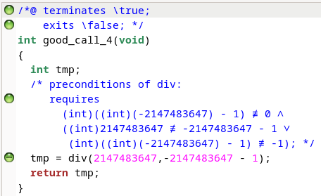
       Frama-C valide la précondition et la postcondition.
     - `good_call_5`: 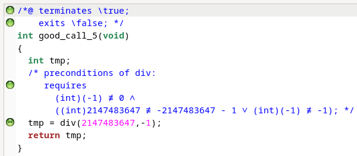
       Frama-C valide la précondition et la postcondition.


&nbsp;  
&nbsp;  
## Exercice 4
Voici le contract que je propose pour `affine`:
```c
/*@ requires -2147483648 ≤ (int)(a * x) + b ≤ 2147483647;
requires -2147483648 ≤ a * x ≤ 2147483647; 
ensures \result == \old(a) * \old(x) + \old(b); */
```
On veut éviter les overflows dans le calcul global mais aussi les calculs intermédiaires de la fonction, d'où les préconditions. La postcondition garantit que le résultat est bien celui attendu.  

Et voici le résultat de Frama-C qui valide la spécification:
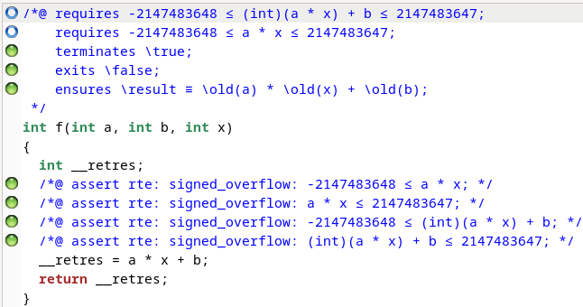


&nbsp;  
&nbsp;  
## Exercice 5
1. Voici le contract que je propose pour `caseResult`:
    ```c
    /*@
      ensures (a == b || b == c || a == c) <==> \result == 0;
      ensures (a != b && a != c && b != c && a < b && a < c) <==> \result == 1;
      ensures (a != b && a != c && b != c && b < a && b < c) <==> \result == 2;
      ensures (a != b && a != c && b != c && c < a && c < b) <==> \result == 3;
    */
    ```
    Il n'y a pas de précondition, car la fonction est définie pour tous les entiers. La postcondition décrit les différents cas de retour de la fonction en fonction des relations entre `a`, `b` et `c`.  
    Voici le résultat de Frama-C qui valide la spécification:
    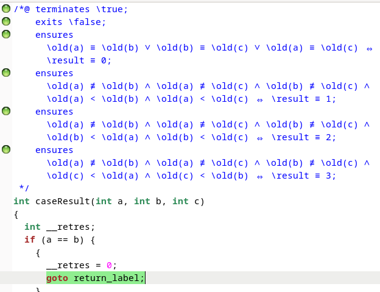

2. Voici le contrat simplifié à l'aide des prédicats:
    ```c
    /*@
      predicate allDifferent(integer a, integer b, integer c) = a != b && a != c && b != c;
      predicate firstInputIsSmallest(integer a, integer b, integer c) = a < b && a < c;
    */
    /*@
      ensures !allDifferent(a,b,c) <==> \result == 0;
      ensures allDifferent(a,b,c) && firstInputIsSmallest(a,b,c) <==> \result == 1;
      ensures allDifferent(a,b,c) && firstInputIsSmallest(b,a,c) <==> \result == 2;
      ensures allDifferent(a,b,c) && firstInputIsSmallest(c,a,b) <==> \result == 3;
    */
    ```
    Voici le résultat de Frama-C qui valide la spécification:
    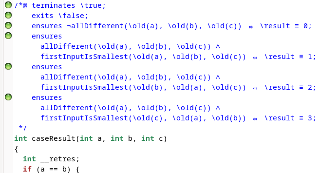

3. Voici le contrat simplifié à l'aide des behaviors:
    ```c
    /*@
      behavior equal:
        assumes a == b || b == c || a == c;
        ensures \result == 0;

      behavior firstSmallest:
        assumes a != b && a != c && b != c && a < b && a < c;
        ensures \result == 1;

      behavior secondSmallest:
        assumes a != b && a != c && b != c && b < a && b < c;
        ensures \result == 2;

      behavior thirdSmallest:
        assumes a != b && a != c && b != c && c < a && c < b;
        ensures \result == 3;

      complete behaviors;
      disjoint behaviors equal, firstSmallest, secondSmallest, thirdSmallest;
    */
    ```
    Voici le résultat de Frama-C qui valide la spécification:
    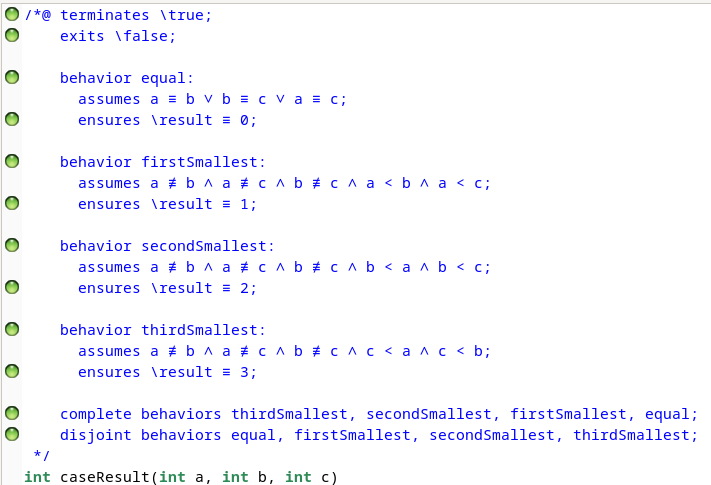


&nbsp;  
&nbsp;  
## Exercice 6
- Pour `min`, mon implementation avec la spécification est:
    ```c
    /*@
      ensures \result <= a && \result <= b && \result <= c && (a == \result || b == \result || c == \result);
    */
    int min(int a, int b, int c) {
      int m = a;
      if(b < m) {
        m = b;
      }
      if( c < m) {
        m = c;
      }
      return m;
    }
    ```
    Voici le résultat de Frama-C qui valide la spécification:
    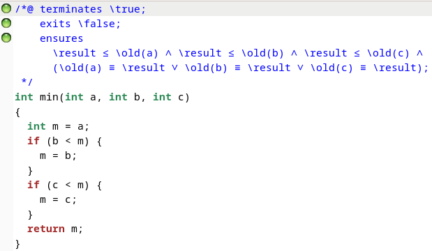

- Pour `syracuseStep`, mon implementation avec la spécification est:
    ```c
    /*@ 
    requires a != 0 && a != INT_MIN && a != (INT_MAX-1)/3;
    ensures a%2==0 ==> \result == a/2 && a%2==1 ==> \result == 3*a + 1;
    */
    int syracuseStep(int a) {
      return a%2==0 ? a/2 : 3*a + 1;
    }
    ```
    Voici le résultat de Frama-C qui valide la spécification:
    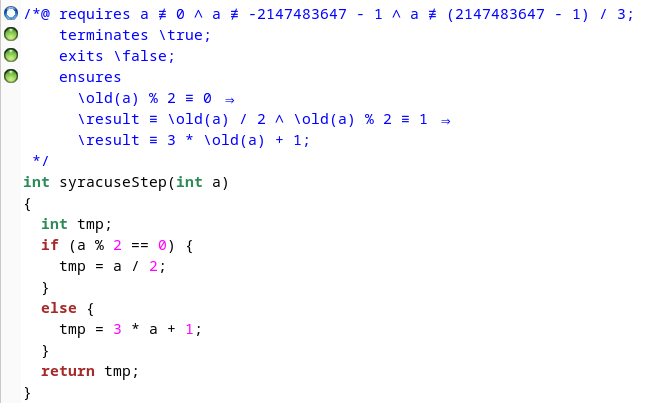

- Pour `roundedDiv`, mon implementation (nombres positifs et négatifs) avec la spécification est:
    ```c
    /*@
      requires b != 0;
      requires b != -1 || a != INT_MIN;
      requires b != 1  || a != INT_MAX;
      requires b < 0 ==> -a >= -2147483647 && -b >= -2147483647;
      requires b > 0 ==> (
        (a >= 0 ==> -2147483648 <= a + b/2 <= 2147483647) &&
        (a < 0  ==> -2147483648 <= a - b/2 <= 2147483647)
      );
      ensures b < 0 ==> \result == ((-a >= 0) ? ((-a + -b/2)/-b) : ((-a - -b/2)/-b));
      ensures b >= 0 ==> \result == ((a >= 0) ? ((a + b/2)/b) : ((a - b/2)/b));
    */
    int roundedDiv(int a, int b) {
      if(b < 0) {
        a = -a;
        b = -b;
      }
      if(a >= 0) {
        return (a + b/2)/b;
      } else {
        return (a - b/2)/b;
      }
    }
    ```
    Voici le résultat de Frama-C qui valide la spécification:
    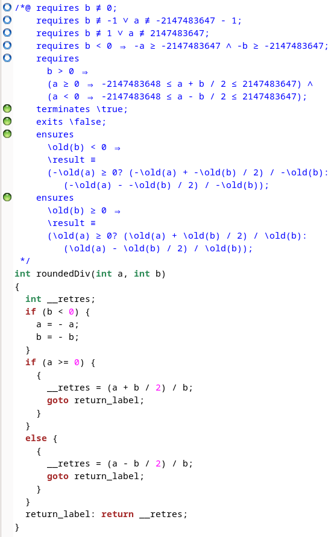
