# TP2
**Mathieu WAHARTE** - 11/09/2025

&nbsp;  
&nbsp;  
## Exercice 1
1. On ne peut en effet pas prouver ces fonctions à cause de la longueur arbitraire du while et du for.
  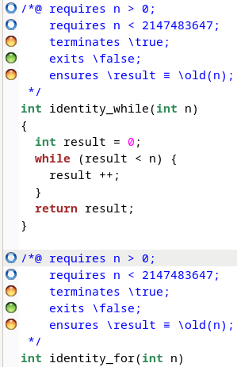

2. Code modifié avec l'invariant:
    ```c
    int identity_while(int n){
      int result = 0;
      /*@
        loop invariant result <= n;
      */
      while (result < n){
        result++;
      }
      return result;
    }
    ```
    Cependant, on ne peut toujours pas prouver la fonction car il manque une condition de terminaison. Pour la terminaison, il faut un variant. Frama-C ne peut donc pas prouver la fonction.
    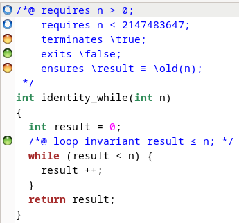

3. Code modifié avec le variant:
    ```c
    int identity_while(int n){
      int result = 0;
      /*@
        loop invariant result <= n;
        loop assigns result;
        loop variant n - result;
      */
      while (result < n){
        result++;
      }
      return result;
    }
    ```
    Maintenant, Frama-C peut prouver la fonction.
    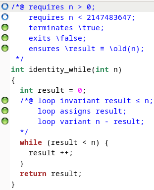
4. Code modifié avec l'invariant et le variant:
    ```c
    int identity_for(int n){
      int result = 0;
      /*@
        loop invariant 1 <= i <= n+1 && result == i-1;
        loop assigns result, i;
        loop variant n - i;
      */
      for (int i = 1; i <=n; i++){
        result++;
      }
      return result;
    }
    ```
    Maintenant, Frama-C peut prouver la fonction.
    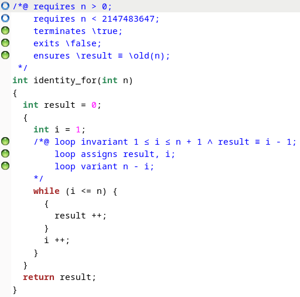


&nbsp;  
&nbsp;  
## Exercice 2
On propose le contrat de boucle suivant:
```c
/*@ loop invariant 1 <= i <= n+1;
    loop invariant (c >= 0 ==> result == 2*(i-1)) && (c < 0 ==> result == (i-1));
    loop assigns result, i;
    loop variant n - i + 1;
*/
```
Ce contract permet de prouver la fonction. En effet, on a deux invariants de boucle:
- `1 <= i <= n+1` qui permet de s'assurer que l'index `i` est toujours dans les bornes de la boucle.
- `(c >= 0 ==> result == 2*(i-1)) && (c < 0 ==> result == (i-1))` qui permet de s'assurer que le résultat est correct en fonction de la valeur de `c`. Si `c` est positif ou nul, le résultat doit être égal à `2*(i-1)` car on incrémente `result` deux fois à chaque itération.
- `loop assigns result, i;` indique que seules les variables `result` et `i` sont modifiées dans la boucle.
- `loop variant n - i + 1;` permet de s'assurer que la boucle termine en indiquant que la valeur de `n - i + 1` diminue à chaque itération et est toujours positive.

Frama-C peut ainsi prouver la fonction:
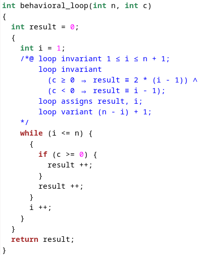


&nbsp;  
&nbsp;  
## Exercice 3
On propose le contrat suivant:
```c
/*@
  requires n > 0;
  requires \valid(tab + (0 .. n - 1));
  ensures \forall int k; 0 <= k < n ==> tab[k] == 0;
*/
void set_to_zero(int *tab, int n) {
  /*@ loop invariant 0 <= i <= n;
      loop invariant \forall int k; 0 <= k < i ==> tab[k] == 0;
      loop assigns i, tab[0..n-1];
      loop variant n - i;
  */
	for(int i = 0; i < n; i++) {
		tab[i] = 0;
	}
}
```

Ce contrat permet de prouver la fonction. En effet, on a:
- `requires n > 0;` qui indique que la taille du tableau doit être strictement positive.
- `requires \valid(tab + (0 .. n - 1));` qui indique que le tableau doit être valide pour les indices de `0` à `n-1`.
- `ensures \forall int k; 0 <= k < n ==> tab[k] == 0;` qui indique que tous les éléments du tableau doivent être égaux à `0` après l'exécution de la fonction.
- `loop invariant 0 <= i <= n;` qui permet de s'assurer que l'index `i` est toujours dans les bornes de la boucle.
- `loop invariant \forall int k; 0 <= k < i ==> tab[k] == 0;` qui permet de s'assurer que tous les éléments du tableau jusqu'à l'index `i-1` sont égaux à `0`.
- `loop assigns i, tab[0..n-1];` indique que seules les variables `i` et les éléments du tableau sont modifiées dans la boucle.
- `loop variant n - i;` permet de s'assurer que la boucle termine en indiquant que la valeur de `n - i` diminue à chaque itération et est toujours positive.

Frama-C peut ainsi prouver la fonction:
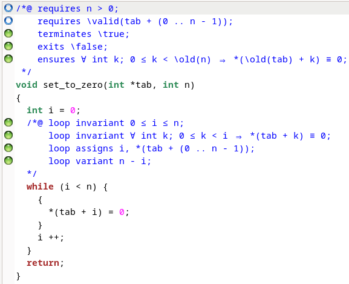


&nbsp;  
&nbsp;  
## Exercice 4
1)  Pour `max_element`, on propose le contrat suivant:
    ```c
    /*@ 
      requires 0 < n <= INT_MAX;
      requires \valid(t + (0 .. n - 1));
      requires \separated(t + (0 .. n - 1), t);
      assigns t[0 .. n-1];
      ensures \forall int i; 0 <= i < n ==> t[i] <= t[\result];
      ensures \forall int i; 0 <= i < n ==> t[i] == \old(t[i]);
    */
    int max_element(const int* t, int n){
      int max = 0;
      /*@
      loop invariant 0 <= i <= n;
      loop invariant max >= 0 && max < n;
      loop invariant \forall integer k; 0 <= k < n ==> t[k] == \at(t[k], Pre);
      loop invariant \forall integer k; 0 <= k < i ==> t[k] <= t[max];
      loop assigns max, i;
      loop variant n - i;
      */
      for (int i = 0; i < n; i++){
        if (t[max] < t[i]) max = i;
      }
      return max;
    }
    ```
    On demande que l'on puisse accéder au tableau `t` pour les indices de `0` à `n-1` et `n` soit un entier strictement positif. On demande aussi que le tableau `t` soit séparé de lui-même pour éviter les aliasing.  
    On souhaite comme postcondition que tous les éléments du tableau soient inférieurs ou égaux à l'élément d'indice `\result` (l'indice de l'élément maximum) et que le tableau n'ait pas été modifié. Indirectement, on demande aussi que `\result` soit un indice valide du tableau (puisqu'on fait `t[\result]`).  
    Pour le contrat de boucle, on s'assure que l'index `i` et `max` sont toujours dans les bornes. Ensuite que les éléments du tableau n'ont pas été modifiés et que `max` est bien l'indice de l'élément maximum parmi les éléments déjà visités.  
    Et voici la preuve de Frama-C:
    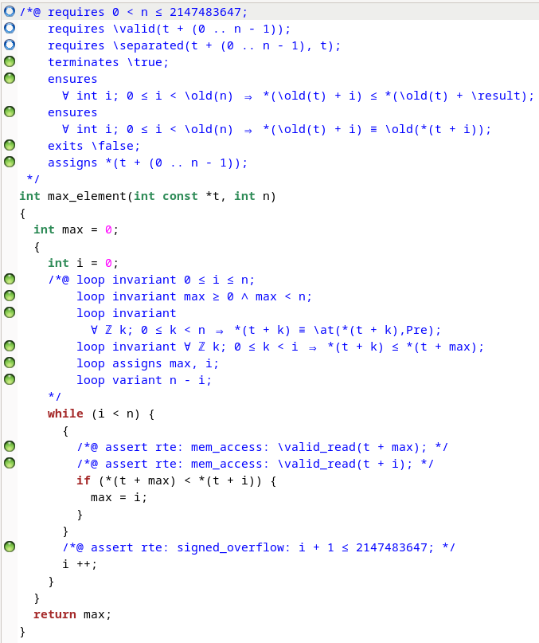


    &nbsp;  
    Pour `sum_of_tab`, on propose le contrat suivant:
    ```c
    /*@
      requires 0 < n <= INT_MAX;
      requires \valid(a + (0 .. n - 1));
      requires \valid(b + (0 .. n - 1));
      requires \forall int i; 0 <= i < n ==> INT_MIN <= a[i] + b[i] <= INT_MAX;
      requires \separated(a + (0 .. n-1), b + (0 .. n-1));
      assigns a[0 .. n-1];
      assigns b[0 .. n-1];
      ensures \forall int i; 0 <= i < n ==> a[i] == \old(a[i]) + b[i];
      ensures \forall int i; 0 <= i < n ==> b[i] == \old(b[i]);
    */
    void sum_of_tab(int *a, int *b, int n){
      /*@
        loop invariant 0 <= i <= n;
        loop invariant \forall integer k; 0 <= k < n ==> b[k] == \at(b[k], Pre);
        loop invariant \forall integer k; 0 <= k < i ==> a[k] == \at(a[k], Pre) + \at(b[k], Pre);
        loop invariant \forall integer k; i <= k < n ==> a[k] == \at(a[k], Pre);
        loop assigns a[0 .. n-1], i;
        loop variant n - i;
      */
      for (int i = 0; i<n; i++){
        a[i] += b[i];
      }
    }
    ```

    On demande que l'on puisse accéder aux tableaux `a` et `b` pour les indices de `0` à `n-1` et `n` soit un entier strictement positif. On demande aussi que les tableaux `a` et `b` soient séparés pour éviter les aliasing.  
    On demande comme postcondition que chaque élément de `a` soit égal à la somme de l'élément correspondant de `a` et `b` avant l'exécution de la fonction et que le tableau `b` n'ait pas été modifié.  
    Dans la boucle, on s'assure que l'index `i` est toujours dans les bornes. Ensuite que le tableau `b` n'a pas été modifié. Puis que les éléments de `a` jusqu'à l'index `i-1` ont bien été mis à jour et que les éléments de `a` à partir de l'index `i` n'ont pas encore été modifiés.  
    Et voici la preuve de Frama-C:  
    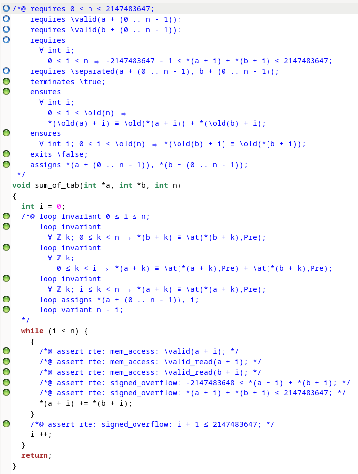


&nbsp;  
2.  On écrit le `main` suivant:
    ```c
    int main() {
      int n = 5;
      int a[6] = {1, 2, 3, 4, 5, 6};

      sum_of_tab(a + 1, a, n);
      for (int i = 0; i < n + 1; i++) {
        printf("a[%d] = %d\n", i, a[i]);
      }
      return 0;
    }
    ```
    Le résultat de l'exécution est:
    ```c
    a[0] = 1
    a[1] = 3
    a[2] = 6
    a[3] = 10
    a[4] = 15
    a[5] = 21
    ```
    Ce qui ne correspond pas au résultat attendu. En effet, on s'attendait à avoir `a[0]=1`, `a[1] = 3`, `a[2] = 5`, `a[3] = 7`, `a[4] = 9` et `a[5] = 11`. Là on obtient une somme cumulée car on reprend le résultat de `a[i+1] += a[i]`. La fonction `sum_of_tab` ne supporte donc pas l'aliasing.  


&nbsp;  
&nbsp;  
## Exercice 5
1. Frama-C n'arrive pas à prouver `add`:
   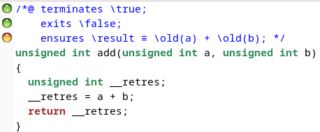
  De même pour `sub`:
   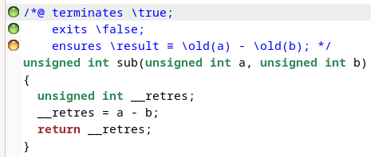

2. Avec les WP-rte guard, on obtient le même résultat:
    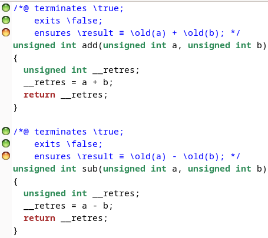
    On notera de plus que cliquer sur "ajouter les guards" ou lancer frama-c avec `-rte` n'ajoute rien de plus aux fonctions.

3. Avec l'option `-warn-unsigned-overflow` on remarque bien la présence d'overflow possible:
    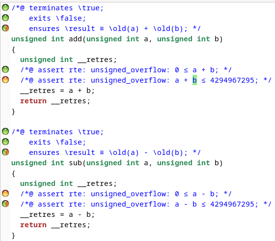
    Pour `add`, on remarque que l'overflow peut arriver si `a+b > INT_MAX` (aussi si `a+b<0` mais Frama-C considère que cela ne peut pas arriver). Pour `sub`, l'overflow peut arriver si `0 > a - b;` (aussi si `a-b > INT_MAX` mais Frama-C considère que cette option est prouvé sous condition).

4. On peut spécifier ces contrats pour que Frama-C puisse prouver les fonctions (avec `<limits.h>` pour `INT_MAX`):
   - Pour `add`:
      ```c
      /*@ 
      requires a + b <= INT_MAX;
      requires a + b >= 0;
      ensures \result == a + b;
      */
      ```
   - Pour `sub`:
      ```c
      /*@ 
      requires 0 <= a - b;
      requires a - b <= INT_MAX;
      ensures \result == a - b;
      */
      ```
    Avec ces contrats, Frama-C peut prouver les fonctions:
    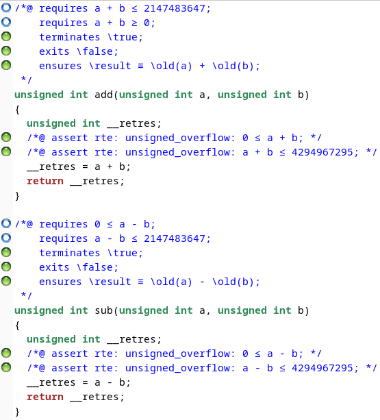


&nbsp;  
&nbsp;  
## Exercice 6
Je propose le contrat suivant:
```c
/*@
  requires src != \null && dest != \null;
  requires src_size > 0 && dest_size > 0;
  requires \valid_read(src + (0 .. src_size-1));
  requires \valid(dest + (0 .. dest_size-1));
  requires \separated(src + (0 .. src_size-1), dest + (0 .. dest_size-1));
  requires src_offset <= src_size;
  requires dest_offset <= dest_size;
  requires size <= INT_MAX - src_offset;
  requires size <= INT_MAX - dest_offset;

  behavior error:
    assumes size > src_size - src_offset || src_offset >= src_size
         || size > dest_size - dest_offset || dest_offset >= dest_size;
    ensures \result == -1;
    ensures \forall integer i; 0 <= i < dest_size ==> dest[i] == \old(dest[i]);
    ensures \forall integer i; 0 <= i < src_size ==> src[i] == \old(src[i]);
    assigns \nothing;

  behavior success:
    assumes src_offset < src_size && dest_offset < dest_size
         && size <= src_size - src_offset
         && size <= dest_size - dest_offset;
    ensures \result == 0;
    ensures \forall integer i; 0 <= i < src_size ==> src[i] == \old(src[i]);
    ensures \forall integer i; 0 <= i < dest_size && (i < dest_offset || i >= dest_offset + size) ==> dest[i] == \old(dest[i]);
    ensures \forall integer i; 0 <= i < size ==> dest[dest_offset + i] == src[src_offset + i];
    assigns dest[dest_offset .. dest_offset + size - 1];

  complete behaviors;
  disjoint behaviors;
@*/
int memcpy(char *src, size_t src_size, size_t src_offset, char *dest, size_t dest_size, size_t dest_offset, size_t size);
```

Et l'implémentation:
```c
int memcpy(char* src, size_t src_size, size_t src_offset, char* dest, size_t dest_size,  size_t dest_offset, size_t size) {
  if (src_offset >= src_size ||
    dest_offset >= dest_size ||
    size > src_size - src_offset ||
    size > dest_size - dest_offset) {
    return -1;
  }

  /*@
    loop invariant 0 <= i <= size;
    loop invariant i <= size;
    loop invariant dest_offset + i <= dest_size;
    loop invariant src_offset + i <= src_size;
    loop invariant \forall integer k; 0 <= k < i ==> dest[dest_offset + k] == src[src_offset + k];
    loop invariant \forall integer k; 0 <= k < dest_size && (k < dest_offset || k >= dest_offset + size) ==> dest[k] == \at(dest[k], Pre);
    loop invariant \forall integer k; 0 <= k < src_size ==> src[k] == \at(src[k], Pre);
    loop assigns i, dest[dest_offset .. dest_offset + size - 1];
    loop variant size - i;
  */
  for (size_t i = 0; i < size; i++) {
    dest[dest_offset + i] = src[src_offset + i];
  }
  return 0;
}
```

Avec ce contrat, Frama-C peut prouver la fonction (je n'arrivais plus à faire fonctionner le gui donc je ne savais pas l'origine des erreurs):
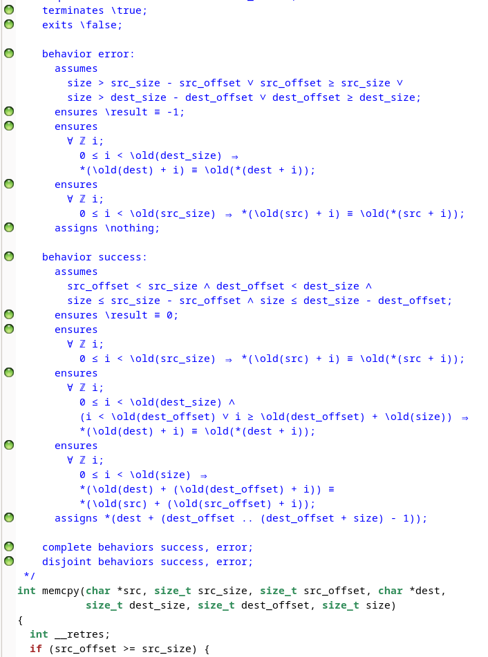
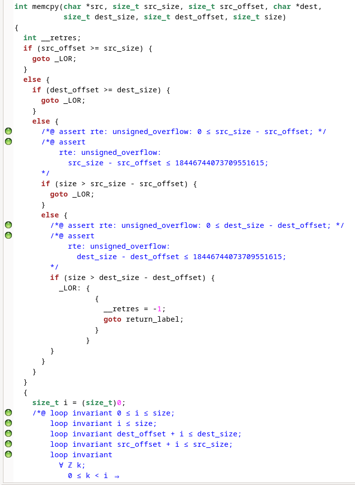
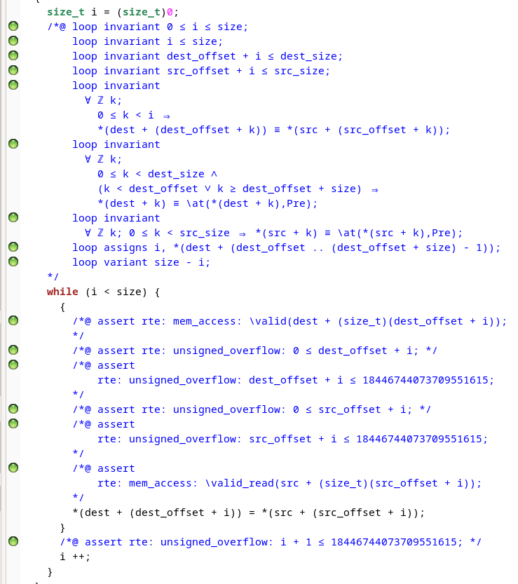