# TP3
**Mathieu WAHARTE** - 19/09/2025

&nbsp;  
&nbsp;  
## Exercice 1
1) On observe bien que `non-terminate` est prouvée par Frama-C.
  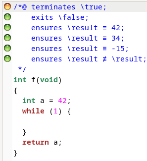
  Cependant, la clause de terminaison ajoutée automatiquement n'est pas prouvée, la fonction ne se terminant pas. Nous reverons cela dans la question 3.

2) On ajoute l'assertion `/*@assert \false;*/` après la boucle:
    ```c
    while (1)
      ;
    /*@assert \false;*/
    return a;
    ```
    Frama-C arrive à prouver l'assertion alors que celle-ci est fausse. Cela nous indique bien que comme la boucle ne termine pas, le programme ne peut jamais atteindre l'assertion et donc elle est considérée comme toujours vraie au lieu de sa vrai valeur de vérité.
    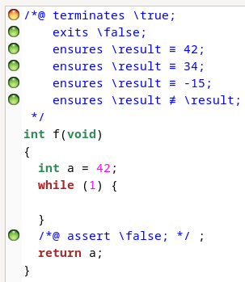

3) On ajoute la clause de terminaison `/*@ terminates \true; */`:
    ```c
    /*@ terminates \true; */
    int f() {
      ...
    ```
    Comme pour la clause automatiquement ajoutée à la question 1, Frama-C n'arrive pas à prouver que la fonction termine pour tout ses contextes d'appels (c'est ce que `\true` signifie). En effet, la fonction ne termine pas.
    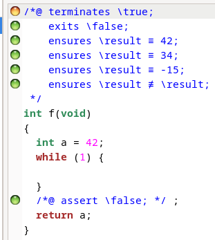

4) Pour aider Frama-C, j'ajoute `/*@loop assigns \nothing; */` avant la boucle infinie:
    ```c
    /*@ terminates \true; */
    int f() {
      int a = 42;
      /*@loop assigns \nothing; */
      while (1)
        ;
      /*@assert \false;*/
      return a;
    }
    ```
    Cela indique à Frama-C que la boucle n'affecte aucune variable. Cependant, cela ne l'aide pas à prouver que la fonction termine, car la boucle ne termine pas.
    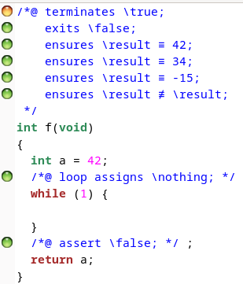

  
&nbsp;  
## Exercice 2

1) On ajoute ces invariants et assigns à la boucle de la fonction:
    ```c
    int f() {
      int i = 30;
      int j = 0;
      /*@ 
      loop invariant 0 <= i <= 30;
      loop invariant j == 30 - i;
      loop assigns i,j; 
      */
      while(i>0){
        j++;
        i--;
      }
      return j;
    }
    ```
    `i` est toujours entre 0 et 30 car elle est initialisée à 30 et décrémentée à chaque itération jusqu'à ce qu'elle atteigne 0. `j` est toujours égal à `30 - i` car elle est initialisée à 0 et incrémentée à chaque itération pendant que `i` est décrémentée. Les `assigns` indiquent que les variables `i` et `j` sont modifiées par la boucle. Frama-C arrive à prouver toutes les clauses.
    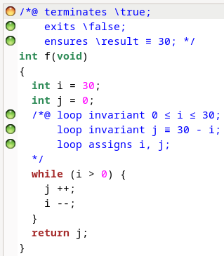

2) Cependant, on peut voir sur le screenshot précédent que la clause `terminates \true;` n'est pas prouvée. En effet, Frama-C ne peut pas déterminer automatiquement que la boucle termine.
  
3)  Pour l'aider, on ajoute la clause de terminaison `/*@ loop variant i; */`:
    ```c
    int f() {
      int i = 30;
      int j = 0;
      /*@ 
      loop invariant 0 <= i <= 30;
      loop invariant j == 30 - i;
      loop assigns i,j; 
      loop variant i;
      */
      while(i>0){
        j++;
        i--;
      }
      return j;
    }
    ```
    Cela indique à Frama-C que `i` diminue à chaque itération de la boucle et il sait aussi qu'elle est toujours positive au début de chaque itération (grâce à l'invariant `0 <= i <= 30`). Ainsi, Frama-C peut conclure que la boucle termine et donc que la fonction termine.
    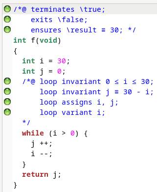


&nbsp;  
## Exercice 3
1) La fonction de `max_tab` est bien prouvée par Frama-C:
   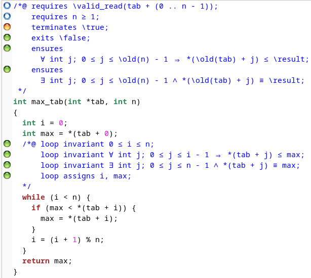
   Et lorsqu'on ajoute des demandes absurdes comme dans l'exercice 1, Frama-C ne peut pas les prouver:
   ```c
    /*@ assert \false; */
    /*@ assert i == 2*n; */
   ```
  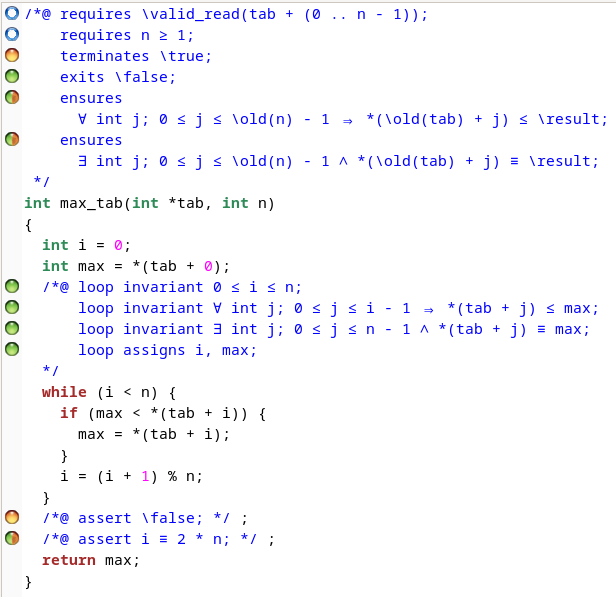

2) Pour prouver la boucle j'ajoute le variant `/*@ loop variant n-i; */`. Cela indique à Frama-C que `n-i` diminue à chaque itération de la boucle et il sait aussi qu'elle est toujours positive au début de chaque itération (grâce à l'invariant `0 <= i < n`). Ainsi, Frama-C devrait pouvoir conclure que la boucle termine et donc que la fonction termine. Mais il n'y arrive pas:
    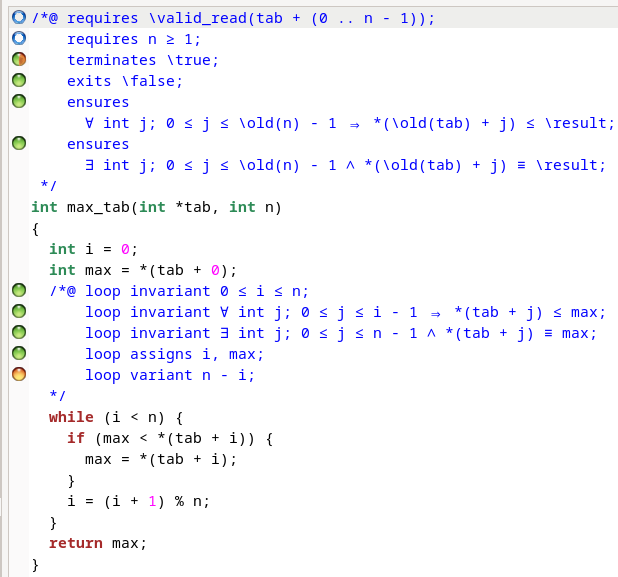
    En effet, dans la boucle, `i` est mis à jour avec `i = (i+1)%n;`, ce qui fait que `i` n'augmente pas toujours. Par exemple, si `i` vaut `n-1`, alors `(i+1)%n` vaut `0`. Donc `i` peut diminuer et le variant `n-i` peut augmenter. Frama-C ne peut donc pas prouver que la boucle termine car la boucle peut potentiellement ne jamais terminer.

3) On peut corriger cela en remplaçant `i = (i+1)%n;` par `i++;`:
    ```c
    while(i < n){
      if(max < tab[i]) max = tab[i];
      i++;
    }
    ```
  Ainsi, `i` augmente toujours et la boucle termine bien lorsque `i` atteint `n`. Frama-C arrive alors à prouver que la boucle termine et donc que la fonction termine et ainsi la correction totale:
      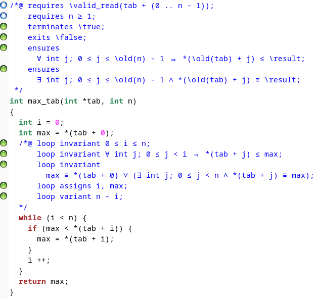

4) Pour prouver la correction partielle de `mystere`, au vu de la condition dans le while, il suffit d'ajouter une clause `/*@ loop assigns b;*/` pour signifier que la valeur de b change. 
  ```c
  int mystery(int hidden){
    int b = hidden+1;
    /*@ loop assigns b; */
    while(b != hidden){
      b = askPlayerNumber();
    }
    return b;
  }
  ```
  Comme la condition d'arrêt est que `b` soit égale à `hidden`, alors si on suppose la terminaison, la sortie de la fonction sera bien égale à `hidden` ce qui correspond à la spécification. Frama-C arrive à prouver la correction partielle:
      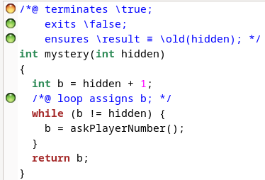

1) La spécification de `askPlayerNumber` indique que la valeur retourné est un entier compris entre `INT_MIN` et `INT_MAX`. Elle ne dit rien quant au fait que la valeur soit égale à `hidden` ou non. Ainsi, on ne peut pas prouver la terminaison de `mystere` car rien n'indique que la valeur retournée par `askPlayerNumber` finira par être égale à `hidden`. Par exemple, si `askPlayerNumber` retourne toujours `hidden + 1`, alors la boucle ne termine jamais. Au vu du nom de la fonction et de ce qu'on en dit dans l'énoncé, on peut même supposer que le cas où `askPlayerNumber` retourne `hidden` est extrêmement rare.
 Frama-C ne pourra donc pas prouver la terminaison:
      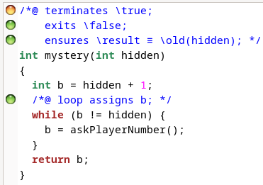


&nbsp;  
## Exercice 4
Installation de Z3:
```bash
sudo apt install z3
```
Installation de CVC5:
```bash
sudo apt install cvc5
```
Ajouter Z3 et CVC5 à Frama-C:
```bash
why3 config detect
```
(Il faudra d'abord suivre les instructions de [mise en place du TP](./VERIF_Formelle_ENV_Travail.pdf))


1)  J'ai utilisé CVC5 pour prouver les postconditions car Alt-Ergo et Z3 avaient du mal:
  [euclidan_gcd_partial_proof](./images/TP3_exo4_1_euclidan_gcd_partial_proof.png)

2) Comme variant strictement décroissant, j'ai choisi `*r`:
  ```c
  void euclidianDiv(int a, int b, int *q, int *r) {
    *q = 0;
    *r = a;
    /*@ loop invariant I1: *r >= 0;
      loop invariant I2: a == b * *q + *r;
      loop assigns *r,*q;
      loop variant *r;
    */
    while (*r >= b) {
      *r = *r - b;
      *q = *q + 1;
    }
    return;
  }
  ```
  En effet, Frama-C n'arrive pas à le prouver car si `b` est négatif, alors `*r` peut augmenter. Par exemple, si `a` vaut 5 et `b` vaut -3, alors `*r` vaut 5 au début de la boucle. Après une itération, `*r` vaut 8 (5 - (-3)).
  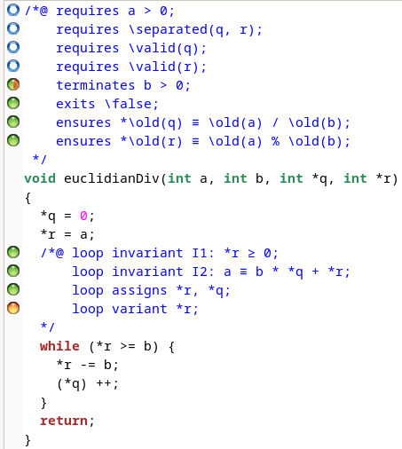

3) En lançant Frama-C avec l'option `-wp-variant-with-terminates`, il arrive bien a vérifier le variant et donc la correction totale:
  
  En effet, comme dit précédement, si `b` est négatif, alors `*r` peut augmenter mais si `b` est positif ou nul, alors `*r` est bien un variant valide et l'option `-wp-variant-with-terminates` permet de prendre en compte la clause de terminaison de la fonction qui indique que `b` est strictement positif et donc `*r` est bien un variant valide dans ce contexte, ce qui permet de prouver la correction totale.


&nbsp;  
## Exercice 5
1) J'ai choisi de prouver `nondet` pour tout a (positif, nul ou négatif). Pour ce faire, j'ai ajouté les spécifications suivantes:
  ```c
  /*@
    behavior neg:
      assumes a <= 0;
      ensures \result == 0;
      assigns \nothing;
      
    behavior pos:
      assumes a > 0;
      requires a <= INT_MAX/2;
      ensures 0 <= \result <= 2 * \old(a);
      assigns \nothing;

    complete behaviors;
    disjoint behaviors;
  */
  int nondet(int a) {
    int res = 0;

    if(a<=0) {
      return res;
    }
    /*@ 
      loop invariant 0 <= a <= \at(a,Pre);
      loop invariant 0 <= res <= 2 * (\at(a,Pre) - a);
      loop assigns a, res;
    */
    while (a > 0) {
      int b = randInt(a);
      if (b > 0) {
        res += b + 1;
      }
      a -= b;
    }
    return res;
  }
  ```
  On remarque en premier que j'ai ajouté une condition, `if(a<=0) return res;`. Celle-ci ne modifie pas le programme puisque si `a` est négatif ou nul, la boucle while est sautée et on return res systématiquement. En revanche, son simple ajout permet aux solveurs de Frama-C de prouver mes spécifications (en somme ce code les aides à comprendre ce qui se passe dans le cas où `a` est négatif, si l'on requiert `a` positif, la preuve tiendrais pour les même spécifications).  
  Ensuite, expliquons les spécifications:
  On a deux cas générals (behaviors), si `a` est négatif ou nul, on va sauter la boucle et renvoyer 0 (le `behavior neg`). Si `a` est positif, on va rentrer dans la boucle. Les invariants pour la boucle sont:
  - `loop invariant 0 <= a <= \at(a,Pre)`: `a` démarre a sa valeur initale et diminiue jusqu'à ce que `a == 0` (car `randInt` renvoie un entier entre 0 et `a` qui est soustrait à `a`, il suffit ensuite d'imaginer les cas limites).
  - `loop invariant 0 <= res <= 2 * (\at(a,Pre) - a)`: à chaque itération (où `b != 0` qui est une itération vide d'opérations), on ajoute a `res` un bout de la valeur de `a` qu'on retire a `a` et on rajoute 1. Si `b == 1` à chaque tour, on va ajouter 2 à res `a` fois et donc `res == 2*a`, ceci est le cas où `res` est le plus grand et est donc une borne supérieure. On poura aussi prouver ce résultat par une réccurence forte ($res_{i+1} + 2\times a_{i+1} = (res_i + b + 1) + 2 \times (a_i-b) = res_i + 2 \times a_i + 1 -b \leq res_i + 2\times a_i$ car $b>=1$, où $i$ est un compteur des itérations non nulles).

  Frama-C arrive ainsi à prouver toutes les clauses:
   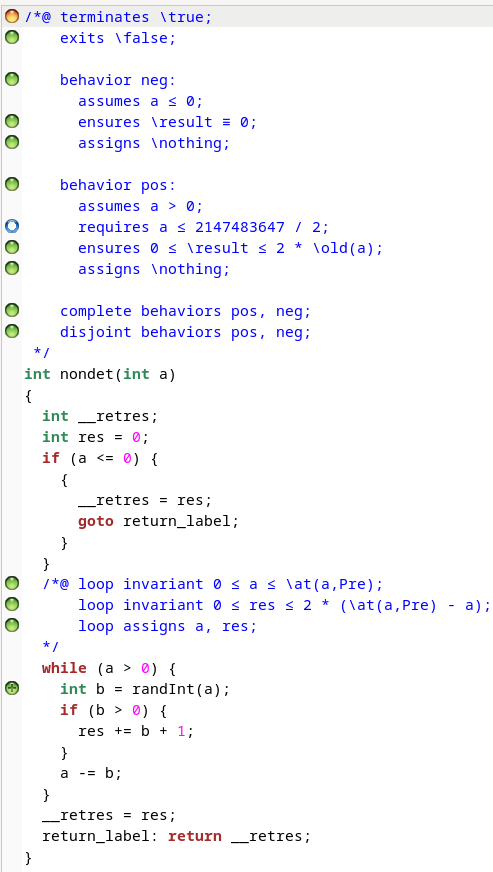

2) Frama-C ne peut pas prouver la correction totale avec le variant `loop variant a;` par exemple (qui est valide) car il est possible que `randInt` renvoie systématiquement 0 et donc que la boucle ne termine jamais `a` étant décrémenté de 0 donc restant inchangé à chaque itération.
  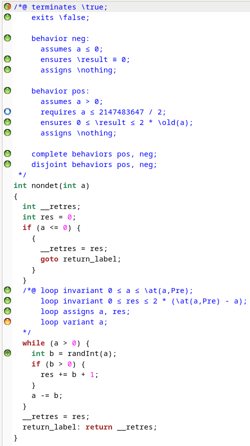

3) Pour permettre à Frama-C de prouver la terminaison, il faut que le variant décroisse strictement à chaque itération. Pour cela, sans modifier randInt, j'ai modifié la boucle pour que si `b == 0`, on le remplace par 1 (ce qui est valide car `b` est censé être entre 0 et `a` et que le programme ne faisait rien si `b == 0`, on évite ainsi les boucles infinies). Le code devient:
  ```c
  while (a > 0) {
		int b = randInt(a);
    if (b == 0) {
      b = 1;
    }
    res += b + 1;
		a -= b;
  }
  ```
  Frama-C arrive alors à prouver la terminaison et donc la correction totale:
  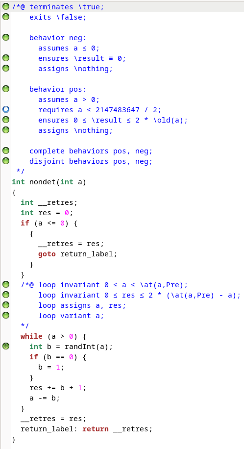