# TP1
**Mathieu Waharte** - 11/09/2025


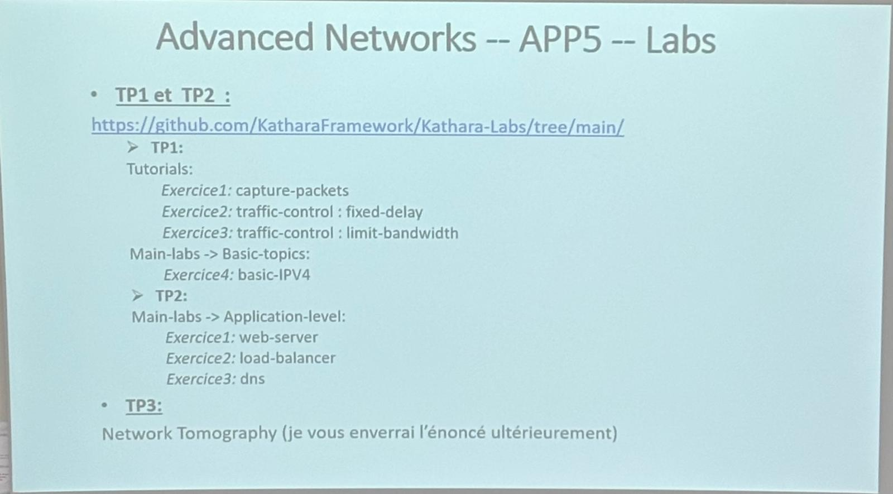


&nbsp;  
&nbsp;  
## Exercice 1 - Capture Pack/Installation de Kathará
1) Télécharger et installer [Docker Desktop](https://www.docker.com/products/docker-desktop/) (si pas déjà installé)
2) Télécharger et installer [Kathará](https://www.kathara.org/download.html)
3) Avec Docker Desktop en cours d'exécution, ouvrez un terminal et exécutez la commande suivante pour vérifier que Kathará est correctement installé :
    ```shell
    kathara --version
    ```
4) Allez dans votre répertoire de lab (contenant les fichiers `lab.conf`, `pc1.startup`, `pc2.startup`) et exécutez `kathara lstart` pour télécharger les images et démarrer le lab. Cela prend un certain temps la première fois. Ensuite, exécutez `kathara check` pour vérifier que tout fonctionne correctement.
5) `kathara lstop` pour arrêter le lab.
6) Ensuite, appliquez les correctifs pour le problème de redirection de port de Docker Desktop : exécutez ``kathara vstart -n pc1 --bridged --port 8080:80 --image kathara/base --exec "/etc/init.d/apache2 start"`. ([Source](https://github.com/KatharaFramework/Kathara/issues/230), le port forwarding dans Kathará rencontre un problème lorsque l'interface bridgée n'est pas la première sur un appareil, c'est un problème de Docker Desktop (docker/for-mac#6978).)
7) Maintenez, pour Docker Desktop, commentez `wireshark[0]=A` dans `lab.conf`.
8) Pour ajouter l'interface A à pc1, exécutez `kathara vconfig -n pc1 --add A`.
9) Enfin, ouvrez votre navigateur à l'adresse `localhost:3000` et vous devriez voir l'interface de Wireshark. Si nécessaire, connectez-vous avec l'utilisateur `abc` et le mot de passe `abc`.

Pour ouvrir un autre lab, il suffit de se placer dans le répertoire du lab et de lancer `kathara lstart`.  

Autres commandes:
- `kathara linfo` pour obtenir le statut de toutes les machines virtuelles du lab et leur liste
- `kathara vclean -n pc1` pour nettoyer la machine virtuelle pc1 (déconnecter et supprimer les fichiers temporaires)
- `kathara lclean` pour nettoyer l'ensemble du lab (déconnecter et supprimer les fichiers temporaires pour toutes les machines virtuelles)

[Introduction à Kathará](https://github.com/KatharaFramework/Kathara-Labs/blob/main/tutorials/introduction/001-kathara-introduction.pdf) pour plus d'informations.

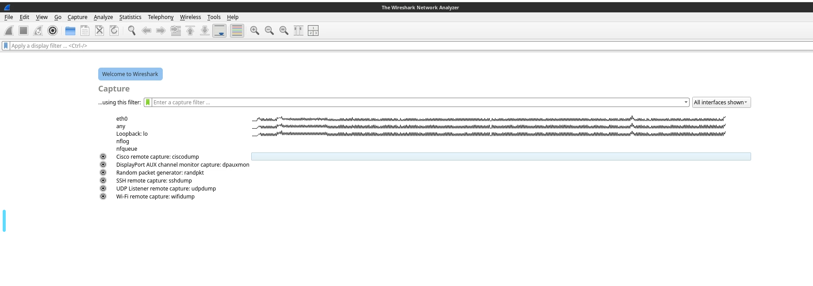
On remarque que l'installation de Kathará a fonctionné et que wireshark observe le traffic sur eth0. On utilisera Wireshark pour les exercices suivants.  


&nbsp;  
&nbsp;  
## Exercice 2 - Fixed Delay
Pour cet exercice, je me suis placé dans le répertoire `fixed-delay` puis j'ai simplement lancé `kathara lstart` pour démarrer le lab. Après avoir vérifié que tout fonctionnait avec `kathara info`, je me suis placé dans la console de pc1.
J'ai ensuite effectué le ping mentionné dans le README:  
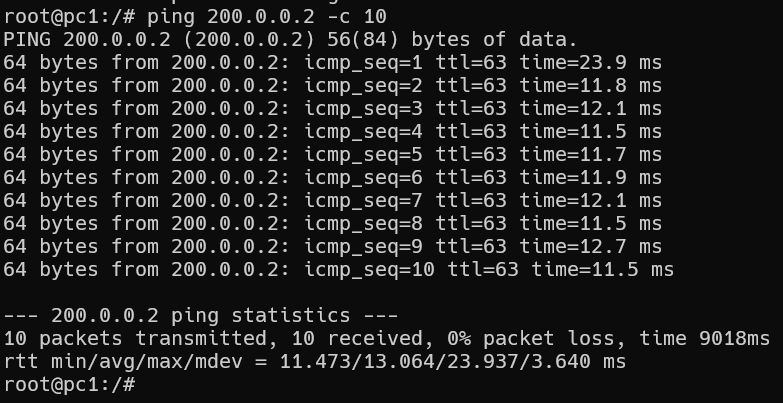

On remarque que le ping fonctionne et que le délai est bien d'environ 10ms (à part un "cold start"), comme prévu.  
Le routeur r1 est bien connecté aux deux domaines et les commandes de routing fonctionnent correctement.


&nbsp;  
&nbsp;  
## Exercice 3 - Limit Bandwidth
Pour cet exercice, je me suis placé dans le répertoire `fixed-delay` puis j'ai simplement lancé `kathara lstart` pour démarrer le lab. Après avoir vérifié que tout fonctionnait avec `kathara info`.

Sur pc2, j'ai lancé la commande `iperf3 -s` pour lancer le serveur de test de débit.  
Sur pc1, j'ai lancé la commande `iperf3 -c 200.0.0.2` pour lancer le client de test de débit.  
Voici le résultat:
- Sur pc2 (serveur):
  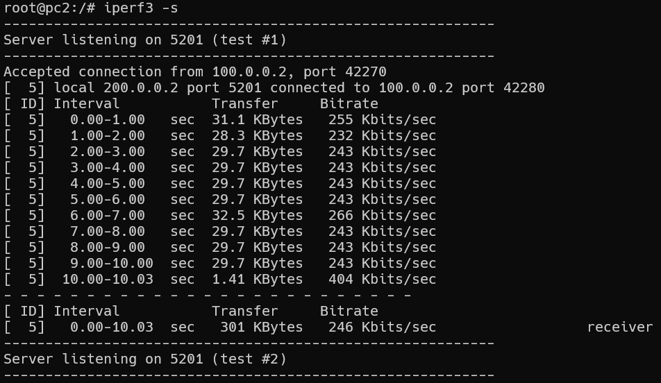
- Sur pc1 (client):
  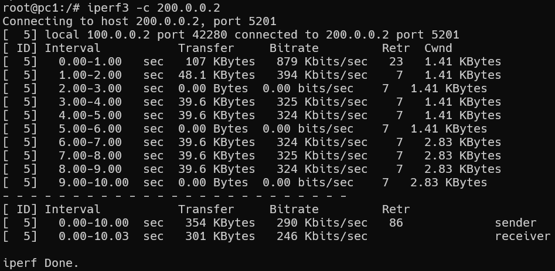

On remarque que le débit est bien limité à environ 256kbps, comme prévu. L'envoie sur pc1 n'est pas limité, mais le débit reçu sur pc2 l'est bien. Le dernier paquet est reçu avec un débit plus élevé car le test s'arrête et le buffer se vide.


&nbsp;  
&nbsp;  
## Exercice 4 - IPv4
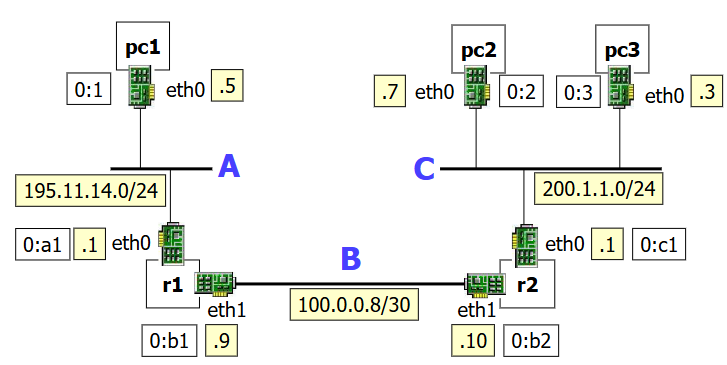

De l'[énoncé](.\main-labs\basic-topics\basic-ipv4\0130-kathara-lab_basic-ipv4.pdf), j'ai retenu les étapes suivantes pour cet exercice:  
1) Sur pc1, pc2, pc3, r1 et r2, exécutez la commande `ip address` pour vérifier les adresses IPv4 assignées aux interfaces et examinez les interfaces eth et loopback.
2) Sur pc1, pc2 et pc3 : exécutez la commande `routel` pour vérifier la présence d'une route par défaut, le préfixe de loopback.
3) Sur r1 et r2 : exécutez la commande `routel` pour vérifier la table de routage, trouver les LAN A, B, C et r1.
4) Sur pc3 :
   - inspectez le cache ARP : `arp -n` (initialement vide, le ping nécessite une résolution d'adresse qui sera stockée dans le cache ARP)
   - exécutez une commande ping vers pc2 : `ping 200.1.1.7`
   - inspectez à nouveau le cache ARP : `arp -n`
   - jetez un œil aux paquets capturés par Wireshark avec `kathara lconfig -n wireshark --add C` et sniff eth1.

    Notez que le trafic dans le même réseau ne passe pas par le routeur r2.

    Sur pc2 : `arp -n`.
    Sniff le trafic:
   - connectez le dispositif Wireshark au domaine de collision C : `kathara lconfig -n wireshark --add C`
   - ouvrez un navigateur sur la machine hôte à l'adresse `localhost:3000`
   - sniff eth1
  Trouvez les requêtes ARP sur Wireshark.

5) PC1-PC2 ping:
     - Connectez le dispositif Wireshark au domaine de collision B avec `kathara lconfig -n wireshark --add B` et sniff eth2.
     - Sur pc2, pingez pc1 : `ping 195.11.14.5`
     - Inspectez le cache ARP sur pc2 avant et après le ping : `arp -n`. L'adresse MAC de eth0 sur r2 devrait apparaître dans le cache ARP de pc2 après le ping, car le trafic IP est adressé en dehors du réseau local.
     - Sur les routeurs, le cache ARP peut également être inspecté : `arp -n`. Ils effectuent une requête ARP chaque fois qu'ils doivent envoyer des paquets IP sur un réseau Ethernet.
     - Regardez les paquets capturés par Wireshark : requêtes et réponses ARP, requêtes et réponses ICMP echo.
6) Traceroute from pc2 to pc1:
   - Connectez le dispositif Wireshark au domaine de collision C avec `kathara lconfig -n wireshark --add C` et sniff eth1.
   - Sur pc2, exécutez une commande traceroute vers pc1 : `traceroute 195.11.14.5 -z 1`. Vous verrez l'eth0 de r2, puis l'eth1 de r1, puis l'eth0 de pc1.
   - Sur Wireshark, recherchez :
     - les paquets UDP envoyés par pc2 vers pc1 avec des valeurs TTL croissantes
     - les messages ICMP Time-to-live exceeded envoyés par r2 et r1 vers pc2
     - le dernier paquet UDP envoyé par pc2 vers pc1 avec TTL=3 et la réponse ICMP echo correspondante envoyée par pc1 vers pc2
     - les requêtes ARP unicast émises par r2 et r1 pendant le dialogue
7) Exercices:
   - Vérifiez les différents messages d'erreur obtenus en essayant de pinger une destination injoignable dans le cas de :
      - destination locale
      - destination non locale
   - Quels paquets sont échangés dans le domaine de collision local dans les deux cas ?

&nbsp;  
Nous allons donc suivre ces étapes:

&nbsp;  

1) Sur pc1, pc2, pc3, r1 et r2, j'ai effectué la commande `ip address` pour vérifier les adresses IPv4 assignées aux interfaces et regarder les interfaces eth et loopback.
   - Sur pc1:
   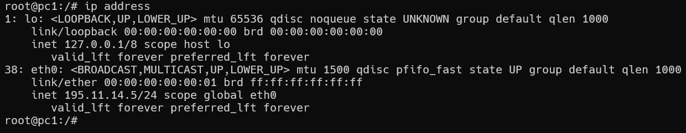
   L'adresse de eth0 est 195.11.14.5/24 et celle de loopback est 127.0.0.1/8.
   - Sur pc2:
   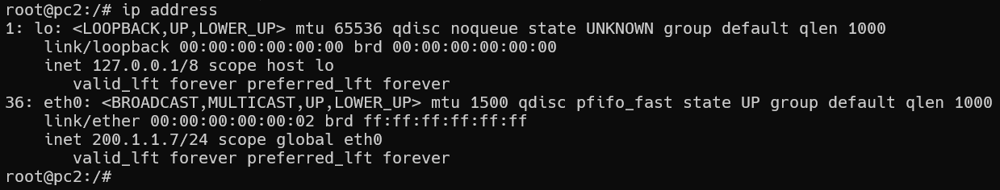
   L'adresse de eth0 est 200.1.1.7/24 et celle de loopback est 127.0.0.1/8.
   - Sur pc3:
   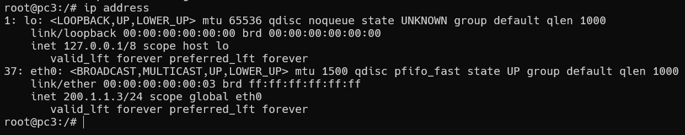
   L'adresse de eth0 est 200.1.1.3/24 et celle de loopback est 127.0.0.1/8.
   - Sur r1:
   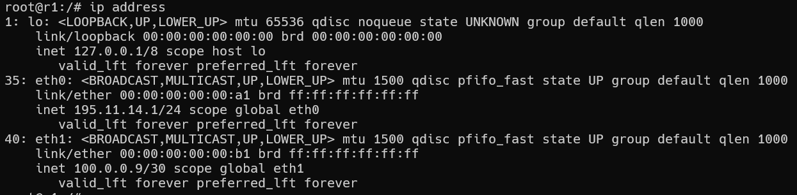
   On a 2 interfaces ethernet. L'adresse de eth0 est 195.11.14.1/24 et celle de eth1 est 100.0.0.9/30.
   - Sur r2:
   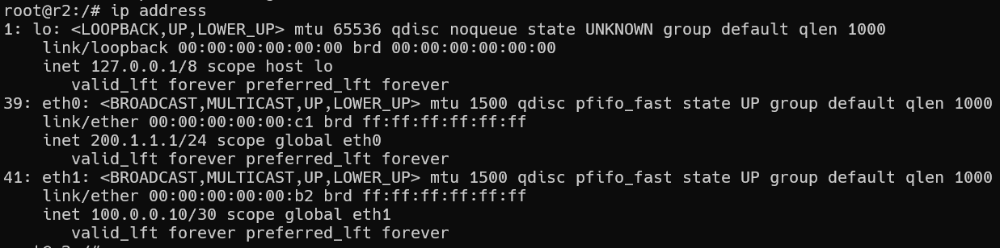
   On a 2 interfaces ethernet. L'adresse de eth0 est 200.1.1.1/24 et celle de eth1 est 100.0.0.10/30.
   On remarque que les adresses IP sont bien assignées comme prévu dans l'énoncé.

2) Sur pc1, pc2 et pc3, j'ai effectué la commande `routel` pour vérifier la présence d'une route par défaut et la préfixe de loopback.
   - Sur pc1:
   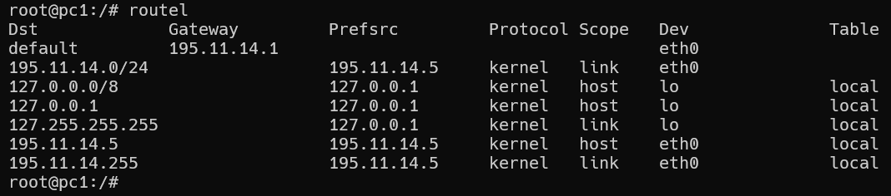
   On remarque que la routeur est r1 (195.11.14.1) qui est bien le routeur présent sur le réseau A.
    - Sur pc2:
   
   On remarque que le routeur est r2 (200.1.1.1) qui est bien le routeur présent sur le réseau C.
    - Sur pc3:
   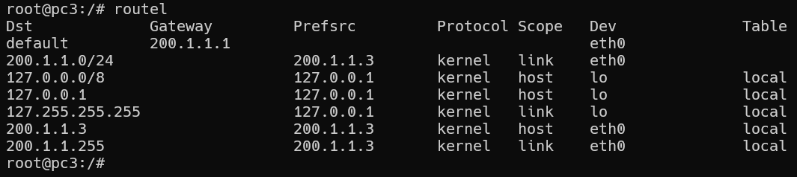
   On remarque que le routeur est r2 (200.1.1.1) qui est bien le routeur présent sur le réseau C.


3) Sur r1 et r2, j'ai effectué la commande `routel` pour vérifier la table de routage et trouver les LAN A, B, C et r1.
   - Sur r1:
   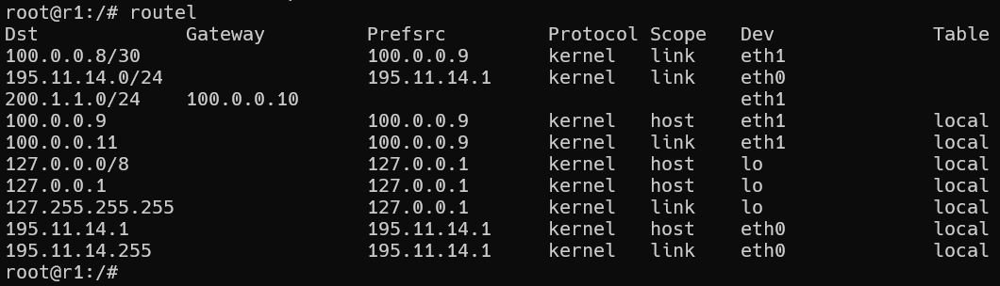
   On remarque que le réseau A est bien présent ainsi que le réseau B. Et qu'on voit le routeur r2 (100.0.0.10).
   - Sur r2:
   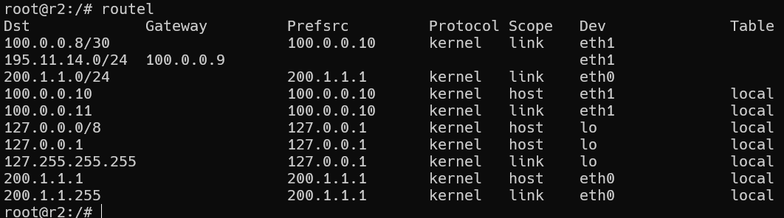
   On remarque que le réseau C est bien présent ainsi que le réseau B. Et qu'on voit le routeur r1 (100.0.0.9).

4) Sur pc3, on observe qu'initalement le cache ARP est vide avec la commande `arp -n` puis après un ping vers pc2, il contient l'adresse MAC de pc2.
  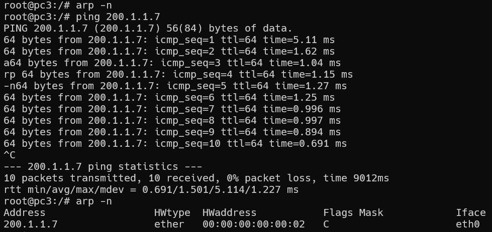
  Sur Wireshark, on observe les requêtes ARP et les réponses ARP ainsi que les paquets ICMP échangés.
  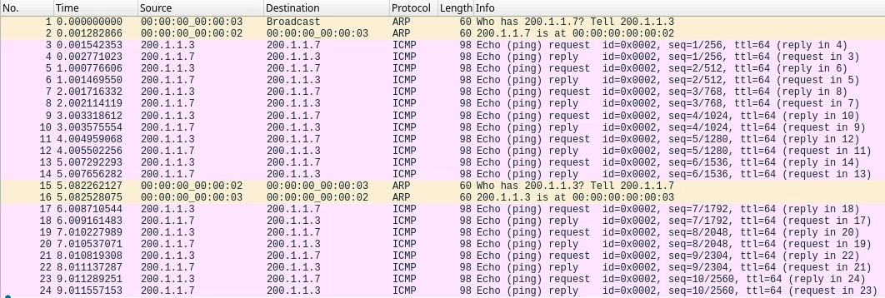
  On remarque que le trafic dans le même réseau est direct, il ne passe pas par le routeur r2. Les requêtes ARP sont en jaune et demandent l'adresse MAC de pc2.
  pc2 a aussi ajouté l'adresse MAC de pc3 dans son cache ARP.
  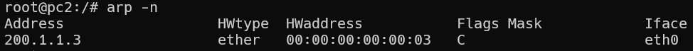

1) On remarque que le cache ARP de pc2 est initialement vide et qu'après le ping, il contient l'adresse MAC de r2 et non pas celle de pc1, car le ping passe par r2, le routeur du réseau C.
  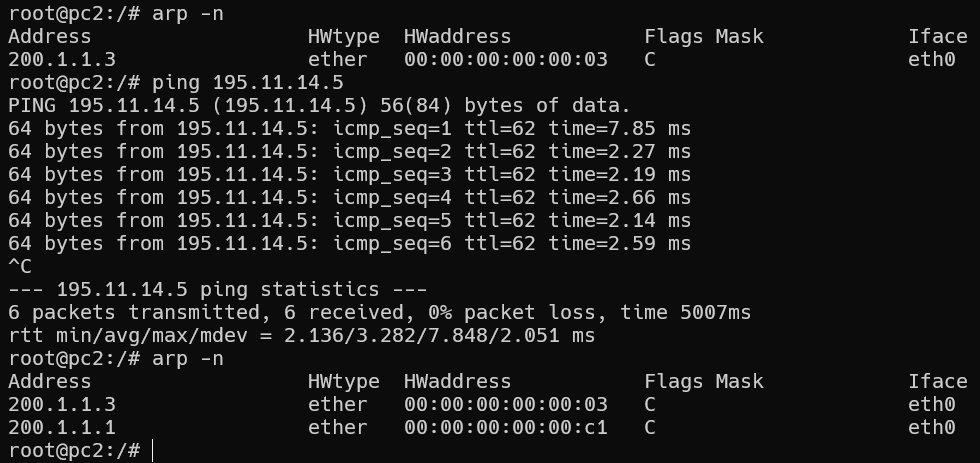
  Symétriquement, le cache ARP de pc1 est initialement vide et qu'après le ping, il contient l'adresse MAC de r1, routeur du réseau A.
  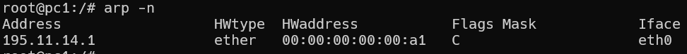
  Sur Wireshark, on observe les requêtes ARP et les réponses ARP ainsi que les paquets ICMP échangés.
  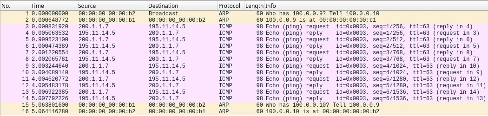
  On remarque que pc2 envoie une requête ARP pour obtenir l'adresse MAC de r2, puis envoie le paquet ICMP à r2 qui le transmet à r1, qui le transmet à pc1. pc1 répond directement à pc2 avec un paquet ICMP.  
  Au niveau des routeurs, on peut aussi remarquer que r2 a ajouté l'adresse MAC de pc2 dans son cache ARP:
  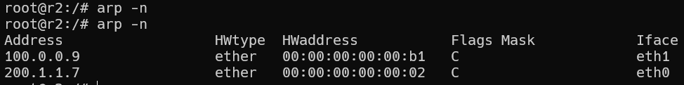
  Et que r1 a ajouté l'adresse MAC de pc1 dans son cache ARP:
  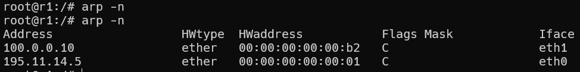


6) Sur pc2, j'ai effectué la commande `traceroute` pour vérifier le chemin emprunté par les paquets vers pc1.
  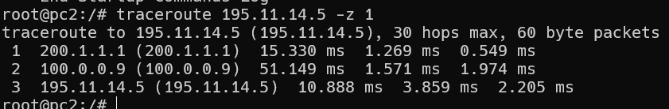
  On remarque que le paquet passe par r2 (200.1.1.1) puis par r1 (195.11.14.1) avant d'atteindre pc1 (195.11.14.2).  
  Sur Wireshark, on observe les paquets UDP envoyés par pc2 vers pc1 avec des valeurs TTL croissantes, les messages ICMP Time-to-live exceeded envoyés par r2 et r1 à pc2. On observe en jaune les requêtes ARP unicast émises par r2 et r1 durant le dialogue.
  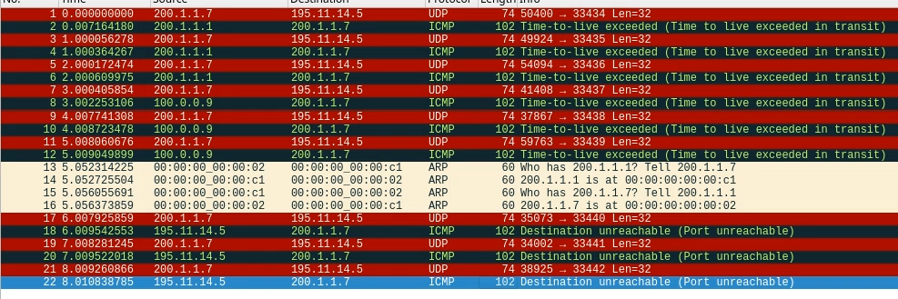
  On remarque aussi que le paquet UDP final envoyé par pc2 à pc1 a TTL=3.
  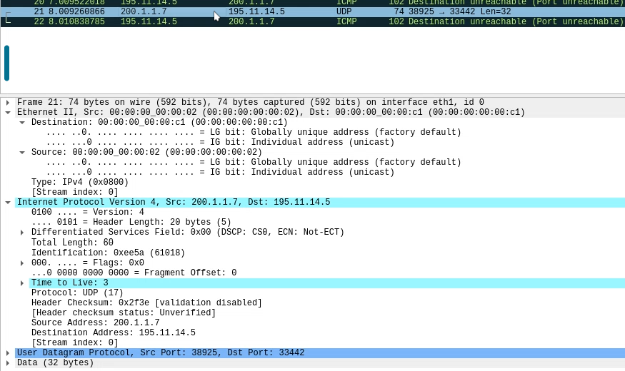


7) J'ai séparé les deux cas pour plus de clarté.
   - Pour illustrer les messages d'erreur et les paquets dans le domaine de collision local, sur pc1, j'ai pingé une adresse locale non attribuée (195.11.14.4) avec la commande `ping 195.11.14.4`.  
   Le message d'erreur est "Destination Host Unreachable":
    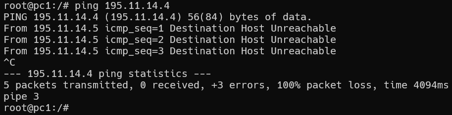
    On observe aussi sur Wireshark (connecté au domaine de collision A) des requêtes ARP Broadcast pour obtenir l'adresse MAC de l'adresse IP recherchée (on ne passe pas par le routeur car l'adresse est locale).
    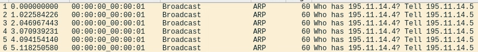

   - Pour illustrer les messages d'erreur et les paquets dans le domaine de collision non local, sur pc1, j'ai pingé une adresse non locale non attribuée (200.1.1.5) avec la commande `ping 200.1.1.5`.  
    Le message d'erreur est "Destination Host Unreachable":
    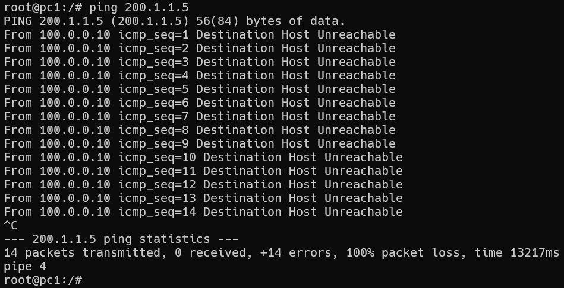
    On observe aussi sur Wireshark (connecté au domaine de collision C) une requête ARP pour obtenir l'adresse MAC associée à l'adresse IP recherchée (on passe par le routeur car l'adresse n'est pas locale et donc la requête est adressée au nom du routeur r2).
    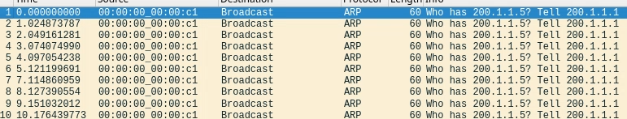
    Avec Wireshark connecté au domaine de collision A, on observe une série de requêtes ARP envoyées par pc1 pour tenter de résoudre l’adresse MAC de la destination (195.11.14.5x), suivies de paquets ICMP "Destination unreachable (Host unreachable)" générés par le routeur r1. Cela montre que le routeur tente d’acheminer le paquet, mais ne trouve pas de correspondance ARP pour la destination, et informe donc l’émetteur que l’hôte est injoignable. Les requêtes ARP restent sans réponse, ce qui confirme que l’adresse IP cible n’est pas attribuée sur le réseau.
    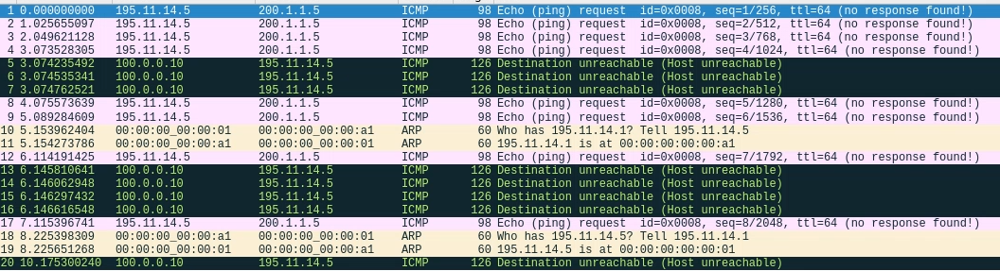


&nbsp;  
&nbsp;  
## Conclusion
Ce premier TP m'a permis de me familiariser avec l'outil Kathará et de revoir les notions de base du réseau, notamment le fonctionnement des adresses IP, des tables de routage, du protocole ARP et des messages ICMP. J'ai pu observer concrètement comment les paquets sont acheminés dans un réseau avec plusieurs sous-réseaux et routeurs, ainsi que les mécanismes de résolution d'adresse et de gestion des erreurs. L'utilisation de Wireshark pour capturer et analyser le trafic réseau a été intéréssante de par sa simplicité mais aussi car j'ai pu visualiser en temps réel les échanges sur les différents réseaux.