# TP2
**Mathieu Waharte** - 06/11/2025

<!--! TODO Mercredi prochain 23:59 -->

&nbsp;  
&nbsp;  
## Exercice 1 - Web Server
On se place dans le répertoire `web-server` et on lance le lab avec `kathara lstart`.  
On peut vérifier que apache2 est bien lancé sur le server avec `systemctl start apache2` et on a:  
  

On va se connecter au serveur depuis le client avec `links http://10.0.0.1`. La page HTML s'affiche:
  

Ensuite on peut regarder les logs d'accès avec `tail -f /var/log/apache2/access.log` sur le server et les logs d'erreur avec `tail -f /var/log/apache2/error.log`.
  

On peut lister les modules apache avec `apache2 -l` et activer un module avec `a2enmod rewrite` par exemple puis en redémarrant:  


Pour expérimenter avec la configuration, on crée un fichier `.htaccess` dans `/var/www/html` avec le contenu suivant:  
```
DirectoryIndex custom_file.html
```
Pour qu'il soit bien pris en compte, on doit modifier la configuration à `/etc/apache2/apache2.conf` pour `AllowOverride All`.  
Et on change le nom du fichier `index.html` en `custom_file.html` avant de redémarrer le serveur.

L'accès à la page web depuis le client fonctionne toujours:


En revanche si l'on remet le nom du fichier en `index.html` sans modifier le `.htaccess`, on devrait obtenir une erreur 403 Forbidden mais le serveur nous prévient juste et donne le dossier à la place:


&nbsp;  
&nbsp;  
## Exercice 2 - Load-balancer
La topologie de ce TP consiste en 2 clients, 3 servers et un load-balancer entre les clients et les serveurs.  
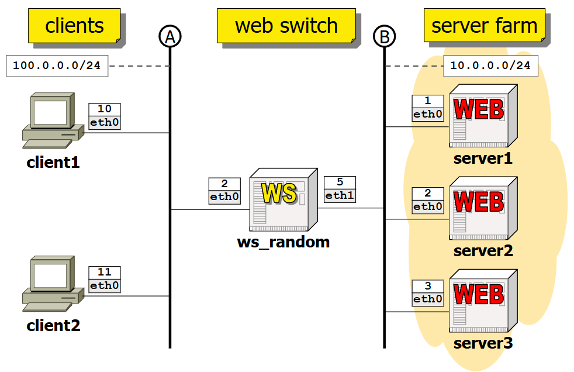

On va se connecter au load-balancer sur un client avec `links http://10.0.0.2`. Le load-balancer redirige vers un des serveurs. Pour retenter, on peut relancer une connexion et le load-balancer redirige vers un autre serveur ou le même. Cela permet de répartir la charge entre les serveurs, normalement leur comportement est identique. On peut donc observer les 3 servers avec la même commande:
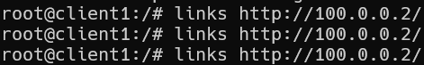
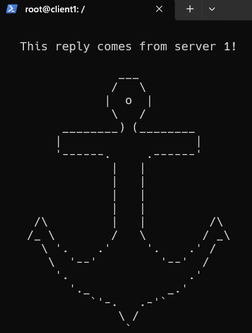
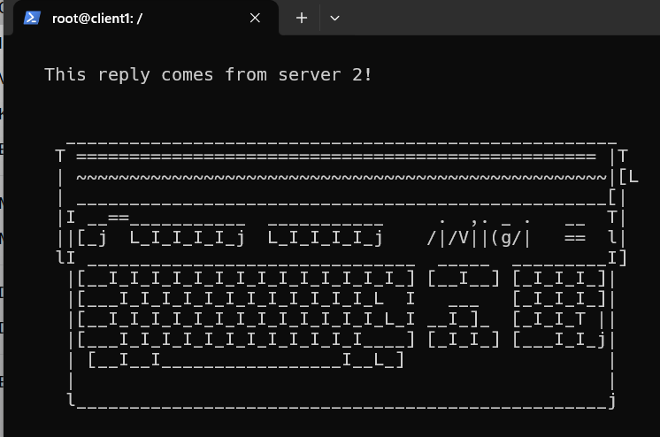
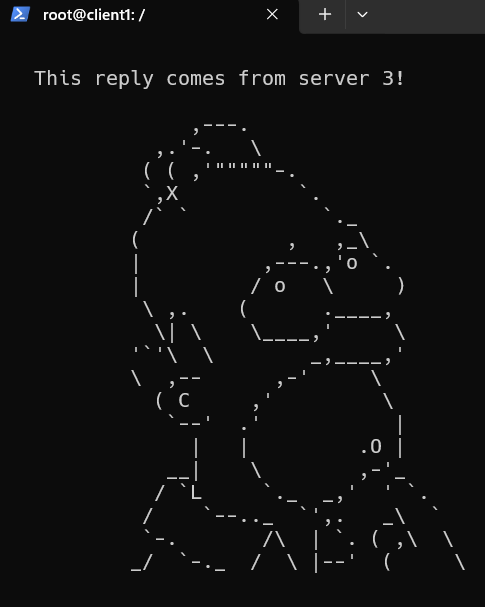

On voit bien qu'on a obtenu des réponses de chacun des serveurs.  
Un autre algorithme de répartition de charge pourrait chercher à nous rediriger autant que possible vers le même serveur quand on est le même client pour réduire la latence de connexion, ne changeant qu'en cas de besoin.  


&nbsp;  
&nbsp;  
## Exercice 3 - DNS
### Explication de la topologie et configuration
La topologie de ce TP met toutes les machines sur le même réseau. On y retrouve un DNS central (serveur racine), un par domaine 'net' et 'it' (dsnet et dsit, serveurs autoritatifs), et un par sous-domaine respectif 'uniroma3' et 'startup' (dsuni et dsstart, serveurs autoritatifs) ainsi que 2 pc (un par sous-domaine) et 2 hôtes de services (localuni et localstart):  
  
La hiérarchie des domaines DNS est la suivante:  
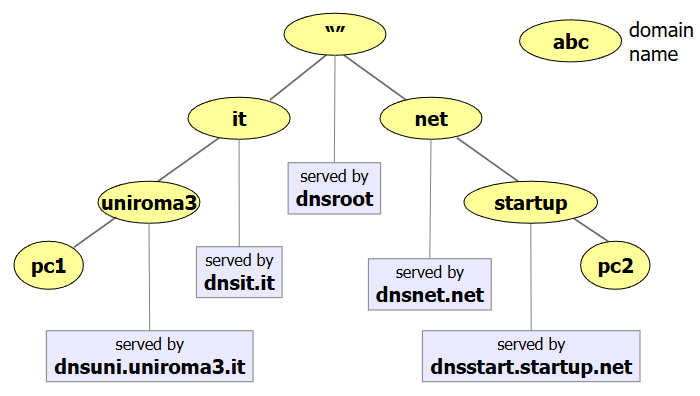  

On peut vérifier la configuration sur le pc1:  
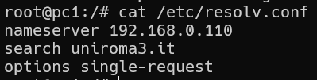
Et sur le pc2:  
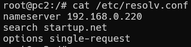
On voit qu'ils sont bien sur les bons sous-domaines et qu'ils pointent leur name server vers les hôtes de services respectifs.  

La configuration des name servers récupère les noms pour les zones des serveurs autoritatifs. Par exemple sur le dsuni:  
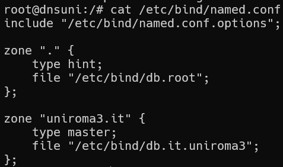
Une ressource sur le name server pour le serveur racine ressemble à ça:
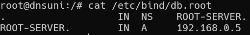
Pour la zone dont il est autoritatif, le dsuni a des enregistrements pour les sous-domaines et les hôtes locaux ainsi que la configuration du serveur lui-même:
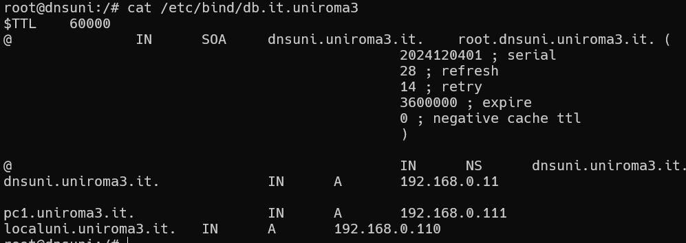


Au niveau supérieur (dsit), on a des enregistrements de quels serveurs sont autoritatifs pour les sous-domaines et leurs IP (dont dsit lui-même):  
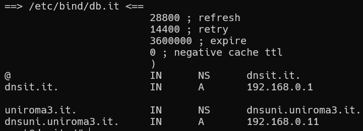


&nbsp;  
### Explication du trafic
On utilise `kathara lconfig -n wireshark --add A` pour capturer le trafic DNS sur le réseau.  

&nbsp;  
**ping de pc1 à pc2:** `ping -n pc2.startup.net`
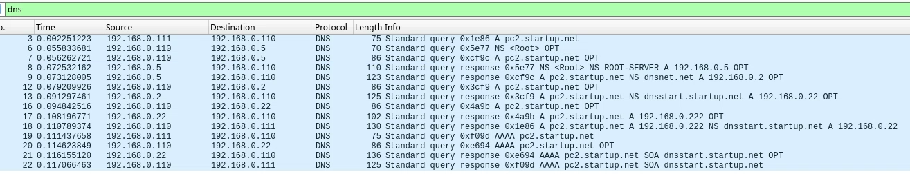
Les paquets DNS capturés montrent le trajet suivant:
1) pc1 demande à localuni l'IP de pc2.startup.net
2) localuni demande à dsuni l'IP du dsnroot
3) dsuni renvoie l'adresse IP du dsnroot
4) localuni demande à dsnroot le serveur autoritatif pour .net
5) dsnroot renvoie l'adresse IP de dsnet
6) localuni demande à dsnet le serveur autoritatif pour startup.net
7) dsnet renvoie l'adresse IP de dsstart
8) localuni demande à dsstart l'IP de pc2.startup.net
9) dsstart renvoie l'IP de pc2.startup.net à localuni
10) localuni renvoie l'IPv4 de pc2.startup.net à pc1
11) pc1 demande maintenant à localuni l'IPv6 (AAAA) de pc2.startup.net
12) localuni demande à dsstart l'IPv6 de pc2.startup.net (il sait déjà l'IP du serveur autoritatif)
13) dsstart renvoie l'IPv6 de pc2.startup.net à localuni
14) localuni renvoie l'IPv6 de pc2.startup.net à pc1
15) pc1 peut maintenant pinger pc2.startup.net avec son IPv6

Voici un schéma récapitulatif des échanges:
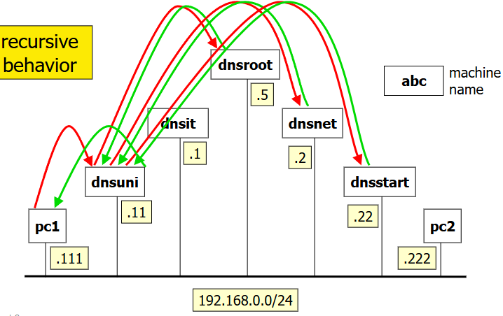

&nbsp;  
**répétition du ping:**
Répéter la commande de ping montre que les réponses sont plus rapides car les résolutions DNS sont en cache sur localuni, il y a moins d'échanges:
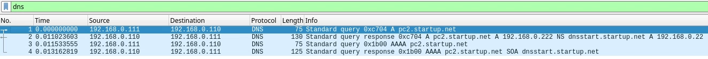
On peut supprimer le cache DNS avec `rndc flush` sur l'hôte de service.


&nbsp;  
**ping d'une cible absente:** `ping pluto.startup.net`
Résultat: 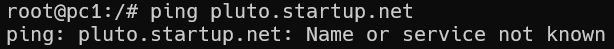

Le trafic DNS capturé montre que la résolution échoue car pluto.startup.net n'existe pas:
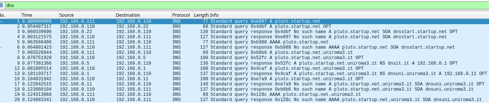
Le parcours est identique à celui du ping précédent jusqu'à l'étape 8 où dsstart ne trouve pas d'enregistrement pour pluto.startup.net et renvoie une erreur de type NXDOMAIN (Non-Existent Domain) à localuni, qui la renvoie à pc1. On n'a pas les mêmes requêtes car on n'a pas vidé le cache DNS entre les pings.


&nbsp;  
**Requête avancée:**
`dig pc2.startup.net` sur pc1:
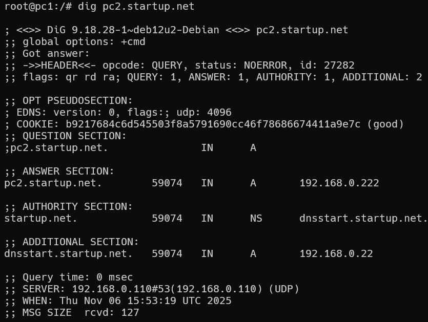
Cela montre l'enregistrement A (IPv4) de pc2.startup.net et des informations sur la requête comme les serveurs d'autorité ainsi que leurs détails comme le temps de conservation que pc1 a conservé du ping précédent.  


&nbsp;  
**Requête itérative:**
`dig +noquestion +noadditional +norecurse pc2.startup.net` sur pc1:  
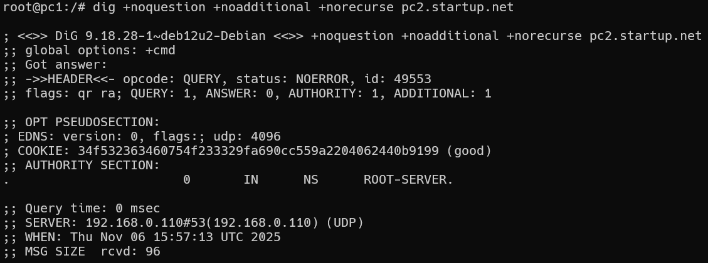
On obtient le serveur d'autorité à contacter pour obtenir les informations souhaités.  
Par exemple, si on contacte dnsroot (avec @192.168.0.5), on obtient le serveur autoritatif pour .net où quand on contacte dsnet (avec @192.168.0.2) on obtient le serveur autoritatif pour startup.net et si l'on contacte dsstart, on obtient l'adresse de pc2.startup.net. On vient de faire le chemin effectué par le ping manuellement.  