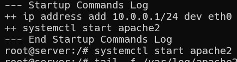
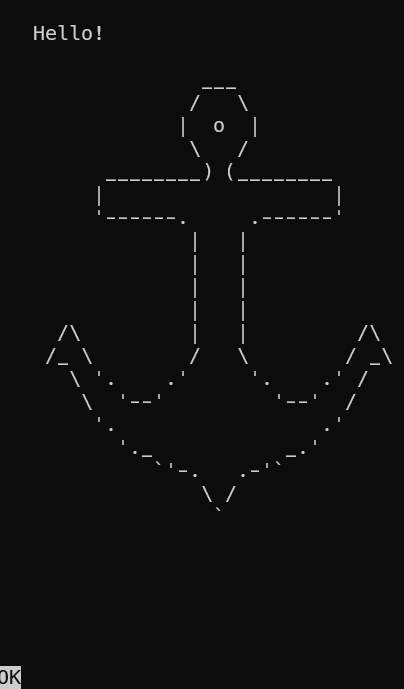
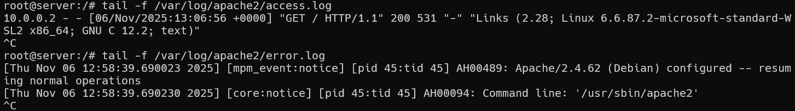
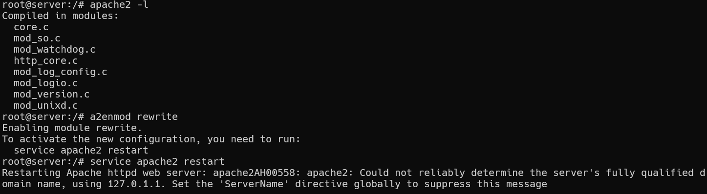
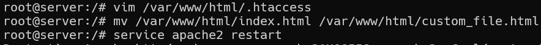
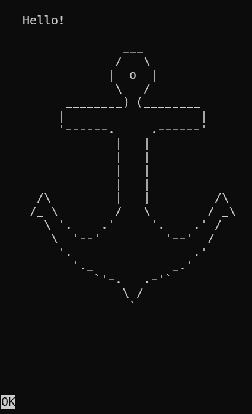
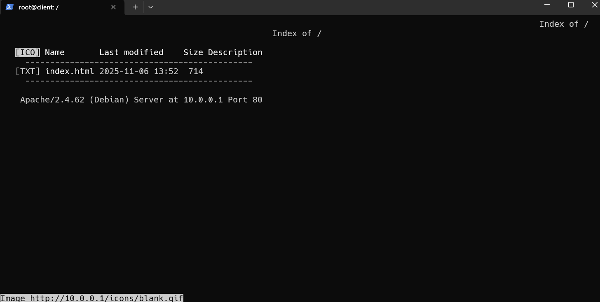

# TP2
**Mathieu Waharte** - 06/11/2025

<!--! TODO Mercredi prochain 23:59 -->

&nbsp;  
&nbsp;  
## Exercice 1 - Web Server
On se place dans le répertoire `web-server` et on lance le lab avec `kathara lstart`.  
On peut vérifier que apache2 est bien lancé sur le server avec `systemctl start apache2` et on a:  
  

On va se connecter au serveur depuis le client avec `links http://10.0.0.1`. La page HTML s'affiche:
  

Ensuite on peut regarder les logs d'accès avec `tail -f /var/log/apache2/access.log` sur le server et les logs d'erreur avec `tail -f /var/log/apache2/error.log`.
  

On peut lister les modules apache avec `apache2 -l` et activer un module avec `a2enmod rewrite` par exemple puis en redémarrant:  



Pour expérimenter avec la configuration, on crée un fichier `.htaccess` dans `/var/www/html` avec le contenu suivant:  
```
DirectoryIndex custom_file.html
```
Pour qu'il soit bien pris en compte, on doit modifier la configuration à `/etc/apache2/apache2.conf` pour `AllowOverride All`.  
Et on change le nom du fichier `index.html` en `custom_file.html` avant de redémarrer le serveur.

L'accès à la page web depuis le client fonctionne toujours:


En revanche si l'on remet le nom du fichier en `index.html` sans modifier le `.htaccess`, on devrait obtienir une erreur 403 Forbidden mais le serveur nous préviens juste et donne le dossier à la place:



&nbsp;  
&nbsp;  
## Exercice 2 - Load-balancer


&nbsp;  
&nbsp;  
## Exercice 3 - DNS