# TP1
**Mathieu WAHARTE - APP5**

&nbsp;  
## Partie 1 : Algorithmes de hachage


&nbsp;  

1) 
    **TODO**
    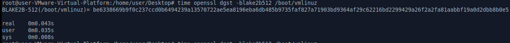

    

    

&nbsp;  

2) 
    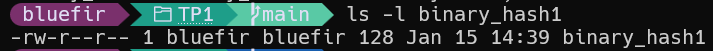 
    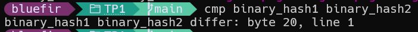
    **TODO**

&nbsp;  

3) La première différence apparait à l'octet 20.
**TODO**

&nbsp;  

4) Les deux blocs sont différents mais leur clés md5 sont identiques. Cela signifie qu'il y a eu une collision de la fonction de hachage md5.  
  La valeur de collision est : `79054025255fb1a26e4bc422aef54eb4`.  
  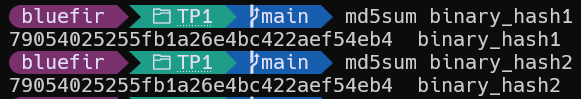

&nbsp;  

5) La concatenation des deux fichiers donne le même résultat que la concaténation dans l'autre ordre.  
    On peut le démontrer avec la commande suivante :  
    - `cat binary_hash1 binary_hash2 | md5sum` et `cat binary_hash2 binary_hash2 | md5sum` sont identiques :   
      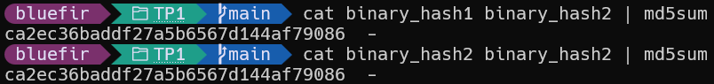

    - Et inversement : `cat binary_hash2 binary_hash1 | md5sum` et `cat binary_hash1 binary_hash1 | md5sum` sont identiques :  
      

    &nbsp;  
    On peut le prouver mathématiquement en utilisant les propriétés de l'opération XOR utilisée dans le calcul des fonctions de hachage : $H(M_1 || M_2) = H(M_1) \oplus H(M_2)$ (avec $||$ la concatenation et $\oplus$ l'opération XOR). Cela implique que seulement l'élément final importe et pas l'ordre des messages intermédiaires (mais ils doivent tous avoir le même hash).


&nbsp;  
&nbsp;  
## Partie 2 : Chiffrement symétrique
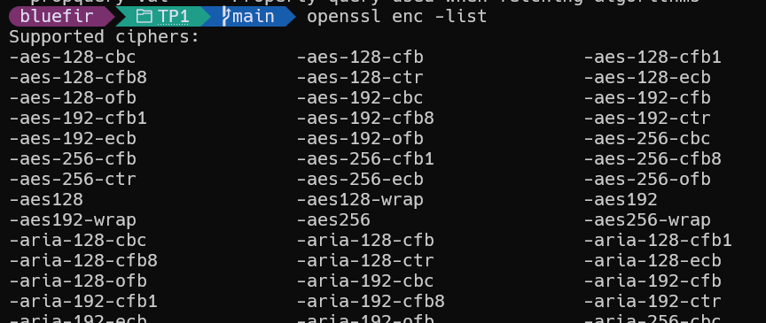
**TODO**

&nbsp;  

6) En faisant `openssl enc –aes-256-cbc –salt -iter 10 -p  –in /etc/passwd –out passwd.c` pour `password123` on obtient successivement :  
  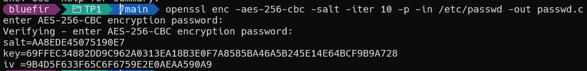
  et
  
  &nbsp;  
  On remarque que les valeurs de salt et key sont différentes. En effet, la valeur de salt est générée aléatoirement à chaque exécution de la commande. La clé est dérivée du mot de passe et du salt, donc elle change aussi.

&nbsp;  

7) Comme on s'en doutait, en utilisant `-nosalt` on obtient la même valeur de salt et key à chaque exécution de la commande avec le même mot de passe (ici `password123`) :  
  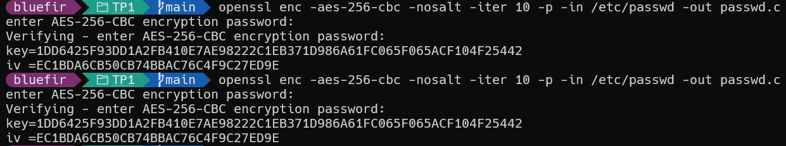

&nbsp;  

8) On utilise `openssl enc -des-ecb -nosalt -provider legacy -provider default -iter 10 -p -in f1 -out f1.c` pour chiffrer le fichier f1 avec le mot de passe `mdp` et de même pour f2 :  
    
    
    On obtient la même clé pour les deux.  

    &nbsp;  
    Maintenant comparons les fichiers chiffrés en hexadécimal :
    
    

    On remarque une permutation des blocs entre les deux fichiers chiffrés (les blocs en roses, vert et bleus sont identiques). En effet, le mode ECB chiffre chaque bloc indépendamment, donc si deux blocs en clair sont identiques, ils seront chiffrés de la même manière. Comme les fichiers f1 et f2 contiennent les mêmes blocs mais dans un ordre différent, les blocs chiffrés apparaissent dans un ordre différent dans les fichiers chiffrés.
    Cela peut révéler des motifs dans les données chiffrées, ce qui est une faiblesse de ce mode de chiffrement.  

&nbsp;  

9) Une explication pour le choix des options de chiffrement est la sécurité. Le mode ECB n'est pas recommandé pour chiffrer des données sensibles car il ne fournit pas une sécurité suffisante contre certaines attaques. Il existe d'autres modes de chiffrement plus sûrs, comme le mode CBC (Cipher Block Chaining) ou GCM (Galois/Counter Mode), qui introduisent de l'aléatoire et de la dépendance entre les blocs pour renforcer la sécurité.  
L'utilisation du salage et d'un nombre d'itérations permettent d'augmenter la sécurité du chiffrement en rendant plus difficile les attaques par force brute ou par dictionnaire. Le salage ajoute une valeur aléatoire au mot de passe avant le dériver la clé de chiffrement, ce qui empêche l'utilisation de tables arc-en-ciel pour casser les mots de passe. Le nombre d'itérations augmente le temps nécessaire pour dériver la clé à partir du mot de passe, ce qui rend les attaques par force brute plus coûteuses en termes de temps et de ressources.  
**TODO**


&nbsp;  
&nbsp;  
## Partie 3 : Génération de clé RSA
10) On peut générer une paire de clé RSA avec la commande `openssl genrsa -out private_f.pem 1024` puis extraire la clé publique avec `openssl rsa -in private_f.pem -pubout -out public_f.pem` avant de l'afficher (avec `openssl rsa -in private_f.pem -text -noout`) :
  
  &nbsp;  
  On peut aussi afficher la clé publique avec `openssl rsa -in public_f.pem -pubin -text -noout` :
  

&nbsp;  

11)  Les nombres premiers sont de taille 512 bits car la taille de la clé RSA est de 1024 bits et que la clé RSA est le produit de deux nombres premiers de taille égale.  
  On chiffre la clé avec DES3 en utilisant la commande `openssl rsa -in private_f.pem -des3 -out private_f_des3.pem`:
  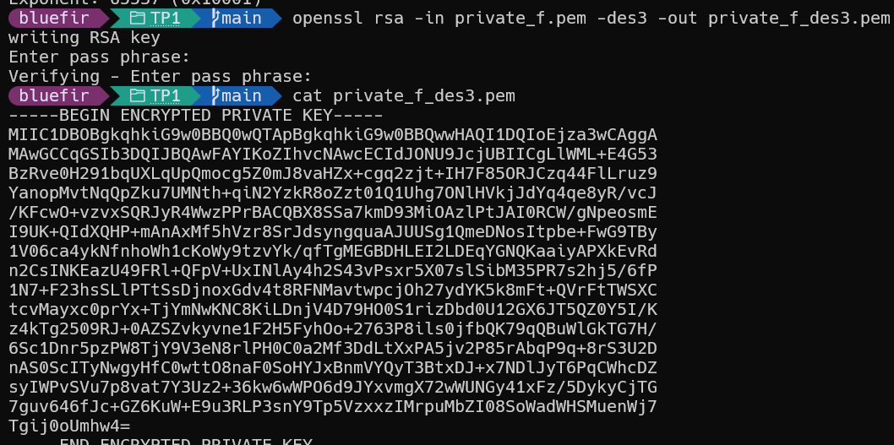  
  &nbsp;  
  On a déjà séparé la clé publique dans le fichier `public_f.pem` à la question précédente.    
  &nbsp;  
  Le but de chiffrer la clé privée avec DES3 est de protéger la clé privée contre les accès non autorisés. Si la clé privée est stockée en clair, toute personne ayant accès au fichier peut l'utiliser pour déchiffrer les messages ou pour signer des documents. En chiffrant la clé privée avec un mot de passe, on ajoute une couche de sécurité supplémentaire, car même si quelqu'un accède au fichier, il ne pourra pas utiliser la clé privée sans connaître le mot de passe.  


&nbsp;  
&nbsp;  
## Partie 4 : Chiffrement asymétrique
On va chiffrer 2 fichiers avec la clé publique générée à la question précedente avec `openssl rsautl –pubin -inkey public_f.pem –encrypt  -oaep –out secret1` et `openssl rsautl –pubin -inkey public_f.pem –encrypt -oaep –out secret2`:


&nbsp;  

12)  La taille du fichier chiffré est de 128 octets (1024 bits) car la taille du bloc chiffré avec RSA est égale à la taille de la clé RSA. Par contre si le message à chiffrer est plus grand que la taille de la clé, `rsault` ne pourra pas le chiffrer.  

&nbsp;  

13) Les fichiers sont différents car le chiffrement RSA avec OAEP utilise un padding aléatoire, ce qui signifie que même si le même message est chiffré plusieurs fois avec la même clé publique, les résultats seront différents à chaque fois. Cela améliore la sécurité du chiffrement en empêchant les attaques par analyse de fréquence ou par comparaison de messages chiffrés.   
    On vérifie que les fichiers chiffrés sont différents avec `cmp secret1 secret2`:  
    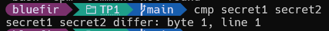

    &nbsp;  
    De plus, en observant leur contenu en hexadécimal, on peut voir que les octets sont différents et qu'il n'y a pas de motifs alors que le message d'origine est similaire:  
    
    

    &nbsp;  
    On vérifie le déchiffrement avec `openssl rsautl -inkey private_f.pem -decrypt -oaep -in secret1`:  
    
    Et pour le second fichier :
    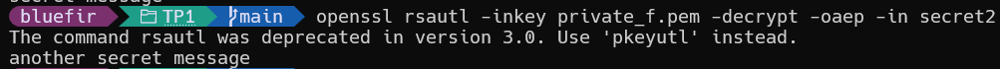

&nbsp;  

14) La commande demande un mot de passe car la clé privée a été chiffrée avec un mot de passe à la question 11. Pour pouvoir utiliser la clé privée pour déchiffrer les messages, il faut d'abord la déchiffrer en fournissant le mot de passe correct. Cela garantit que seule une personne autorisée ayant connaissance du mot de passe peut accéder à la clé privée et l'utiliser pour déchiffrer les messages.


&nbsp;  
&nbsp;  
## Partie 5 : Signature
On signe le fichier /etc/passwd avec la clé privée générée précédemment avec la commande `openssl dgst -sha256 -out passwd.sig -sign private_f.pem /etc/passwd` :  


On peut vérfier la signature avec la clé publique avec la commande `openssl dgst -sha256 -signature passwd.sig -verify public_f.pem /etc/passwd` :  


&nbsp;  

15) La première commande demande un mot de passe car elle utilise la clé privée qui a été chiffrée avec un mot de passe à la question 11. Pour pouvoir utiliser la clé privée pour signer le fichier, il faut d'abord la déchiffrer en fournissant le mot de passe correct. Cela garantit que seule une personne autorisée ayant connaissance du mot de passe peut accéder à la clé privée et l'utiliser pour signer des fichiers. La deuxième commande ne demande pas de mot de passe car elle utilise la clé publique, qui n'est pas chiffrée et peut être utilisée librement pour vérifier les signatures.  

&nbsp;  

16) Si on modifie le fichier /etc/passwd et qu'on vérfie à nouveau la signature, on obtient le message d'erreur suivant :    
    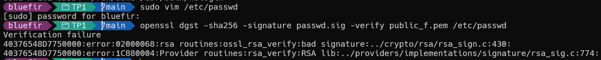
    Le message indique que la signature n'est pas valide pour le fichier modifié. En effet, la signature est calculée à partir du contenu du fichier original, donc si le fichier est modifié, la signature ne correspond plus au nouveau contenu. Cela montre l'intégrité du fichier, car toute modification du fichier entraîne une invalidation de la signature.

&nbsp;  

17) Non, on ne peut pas savoir ce qui a été modifié en utilisant uniquement la signature. La signature permet seulement de vérifier si le fichier a été modifié ou non, mais elle ne fournit pas d'informations sur les modifications spécifiques apportées au fichier. Pour savoir ce qui a été modifié, il faudrait comparer le fichier original avec le fichier modifié en utilisant des outils de comparaison de fichiers, comme `diff` sous Linux.  


&nbsp;  
&nbsp;  
## Partie 6 : Echange de fichiers chiffrés et signés
18) Supposons que le fichier à transférer est `monfichier.txt` depuis `source/` vers `destination/`. Voici les commandes utilisées pour préparer le fichier à envoyer et pour le recevoir :  
      1. Préparation des répertoires et des clés :
         ```bash
         mkdir source destination
         # Copier les clés publiques nécessaires dans chaque répertoire
         cp public_f.pem destination/   # Clé publique du destinataire pour chiffrer
         cp public_f.pem source/       # Clé publique de l'expéditeur pour vérification de signature
         ```

          Ces commande crée les répertoires `source` et `destination` pour organiser les fichiers de l'expéditeur et du destinataire.  
          Puis copie la clé publique du destinataire dans le répertoire `destination` (permet à l'expéditeur de chiffrer pour le destinataire).  
          Et enfin copie la clé publique de l'expéditeur dans `source` (utile pour que le destinataire puisse vérifier les signatures de l'expéditeur).  
      2. L'expéditeur chiffre le fichier avec la clé publique du destinataire : 
         ```bash
         openssl rsautl -encrypt -oaep -pubin -inkey destination/public_f.pem -in source/monfichier.txt -out source/monfichier.txt.enc
         ```

          Cette commande chiffre `monfichier.txt` avec la clé publique du destinataire en utilisant le padding OAEP, et produit `monfichier.txt.enc`.  
      3. L'expéditeur signe le fichier original avec la clé privée de l'expéditeur (garantit son authenticité et son intégrité) : 
         ```bash
         openssl dgst -sha256 -sign source/private_f.pem -out source/monfichier.txt.sig source/monfichier.txt
         ```

          Cette commande calcule le haché SHA-256 du fichier et signe ce haché avec la clé privée de l'expéditeur, écrivant la signature dans `monfichier.txt.sig`.  
      4. On Transfère le fichier chiffré et la signature : 
         ```bash
         cp source/monfichier.txt.enc destination/
         cp source/monfichier.txt.sig destination/
         ```

          Ces commandes transfèrent respectivement le fichier chiffré et la signature vers le répertoire du destinataire.  
      5. Le destinataire déchiffre le fichier avec sa clé privée : 
         ```bash
         openssl rsautl -decrypt -oaep -inkey destination/private_f.pem -in destination/monfichier.txt.enc -out destination/monfichier.txt
         ```

          Cette commande utilise la clé privée du destinataire pour déchiffrer `monfichier.txt.enc` et restaurer le fichier original.  


&nbsp;  
&nbsp;  

19) Les commandes utilisées pour signer le fichier, envoyer la signature
puis vérifier cette signature sont les suivantes :
     1. L'expéditeur signe le fichier avec sa clé privée :
        ```bash
        openssl dgst -sha256 -sign source/private_f.pem -out source/monfichier.txt.sig source/monfichier.txt
        ```

      Cette commande calcule le digest SHA-256 de `monfichier.txt` et signe ce digest avec la clé privée `source/private_f.pem`, produisant la signature `monfichier.txt.sig`.  

     2. On transférer la signature et la clé publique de l'expéditeur :
        ```bash
        cp source/monfichier.txt.sig destination/
        cp source/public_f.pem destination/
        ```

         Ces commandes transfèrent la signature et la clé publique de l'expéditeur vers le destinataire afin que celui-ci puisse vérifier la signature.  
     3. Le destinaire vérifier la signature avec la clé publique de l'expéditeur :
        ```bash
        openssl dgst -sha256 -verify destination/public_f.pem -signature destination/monfichier.txt.sig destination/monfichier.txt
        ```
         La signature est valide si la commande retourne "Verified OK". Cela signifie que le fichier n'a pas été modifié depuis qu'il a été signé par l'expéditeur, garantissant ainsi son intégrité et son authenticité.

         Cette commande vérifie la signature en recalculant le haché SHA-256 du fichier reçu et en utilisant la clé publique fournie pour valider que la signature provient bien de la clé privée associée.  