# TP1 - Sécurité et Confidentialité
**Mathieu WAHARTE - APP5**

&nbsp;  
## Partie 1 : Algorithmes de hachage
On peut obtenir la liste des algorithmes supportés par openssl avec la commande `openssl dgst -list` :
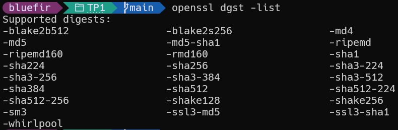

&nbsp;  

1) On va comparer les temps de calcul des fonctions de hachage blake2b512 et SHA3-256 sur le fichier `/boot/vmlinuz` en utilisant la commande `time openssl dgst [-blake2b512 | -sha3-256] /boot/vmlinuz` :
    Le temps pour blake2b512 est :  
    

    Le temps pour sha3-256 est :
    

    Le plus rapide est blake2b512 avec un temps de 0.043s contre 0.107s pour sha3-256. L'ordre de grandeur est de la dizaine de millisecondes pour blake2b512 et de la centaine de millisecondes pour sha3-256.

&nbsp;  


2) Nous allons vérifier la détection du changement du fichier source. Pour cela, nous allons copier le fichier `/boot/vmlinuz` dans un nouveau fichier `modif`, puis ajouter une ligne à la fin de ce fichier. Ensuite, nous allons recalculer le hash du fichier modifié et le comparer avec le hash du fichier original en utilisant le même algorithme.  
    Voici les commandes utilisées :
    ```bash
    cp /boot/vmlinuz modif
    echo 1>>modif
    openssl dgst -blake2b512 /boot/vmlinuz > original_hash
    openssl dgst -blake2b512 modif > modified_hash
    diff original_hash modified_hash
    ```
    Après avoir exécuté ces commandes, nous constatons que les deux hash sont différents (je les aies exécutés sur un autre fichier car WSL n'as pas /boot/vmlinuz).  
    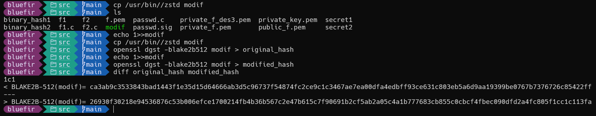
    On peut conclure que même un petit changement dans le fichier source (comme l'ajout d'une ligne) entraîne un changement significatif dans le hash calculé. Cela démontre l'efficacité de la fonction de hachage pour détecter les modifications dans les données.


&nbsp;  


3) Vérifions les deux représentations hexadécimales.  
    Leur taille est bien de 128 octets :
    

    Et les deux représentations sont bien différentes :  
     
    Le rang de la première différence est 20.


&nbsp;  

4) Les deux blocs sont différents mais leur clés md5 sont identiques. Cela signifie qu'il y a eu une collision de la fonction de hachage md5.  
  
  La valeur de collision est : `79054025255fb1a26e4bc422aef54eb4`.  

&nbsp;  

5) On constate que l'on peut générer de nouvelles collisions en concaténant un même suffixe aux deux blocs collisionnaires :  
    - Commande 1 : `cat binary_hash1 binary_hash1 | md5sum`
    - Commande 2 : `cat binary_hash2 binary_hash1 | md5sum`
    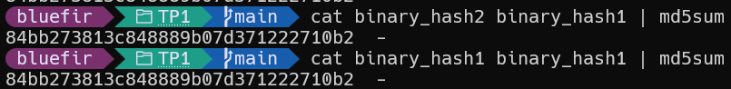
    &nbsp;  
    En changeant le suffixe :  
    - Commande 1 : `cat binary_hash1 binary_hash2 | md5sum`
    - Commande 2 : `cat binary_hash2 binary_hash2 | md5sum`
    

    &nbsp;  
    Les résultats des 2 commandes sont identiques par suffixe. On a donc bien généré de nouvelles collisions en ajoutant un suffixe commun aux deux blocs initiaux.    
    &nbsp;  
    En cherchant, on trouve que MD5 est une fonction itérative qui maintient un état interne mis à jour bloc par bloc. Si deux blocs distincts (ici `binary_hash1` et `binary_hash2`) laissent l'algorithme dans le même état interne après leur traitement (c'est la collision observée), alors tout suffixe commun ajouté ensuite sera traité à partir du même état et produira le même haché final. Ce comportement n'est pas dû à une propriété commutative (l'ordre des blocs compte en général), mais au fait que l'état interne est identique avant le traitement du suffixe.


&nbsp;  
&nbsp;  
## Partie 2 : Chiffrement symétrique
On peut obtenir la liste des algorithmes de chiffrement symétrique supportés par openssl avec la commande `openssl enc -list` :


&nbsp;  

6) En faisant `openssl enc -aes-256-cbc -salt -iter 10 -p  -in /etc/passwd -out passwd.c` pour `password123` on obtient successivement :  
  
  et
  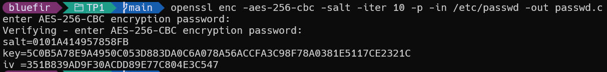
  &nbsp;  
  On remarque que les valeurs de salt et key sont différentes. En effet, la valeur de salt est générée aléatoirement à chaque exécution de la commande. La clé est dérivée du mot de passe et du salt, donc elle change aussi.

&nbsp;  

7) Comme on s'en doutait, en utilisant `-nosalt` on obtient la même valeur de salt et key à chaque exécution de la commande avec le même mot de passe (ici `password123`) :  
  

&nbsp;  

8) On utilise `openssl enc -des-ecb -nosalt -provider legacy -provider default -iter 10 -p -in f1 -out f1.c` pour chiffrer le fichier f1 avec le mot de passe `mdp` et de même pour f2 :  
    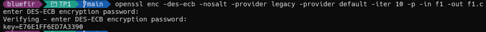
    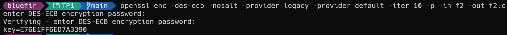
    On obtient la même clé pour les deux.  

    &nbsp;  
    Maintenant comparons les fichiers chiffrés en hexadécimal :
    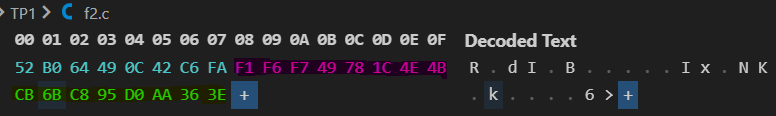
    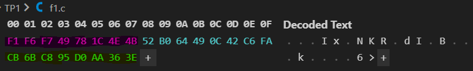

    On remarque une permutation des blocs entre les deux fichiers chiffrés (les blocs en roses, vert et bleus sont identiques). En effet, le mode ECB chiffre chaque bloc indépendamment, donc si deux blocs en clair sont identiques, ils seront chiffrés de la même manière. Comme les fichiers f1 et f2 contiennent les mêmes blocs mais dans un ordre différent, les blocs chiffrés apparaissent dans un ordre différent dans les fichiers chiffrés.
    Cela peut révéler des motifs dans les données chiffrées, ce qui est une faiblesse de ce mode de chiffrement.  

&nbsp;  

9) Une explication pour le choix des options de chiffrement est la sécurité. Le mode ECB n'est pas recommandé pour chiffrer des données sensibles car il ne fournit pas une sécurité suffisante contre certaines attaques. Il existe d'autres modes de chiffrement plus sûrs, comme le mode CBC (Cipher Block Chaining) ou GCM (Galois/Counter Mode), qui introduisent de l'aléatoire et de la dépendance entre les blocs pour renforcer la sécurité.  
L'utilisation du salage et d'un nombre d'itérations permettent d'augmenter la sécurité du chiffrement en rendant plus difficile les attaques par force brute ou par dictionnaire. Le salage ajoute une valeur aléatoire au mot de passe avant le dériver la clé de chiffrement, ce qui empêche l'utilisation de tables arc-en-ciel pour casser les mots de passe. Le nombre d'itérations augmente le temps nécessaire pour dériver la clé à partir du mot de passe, ce qui rend les attaques par force brute plus coûteuses en termes de temps et de ressources.  


&nbsp;  
&nbsp;  
## Partie 3 : Génération de clé RSA
10) On peut générer une paire de clé RSA avec la commande `openssl genrsa -out private_f.pem 1024` puis extraire la clé publique avec `openssl rsa -in private_f.pem -pubout -out public_f.pem` avant de l'afficher (avec `openssl rsa -in private_f.pem -text -noout`) :
  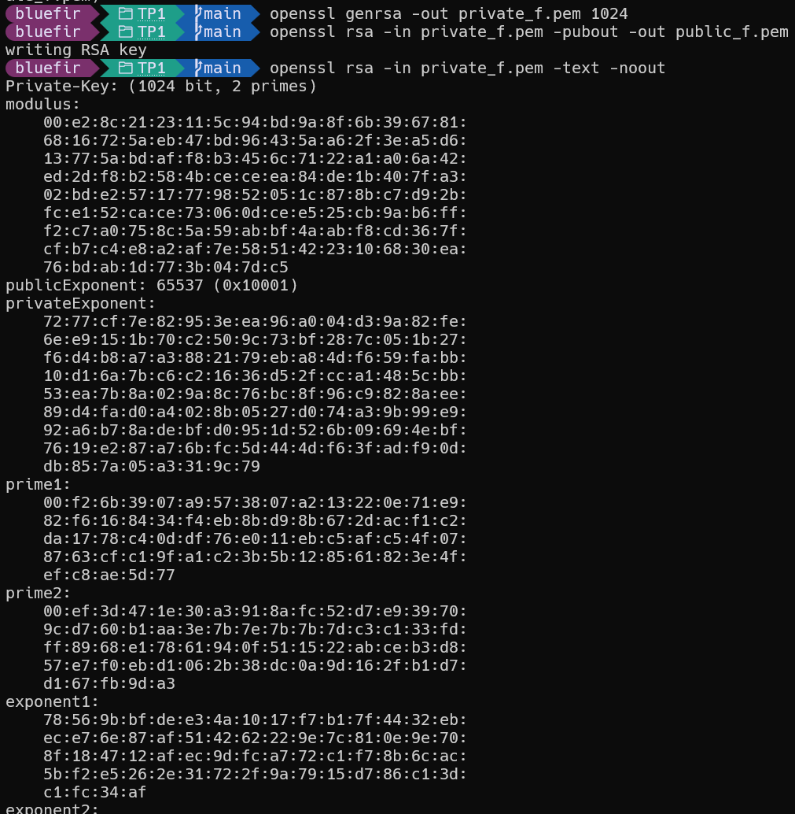
  &nbsp;  
  On peut aussi afficher la clé publique avec `openssl rsa -in public_f.pem -pubin -text -noout` :
  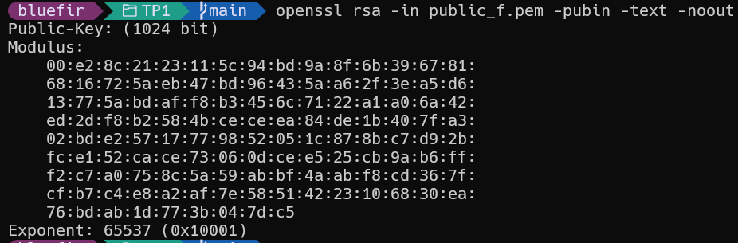

&nbsp;  

11) Les nombres premiers sont de taille 512 bits car la taille de la clé RSA est de 1024 bits et que la clé RSA est le produit de deux nombres premiers de taille égale.  
  On chiffre la clé avec DES3 en utilisant la commande `openssl rsa -in private_f.pem -des3 -out private_f_des3.pem`:
     
  &nbsp;  
  On a déjà séparé la clé publique dans le fichier `public_f.pem` à la question précédente.    
  &nbsp;  
  Le but de chiffrer la clé privée avec DES3 est de protéger la clé privée contre les accès non autorisés. Si la clé privée est stockée en clair, toute personne ayant accès au fichier peut l'utiliser pour déchiffrer les messages ou pour signer des documents. En chiffrant la clé privée avec un mot de passe, on ajoute une couche de sécurité supplémentaire, car même si quelqu'un accède au fichier, il ne pourra pas utiliser la clé privée sans connaître le mot de passe.  


&nbsp;  
&nbsp;  
## Partie 4 : Chiffrement asymétrique
On va chiffrer 2 fichiers avec la clé publique générée à la question précedente avec `openssl rsautl -pubin -inkey public_f.pem -encrypt  -oaep -out secret1` et `openssl rsautl -pubin -inkey public_f.pem -encrypt -oaep -out secret2`:
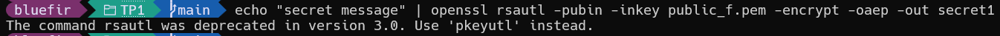
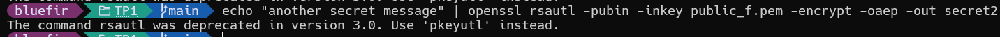

&nbsp;  

12) La taille du fichier chiffré est de 128 octets (1024 bits) car la taille du bloc chiffré avec RSA est égale à la taille de la clé RSA. Par contre si le message à chiffrer est plus grand que la taille de la clé, `rsault` ne pourra pas le chiffrer.  
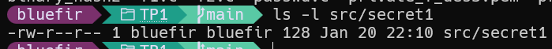

&nbsp;  

13) Les fichiers sont différents car le chiffrement RSA avec OAEP utilise un padding aléatoire, ce qui signifie que même si le même message est chiffré plusieurs fois avec la même clé publique, les résultats seront différents à chaque fois. Cela améliore la sécurité du chiffrement en empêchant les attaques par analyse de fréquence ou par comparaison de messages chiffrés.   
    On vérifie que les fichiers chiffrés sont différents avec `cmp secret1 secret2`:  
    

    &nbsp;  
    De plus, en observant leur contenu en hexadécimal, on peut voir que les octets sont différents et qu'il n'y a pas de motifs alors que le message d'origine est similaire:  
    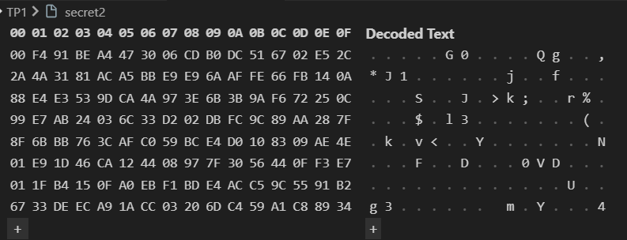
    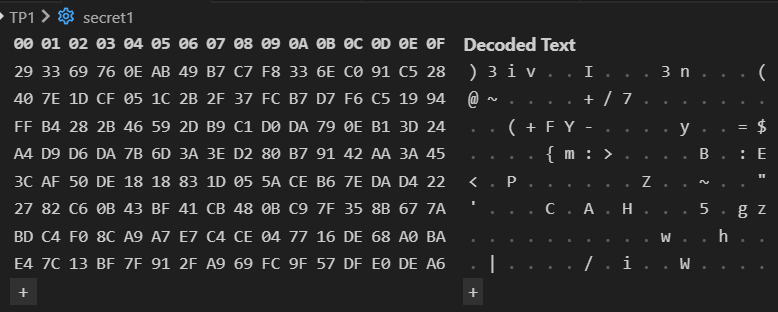

    &nbsp;  
    On vérifie le déchiffrement avec `openssl rsautl -inkey private_f.pem -decrypt -oaep -in secret1`:  
    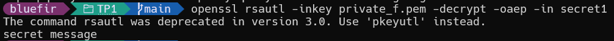
    Et pour le second fichier :
    

&nbsp;  

14) La commande demande un mot de passe car la clé privée a été chiffrée avec un mot de passe à la question 11. Pour pouvoir utiliser la clé privée pour déchiffrer les messages, il faut d'abord la déchiffrer en fournissant le mot de passe correct. Cela garantit que seule une personne autorisée ayant connaissance du mot de passe peut accéder à la clé privée et l'utiliser pour déchiffrer les messages.


&nbsp;  
&nbsp;  
## Partie 5 : Signature
On signe le fichier /etc/passwd avec la clé privée générée précédemment avec la commande `openssl dgst -sha256 -out passwd.sig -sign private_f.pem /etc/passwd` :  


On peut vérfier la signature avec la clé publique avec la commande `openssl dgst -sha256 -signature passwd.sig -verify public_f.pem /etc/passwd` :  
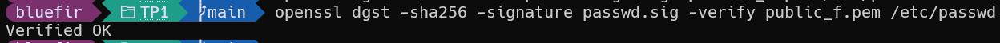

&nbsp;  

15) La première commande demande un mot de passe car elle utilise la clé privée qui a été chiffrée avec un mot de passe à la question 11. Pour pouvoir utiliser la clé privée pour signer le fichier, il faut d'abord la déchiffrer en fournissant le mot de passe correct. Cela garantit que seule une personne autorisée ayant connaissance du mot de passe peut accéder à la clé privée et l'utiliser pour signer des fichiers. La deuxième commande ne demande pas de mot de passe car elle utilise la clé publique, qui n'est pas chiffrée et peut être utilisée librement pour vérifier les signatures.  

&nbsp;  

16) Si on modifie le fichier /etc/passwd et qu'on vérfie à nouveau la signature, on obtient le message d'erreur suivant :    
    
    Le message indique que la signature n'est pas valide pour le fichier modifié. En effet, la signature est calculée à partir du contenu du fichier original, donc si le fichier est modifié, la signature ne correspond plus au nouveau contenu. Cela montre l'intégrité du fichier, car toute modification du fichier entraîne une invalidation de la signature.

&nbsp;  

17) Non, on ne peut pas savoir ce qui a été modifié en utilisant uniquement la signature. La signature permet seulement de vérifier si le fichier a été modifié ou non, mais elle ne fournit pas d'informations sur les modifications spécifiques apportées au fichier. Pour savoir ce qui a été modifié, il faudrait comparer le fichier original avec le fichier modifié en utilisant des outils de comparaison de fichiers, comme `diff` sous Linux.  


&nbsp;  
&nbsp;  
## Partie 6 : Echange de fichiers chiffrés et signés
18) Supposons que le fichier à transférer est `monfichier.txt` depuis `source/` vers `destination/`. Voici les commandes utilisées pour préparer le fichier à envoyer et pour le recevoir, en créant une paire de clés propre au destinataire (séparation claire des identités) :  
    1. Préparation des répertoires et génération (si nécessaire) des clés du destinataire :
        ```bash
        mkdir -p source destination
        # Générer une paire de clés pour le destinataire (destination)
        openssl genrsa -out destination/private_dest.pem 1024
        openssl rsa -in destination/private_dest.pem -pubout -out destination/public_dest.pem

        # Copier la clé publique du destinataire dans le répertoire de l'expéditeur
        cp destination/public_dest.pem source/

        # Copier la clé publique de l'expéditeur (générée précédemment : public_f.pem)
        # dans le répertoire du destinataire pour vérification des signatures
        cp public_f.pem destination/
        ```
       Ces commandes créent les répertoires `source` et `destination`, génèrent une paire de clés propre au destinataire (`private_dest.pem` / `public_dest.pem`), puis distribuent les clés publiques nécessaires : la clé publique du destinataire est copiée dans `source/` pour permettre à l'expéditeur de chiffrer pour le destinataire, et la clé publique de l'expéditeur (`public_f.pem`) est copiée dans `destination/` pour permettre la vérification des signatures.  
       &nbsp;  
    2. L'expéditeur chiffre le fichier avec la clé publique du destinataire (précédemment copiée dans `source/`) : 
        ```bash
        openssl rsautl -encrypt -oaep -pubin -inkey source/public_dest.pem -in source/monfichier.txt -out source/monfichier.txt.enc
        ```

       Cette commande chiffre `monfichier.txt` avec la clé publique du destinataire en utilisant le padding OAEP, et produit `monfichier.txt.enc`.  
       &nbsp;  
    3. L'expéditeur signe le fichier original avec sa clé privée (garantit son authenticité et son intégrité) : 
        ```bash
        openssl dgst -sha256 -sign source/private_f.pem -out source/monfichier.txt.sig source/monfichier.txt
        ```

       Cette commande calcule le haché SHA-256 du fichier et signe ce haché avec la clé privée de l'expéditeur, écrivant la signature dans `monfichier.txt.sig`.  
       &nbsp;  
    4. On transfère le fichier chiffré et la signature : 
        ```bash
        cp source/monfichier.txt.enc destination/
        cp source/monfichier.txt.sig destination/
        ```

       Ces commandes transfèrent respectivement le fichier chiffré et la signature vers le répertoire du destinataire.
       &nbsp;  
    5. Le destinataire déchiffre le fichier avec sa clé privée : 
        ```bash
        openssl rsautl -decrypt -oaep -inkey destination/private_dest.pem -in destination/monfichier.txt.enc -out destination/monfichier.txt
        ```

       Cette commande utilise la clé privée du destinataire (`private_dest.pem`) pour déchiffrer `monfichier.txt.enc` et restaurer le fichier original.


&nbsp;  
&nbsp;  

19) Les commandes utilisées pour signer le fichier, envoyer la signature puis vérifier cette signature sont les suivantes :
    1. L'expéditeur signe le fichier avec sa clé privée :
        ```bash
        openssl dgst -sha256 -sign source/private_f.pem -out source/monfichier.txt.sig source/monfichier.txt
        ```
        Cette commande calcule le digest SHA-256 de `monfichier.txt` et signe ce digest avec la clé privée `source/private_f.pem`, produisant la signature `monfichier.txt.sig`.
    &nbsp;  
    2. On transfère la signature et la clé publique de l'expéditeur vers le destinataire :
        ```bash
        cp source/monfichier.txt.sig destination/
        cp source/public_f.pem destination/
        ```
        Ces commandes transfèrent la signature et la clé publique de l'expéditeur vers le destinataire afin que celui-ci puisse vérifier la signature.  
    &nbsp;  
    3. Le destinataire vérifie la signature avec la clé publique de l'expéditeur :
        ```bash
        openssl dgst -sha256 -verify destination/public_f.pem -signature destination/monfichier.txt.sig destination/monfichier.txt
        ```
        La signature est valide si la commande retourne "Verified OK". Cela signifie que le fichier n'a pas été modifié depuis qu'il a été signé par l'expéditeur, garantissant ainsi son intégrité et son authenticité.

        Cette commande vérifie la signature en recalculant le haché SHA-256 du fichier reçu et en utilisant la clé publique fournie pour valider que la signature provient bien de la clé privée associée.