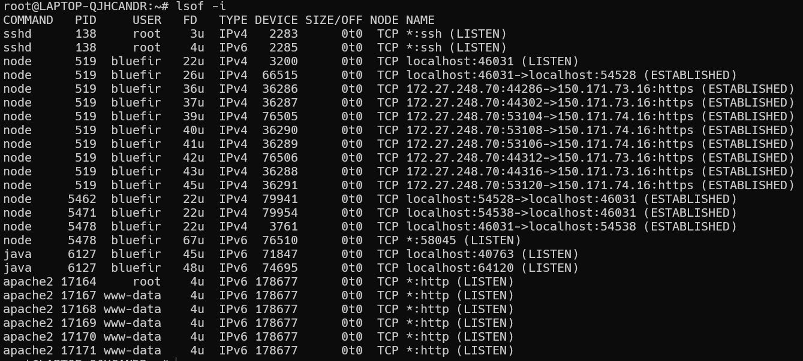
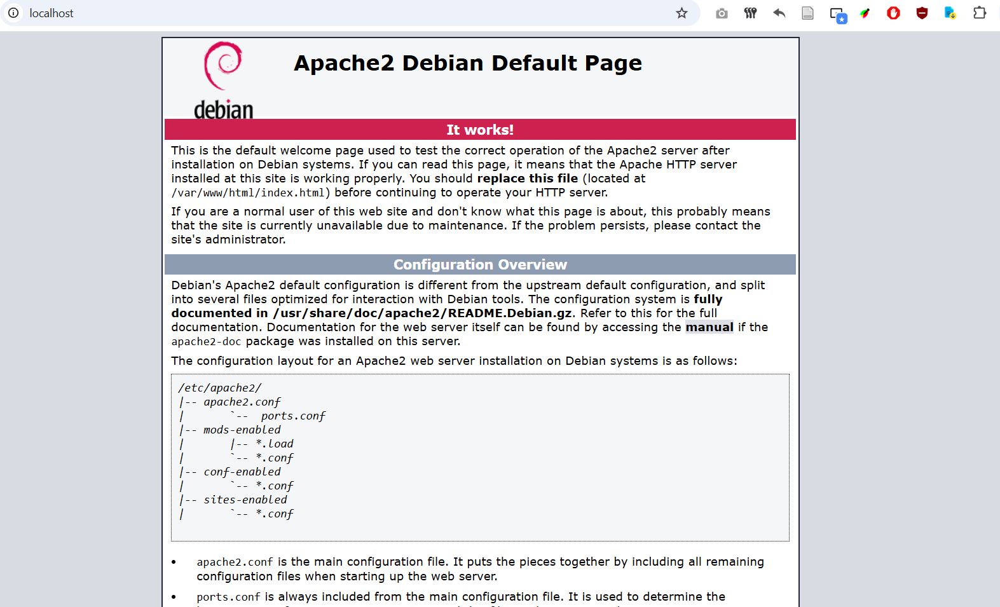
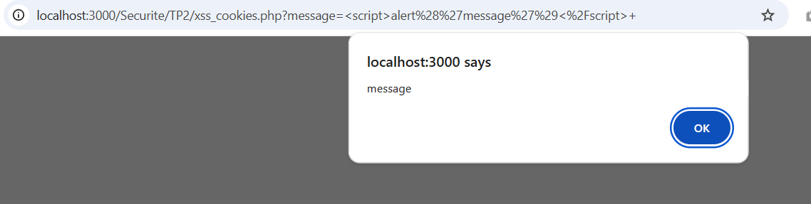
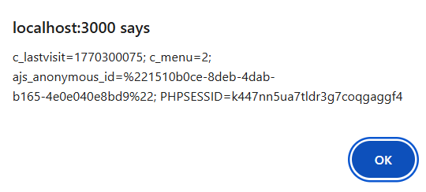
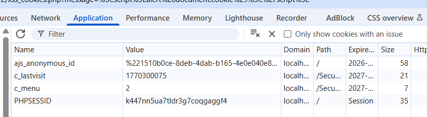
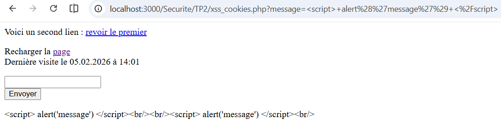
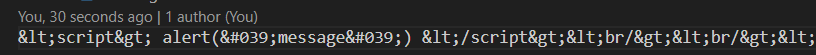

# TP2 - Failles Web & Système d’exploitation
**Mathieu WAHARTE - APP5**

&nbsp;  
# Exercice 1

1) On observe avec `lsof -i` que Apache2 est lancé:  
  
  Le processus principal est `apache2` et il est lancé par l'utilisateur `root`. Il lance ensuite des processus fils `apache2` qui sont lancés par l'utilisateur `www-data` (le serveur web).  

Le serveur apache est bien accessible à localhost.  

2) J'ai servi la page `xss_cookies.php` et j'ai entré `` dans le champ de saisie:  

On observe que le script est exécuté et affiche une alerte avec le message "message". Cela montre que la page est vulnérable à une attaque de type Cross-Site Scripting (XSS), car elle ne filtre pas correctement les entrées utilisateur avant de les afficher, on les écrit sans filtrage ou validation dans un fichier qu'on lit ensuite directement, toujours sans vérifications. Comme proposé au début, on pourrait envoyer les cookies utilisateurs (logins bancaires, comptes de réseaux sociaux, etc.) à un serveur malveillant pour les exploiter ensuite. Je ne le ferais pas car je fais ce TP sur ma machine, n'ayant pas accès à la sandbox.  

3) En remplaçant le script par ``, on observe maintenant les cookies de mon navigateur:  

Cela montre que les cookies sont accessibles via le script injecté, ce qui peut être dangereux si les cookies contiennent des informations sensibles. Un attaquant pourrait utiliser cette vulnérabilité pour voler les cookies de session d'un utilisateur et ainsi prendre le contrôle de sa session sur le site web. On pourrait aussi profiter d'une vulnérabilité dans le moteur de rendu du navigateur (V8 pour Chrome) et ainsi exécuter du code directement sur la machine de l'utilisateur, ce qui est encore plus dangereux.  

4) Le navigateur conserve les cookies même si on termine le navigateur car les cookies `c_lastvisit` et `c_menu` ont une date d'expiration définie dans le futur (dans session.php). En revanche la session est perdue si on termine le navigateur car les cookies de session n'ont pas de date d'expiration et sont supprimés lorsque le navigateur est fermé.  

5) Pour afficher les cookies, on peut tout simplement utiliser `` comme on l'a fait précédemment. On obtient alors:  

On trouve bien les cookies `c_lastvisit` et `c_menu` qui sont persistants, et le cookie de session `PHPSESSID` qui est supprimé lorsque le navigateur est fermé. On peut vérifier cela dans les Chrome DevTools:  

6) La valeur du cookie pour la dernière visite est de `1770300075` qui est un temps en Unix mili (temps écoulé depuis le 1er Janvier 1970 en secondes). En convertissant ce temps en date, on trouve que la dernière visite a eu lieu le 5 Février 2026 à 14:01:15 UTC.

7) En mettant `htmlentities()` autours de l'entrée utilisateur, on convertit les caractères spéciaux en entités HTML, ce qui empêche l'exécution de scripts malveillants. Par exemple, `` après avoir ajouté `htmlentities()`, on observe que le script n'est plus exécuté et est affiché comme du texte normal:

8) Dans `messages.txt`, on trouve bien les entités HTML au lieu des caractères spéciaux:  

Ce type de "sanization" permet aussi d'éviter de corrompre sa propre base de données ou son application.  

9) Je conclu que les failli XSS sont très dangereuses car elles permettent à un attaquant d'injecter du code malveillant dans une page web, ce qui peut entraîner le vol de données sensibles, la prise de contrôle de la session d'un utilisateur, ou même l'exécution de code sur la machine de l'utilisateur. Heuresement, il existe des moyens de s'en prémunir, il faut déjà nettoyer **toutes** les entrées utilisateur (dont les API), de plus il faut les valider à chaque niveau de l'application (le back-end ne peut pas faire confiance ni au front-end ni à la base de données). Il faut aussi éviter d'afficher des données sensibles dans les cookies ou les URL, et utiliser des mécanismes de sécurité comme les Content Security Policy (CSP) pour limiter les sources de scripts autorisées. Enfin, je dirais que malgré leur risques, les failles XSS sont assez évitables, notamment par l'utilisation d'outils à jour et d'analyseurs de code statique (ce type de vulnérabilité peut être détecté automatiquement).  

