# TP2 - Failles Web & Système d’exploitation
**Mathieu WAHARTE - APP5**

&nbsp;  
# Exercice 1 - XSS
1) On observe avec `lsof -i` que Apache2 est lancé:  
  
  Le processus principal est `apache2` et il est lancé par l'utilisateur `root`. Il lance ensuite des processus fils `apache2` qui sont lancés par l'utilisateur `www-data` (le serveur web).  
&nbsp;  

Le serveur apache est bien accessible à localhost.  

&nbsp;  

2) J'ai servi la page `xss_cookies.php` et j'ai entré `<script> alert('message') </script>` dans le champ de saisie:  

On observe que le script est exécuté et affiche une alerte avec le message "message". Cela montre que la page est vulnérable à une attaque de type Cross-Site Scripting (XSS), car elle ne filtre pas correctement les entrées utilisateur avant de les afficher, on les écrit sans filtrage ou validation dans un fichier qu'on lit ensuite directement, toujours sans vérifications. Comme proposé au début, on pourrait envoyer les cookies utilisateurs (logins bancaires, comptes de réseaux sociaux, etc.) à un serveur malveillant pour les exploiter ensuite. Je ne le ferais pas car je fais ce TP sur ma machine, n'ayant pas accès à la sandbox.  
&nbsp;  

3) En remplaçant le script par `<script> alert(document.cookie) </script>`, on observe maintenant les cookies de mon navigateur:  

Cela montre que les cookies sont accessibles via le script injecté, ce qui peut être dangereux si les cookies contiennent des informations sensibles. Un attaquant pourrait utiliser cette vulnérabilité pour voler les cookies de session d'un utilisateur et ainsi prendre le contrôle de sa session sur le site web. On pourrait aussi profiter d'une vulnérabilité dans le moteur de rendu du navigateur (V8 pour Chrome) et ainsi exécuter du code directement sur la machine de l'utilisateur, ce qui est encore plus dangereux.  
&nbsp;  

4) Le navigateur conserve les cookies même si on termine le navigateur car les cookies `c_lastvisit` et `c_menu` ont une date d'expiration définie dans le futur (dans session.php). En revanche la session est perdue si on termine le navigateur car les cookies de session n'ont pas de date d'expiration et sont supprimés lorsque le navigateur est fermé.  
&nbsp;  

5) Pour afficher les cookies, on peut tout simplement utiliser `<script>alert(document.cookie)</script>` comme on l'a fait précédemment. On obtient alors:  

On trouve bien les cookies `c_lastvisit` et `c_menu` qui sont persistants, et le cookie de session `PHPSESSID` qui est supprimé lorsque le navigateur est fermé. On peut vérifier cela dans les Chrome DevTools:  

&nbsp;  


6) La valeur du cookie pour la dernière visite est de `1770300075` qui est un temps en Unix mili (temps écoulé depuis le 1er Janvier 1970 en secondes). En convertissant ce temps en date, on trouve que la dernière visite a eu lieu le 5 Février 2026 à 14:01:15 UTC.
&nbsp;  

7) En mettant `htmlentities()` autours de l'entrée utilisateur, on convertit les caractères spéciaux en entités HTML, ce qui empêche l'exécution de scripts malveillants. Par exemple, `<script>` devient `&lt;script&gt;`, ce qui est affiché comme du texte normal dans le navigateur au lieu d'être interprété comme du code. Cela protège contre les attaques XSS en empêchant l'injection de code malveillant dans la page web. Cette solution n'est cependant pas suffisante pour protéger contre toutes les attaques XSS, car il existe d'autres vecteurs d'attaque (comme les événements JavaScript ou les URL malveillantes) qui peuvent encore être exploités. De plus cela peut rendre l'expérience utilisateur moins agréable si les utilisateurs veulent utiliser des caractères spéciaux dans leurs entrées. J'ai été confronté à ce cas au travail, je devais en même temps protéger contre ces attaques dans un champs texte mais il était spécifié originellement que les utilisateurs pouvaient utiliser `<` et `>` dans leurs entrées. Comme la taille du champs était aussi contrainte, j'ai discuté avec mes collègues et on a choisi d'enlever ces caractères du champs.
Si on reassaye notre injection `<script> alert('message') </script>` après avoir ajouté `htmlentities()`, on observe que le script n'est plus exécuté et est affiché comme du texte normal:

&nbsp;  

8) Dans `messages.txt`, on trouve bien les entités HTML au lieu des caractères spéciaux:  

Ce type de "sanization" permet aussi d'éviter de corrompre sa propre base de données ou son application.  
&nbsp;  

9) Je conclu que les failli XSS sont très dangereuses car elles permettent à un attaquant d'injecter du code malveillant dans une page web, ce qui peut entraîner le vol de données sensibles, la prise de contrôle de la session d'un utilisateur, ou même l'exécution de code sur la machine de l'utilisateur. Heuresement, il existe des moyens de s'en prémunir, il faut déjà nettoyer **toutes** les entrées utilisateur (dont les API), de plus il faut les valider à chaque niveau de l'application (le back-end ne peut pas faire confiance ni au front-end ni à la base de données). Il faut aussi éviter d'afficher des données sensibles dans les cookies ou les URL, et utiliser des mécanismes de sécurité comme les Content Security Policy (CSP) pour limiter les sources de scripts autorisées. Enfin, je dirais que malgré leur risques, les failles XSS sont assez évitables, notamment par l'utilisation d'outils à jour et d'analyseurs de code statique (ce type de vulnérabilité peut être détecté automatiquement).  


&nbsp;  
&nbsp;  
## Exercice 2 - DOM
Avec essai dans l'URL, `dom.html` affiche bien le bon message:
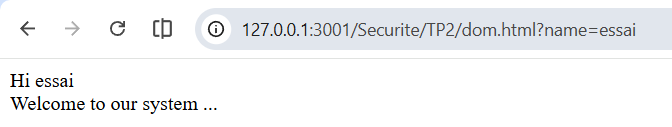
&nbsp;  

10)  On change l'URL en `dom.html?name=<script>alert(document.cookie)</script>` pour essayer d'injecter du code JavaScript.  
&nbsp;  

11) L'affichage obtenu est le suivant:  
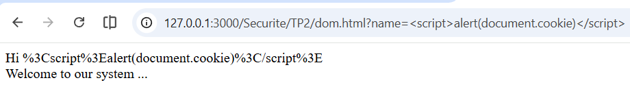
Le script n'est pas exécuté, il est affiché comme un texte mais les caractères spéciaux sont échappés. Le script par défaut n'interprète pas les caractères spéciaux, il les affiche tels quels. Ce type d'injection XSS n'est pas possible par défaut.  
&nbsp;  

12) Pour faire fonctionner la faille, on peut utiliser la fonction `decodeURIComponent()` pour décoder les caractères spéciaux dans l'URL. En modifiant le script dans `dom.html` comme suit:  
    ```html
    <html>
      <title>Welcome!</title>
      Hi
      <script>
        const pos = document.URL.indexOf("name=") + 5;
        document.write(decodeURIComponent(document.URL.substring(pos, document.URL.length)));
      </script>
      <br />
      Welcome to our system ...
    </html>
    ```
    On peut alors injecter du code JavaScript avec un paramètre dans l'URL comme `dom.html?name=<script>alert(document.cookie)</script>`, on a alors:  
    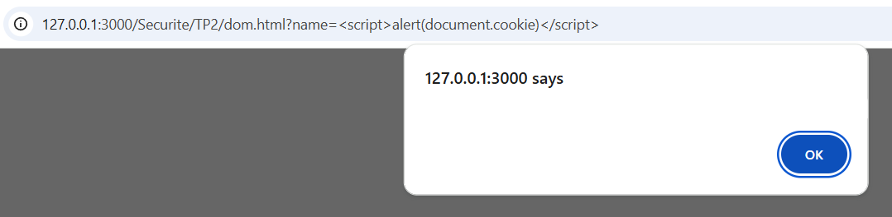
    On ne voit pas de cookies car il n'y en a pas dans ce contexte mais le script est exécuté, on vient donc d'ouvrir la porte aux failles XSS en utilisant `decodeURIComponent()` pour décoder les caractères spéciaux dans l'URL. Cela montre que même si le script par défaut n'interprète pas les caractères spéciaux, il est possible de contourner cette protection en utilisant des fonctions de décodage, ce qui souligne l'importance de valider et de nettoyer toutes les entrées utilisateur, y compris celles provenant de l'URL.  


&nbsp;  
&nbsp;  
## Exercice 3 - Comptes utilisateurs et mots de passe

On va créer un premier utilisateur avec la commande `useradd` et lui donner un mot de passe avec la commande `passwd`:  
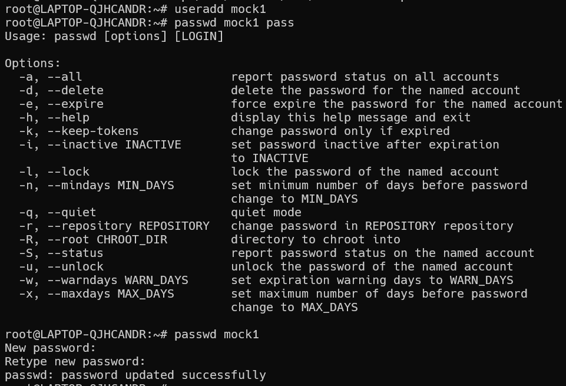

Le fichier contenant les données système du compte est `/etc/passwd`:  
`mock1:x:1001:1002::/home/mock1:/bin/sh`

Et le fichier contenant l'empreinte du mot de passe est `/etc/shadow`:  
`mock1:$y$j9T$XjqWXlFKO0Ad9bkhNqd3n0$PVJPFytpbEDhBkn28XVPPtttVI3xuFJhmKUvixhCaR5:20489:0:99999:7:::`  

Voici le format d'empreinte d'après la page de manuel de `crypt`:
`$ID$SALT$HASH`
- `ID` est l'identifiant de la fonction de hash utilisée (par exemple, `1` pour MD5, `5` pour SHA-256, `6` pour SHA-512, etc.)
- `SALT` est une chaîne de caractères aléatoire utilisée pour rendre le hash plus résistant aux attaques par dictionnaire et par force brute.
- `HASH` est le résultat du hashage du mot de passe combiné avec le salt.
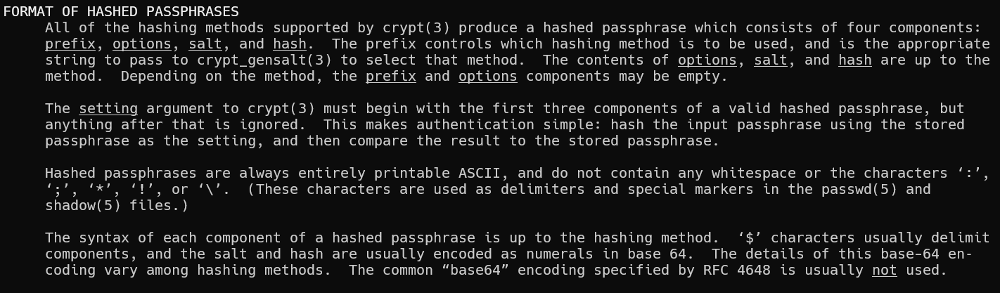
&nbsp;  

13) En regardant l'empreinte du mot de passe dans `/etc/shadow`, on observe que la fonction de hash utilisée est yescrypt, car l'identifiant `ID` est égal à `y`. 
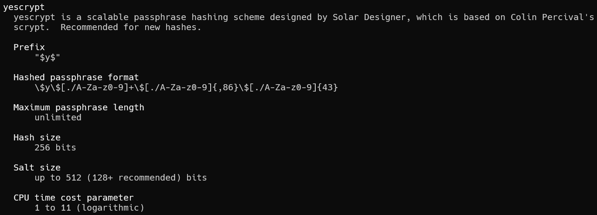
La ligne complète (trouvée précédemment) est : `mock1:$y$j9T$XjqWXlFKO0Ad9bkhNqd3n0$PVJPFytpbEDhBkn28XVPPtttVI3xuFJhmKUvixhCaR5:20489:0:99999:7:::`  

&nbsp;  

On crée un nouvel utilisateur `mock2` et on lui donne un mot de passe avec `openssl passwd -1` (`-crypt` n'est pas disponible dans ma version d'openssl) qu'on va mettre directement dans le fichier `/etc/shadow` pour ce nouvel utilisateur. L'empreinte du mot de passe de `mock2` est la suivante:  `$1$LW3HcSWk$ISBdqLWym/VEKAqlyAOG51`    
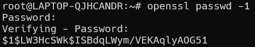
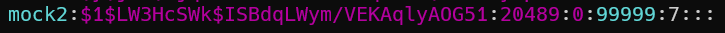
Ce mot de passe fonctionne bien (avec la commande `su - mock2`):  
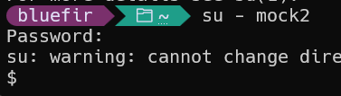


&nbsp; 
 
14) On va comparer les deux empreintes des mots de passe des deux utilisateurs créés. 
  L'empreinte du mot de passe de `mock1` est la suivante: `$y$j9T$XjqWXlFKO0Ad9bkhNqd3n0$PVJPFytpbEDhBkn28XVPPtttVI3xuFJhmKUvixhCaR5`.
  Et l'empreinte du mot de passe de `mock2` est la suivante: `$1$LW3HcSWk$ISBdqLWym/VEKAqlyAOG51`.
  Les deux chaînes sont différentes car elles utilisent des fonctions de hash différentes (yescrypt pour `mock1` et MD5 pour `mock2`), et elles ont aussi des salts différents (`XjqWXlFKO0Ad9bkhNqd3n0` pour `mock1` et `LW3HcSWk` pour `mock2`). Et ce pour le même mot de passe, ce qui montre l'importance du salt pour rendre les hash plus résistants aux attaques par dictionnaire et par force brute. En effet, même si deux utilisateurs ont le même mot de passe, leurs empreintes seront différentes grâce au salt, ce qui rend plus difficile pour un attaquant de deviner les mots de passe à partir des empreintes. De plus, l'utilisation de fonctions de hash plus robustes comme yescrypt rend également les empreintes plus résistantes aux attaques.  


&nbsp;  

Pour tester John, on va mettre le mot de passe `j1l2t3` qu'on retrouve dans son dictionnaire:  
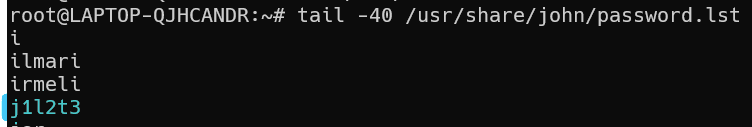

15) En lançant avec la commande `#john --wordlist=/usr/share/john/password.lst –format=crypt /etc/shadow`, on observe que le mot de passe est retrouvé en 59 secondes avec 16 threads:  
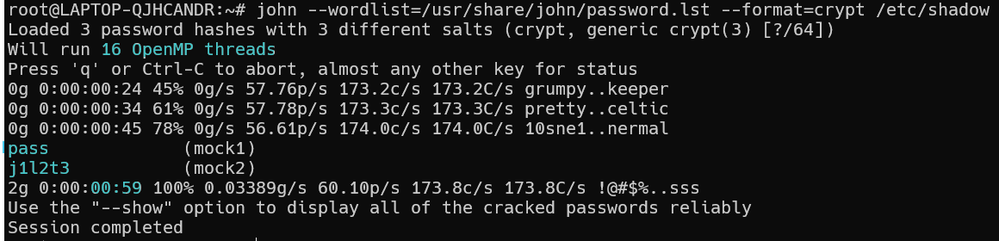
Pour les mots de passe dans le dictionnaire, John est très efficace pour les retrouver, même avec des fonctions de hash plus robustes comme yescrypt.  

&nbsp;  
Maintenant on mets le mot de passe `wx` qui n'est pas dans le dictionnaire de John (`grep wx /usr/share/john/password.lst` ne retourne rien):
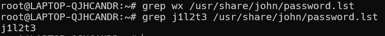

&nbsp;  


16) En relançant la commande de recherche, on observe que le mot de passe n'est pas retrouvé (mais l'autre toujours), même après un certain temps d'attente:   
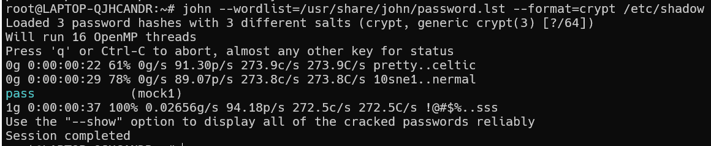
Cela montre que les mots de passe qui ne sont pas dans les dictionnaires peuvent être plus difficiles à retrouver pour les attaquants, surtout s'ils sont courts et simples. Cependant, il est important de noter que les attaques par force brute peuvent toujours être utilisées pour essayer de deviner les mots de passe, même s'ils ne sont pas dans les dictionnaires, ce qui souligne l'importance d'utiliser des mots de passe longs et complexes pour renforcer la sécurité des comptes utilisateurs.
&nbsp;  


17) 


18)  


19) 


&nbsp;  
&nbsp;  
&nbsp;  
&nbsp;  
&nbsp;  
&nbsp;  
&nbsp;  
&nbsp;  
#### 3.3.2 Essai brute force
Pour vérifier que la recherche fonctionne, on configure john pour faire une recherche sur 2 caractères seulement.
Pour cela il faut définir dans le fichier `/etc/john/john.conf` les paramètres de recherche :
```conf
[incremental :essai]
File= /usr/share/john/ascii.chr
MinLen=2
MaxLen=2
```
Lancer la recherche avec la commande suivante :
`# john –format=crypt –i :essai /etc/shadow`

**Question 17: Quelle est la durée de la recherche ?**
On passe à un mot de passe de 4 caractères avec un fichier de configuration aussi limité à exactement 4 caractères
Est-ce que la recherche fonctionne encore rapidement ?

Pour les étudiants curieux vous pouvez reprendre le même mot de passe et le coder en hash DES traditionnel, puis
relancer john avec le même paramétrage. On constate que la recherche avec le DES est plus rapide qu’avec le hash
sha512.

En conclusion avec un hash sha512 est un mot de passe suffisamment long et hors dictionnaire le programme
risque de prendre un temps prohibitif.


## 4 Comptes et droits Unix
### 4.1 Programmes setuid
Se connecter sous un utilisateur crée à la question 1 ou 2, changer son mot de passe.
Vérifier que le fichier /etc/shadow a été modifié

**Question 18: Quels sont les droits du fichier /etc/shadow et du programme passwd utilisé ? Comment expliquez-vous que le fichier /etc/shadow a été modifié par votre compte non privilégié?**


### 4.2 Exemple de shell setuid
Le but est de montrer la possibilité de lancer un shell ayant les droits de root depuis un compte normal si une erreur
de droit est introduite.
Ecrire et compiler le programme suivant sous root :
```c
#include <stdio.h>
#include <sys/types.h>
#include <unistd.h>:
void main(void)
{
/* pour forcer l’uid reel effectif et sauvé à root */
setreuid(0,0);
/* lancer le shell */
execl(“/bin/bash”,”bash”,0,NULL);
}
```
Placer le programme dans /tmp et ajouter le droit setuid et exécution pour les utilisateurs
Lancer le programme depuis un compte normal.

**Question 19: Quel est l’uid du shell lancé depuis le programme setuid. Quel est le propriétaire d’un fichier crée depuis ce shell. Que pouvez-vous en conclure sur les programmes setuid ?**
