# TP3 - Certificats SSL/TLS
**Mathieu WAHARTE - APP5**

&nbsp;  
On va créer une autorité de certification locale afin de pouvoir signer ensuite le certificat du serveur Apache. Le but est de reproduire en local le fonctionnement classique d'une chaîne de confiance TLS.

&nbsp;  
# 1 - Génération de certificats pour apache
Le répertoire `ssl` contient les fichiers de clé privée, de certificat et de demande de signature pour l'autorité de certification (CA) et pour le serveur Apache. Voici un aperçu de la structure du répertoire :  
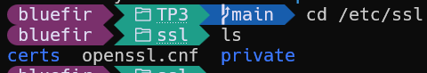

&nbsp;  

Créons la clé privée du CA avec `openssl genrsa -des3 -out private/ca.pem 2048` (et pass_phrase) : 
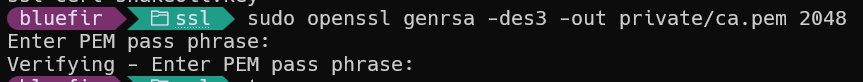

&nbsp;  

On va ensuite modifier une copie du fichier de configuration `openssl.cnf` pour y ajouter les informations de notre CA : 
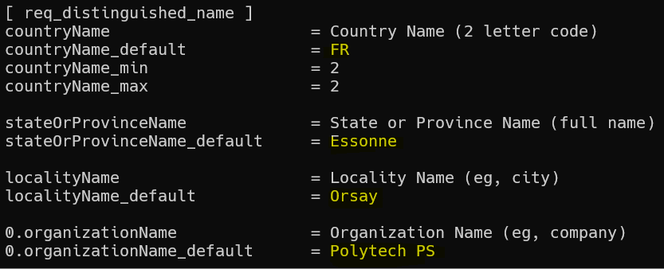

&nbsp;  

Le nom de domaine de la machine peut être obtenu avec la commande `hostname -f` et est : `LAPTOP-QJHCANDR.localdomain`.  


On peut ensuite créer le certificat à partir de ce fichier de configuration avec `openssl req -new -x509 -days 365 -key private/ca.pem -out private/ca.crt -config essai.cnf`:  
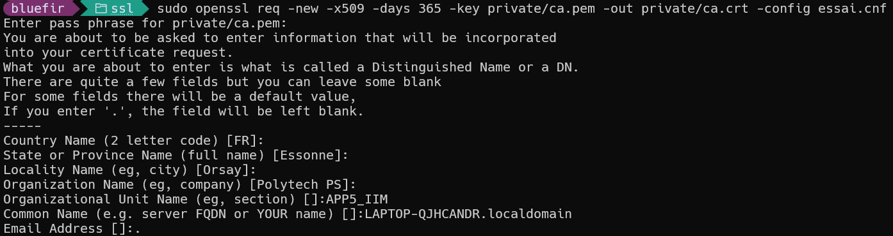
Le CommonName renseigné est `LAPTOP-QJHCANDR.localdomain`.  

&nbsp;  

1) Pour afficher le certificat de l'autorité de certification, on utilise la commande `openssl x509 -noout -text -in private/ca.crt`. On obtient alors le détail complet du certificat X.509 du CA, avec notamment le sujet, l'émetteur, la période de validité, la clé publique et les extensions du certificat :
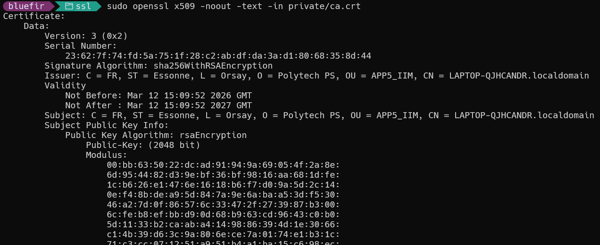


&nbsp;  
Le common name avec le nom de domaine dns complet (obtensible avec `hostname -f`) est : `LAPTOP-QJHCANDR.localdomain` ce qui matche le Common Name renseigné.  

`openssl req -nodes -new -keyout private/server.key -out private/server.csr -config essai.cnf` permet de générer la clé privée du serveur et la demande de signature (CSR) en une seule commande :  
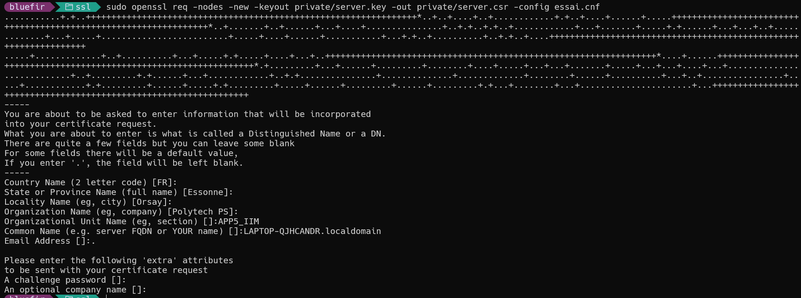

&nbsp;  

2) Le common name que j'ai spécifié est `LAPTOP-QJHCANDR.localdomain`.  
Pour afficher la demande de certificat, on utilise ensuite `openssl req -noout -text -in private/server.csr`. Cette commande permet de vérifier les informations présentes dans la CSR, notamment le sujet et la taille de la clé publique. La sortie est à coller ici :
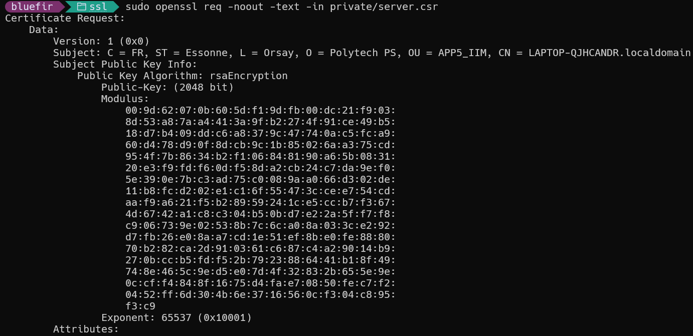


&nbsp;  

3) Dans la demande de certificat, on observe que la taille de la clé RSA utilisée est normalement de **2048 bits**. On retrouve cette information dans une ligne du type `Public-Key: (2048 bit)`.  

&nbsp;  

4) Cette option peut être changée directement au moment de la génération de la clé. Par exemple, dans une commande comme `openssl genrsa -des3 -out private/ca.pem 2048`, la valeur `2048` correspond à la taille de la clé. On peut donc la remplacer par `4096` si l'on veut une clé plus grande. De manière générale, c'est au moment de la génération de la clé RSA que l'on choisit cette taille.  

&nbsp;  


On crée le répertoire `demoCA`, le fichier `serial` avec la valeur `01`, le répertoire `newcerts` et le fichier `index.txt` vide.  
Ensuite, on signe la demande de certificat du serveur avec la commande `openssl ca -out private/server.crt -in private/server.csr -cert private/ca.crt -keyfile private/ca.pem` :  
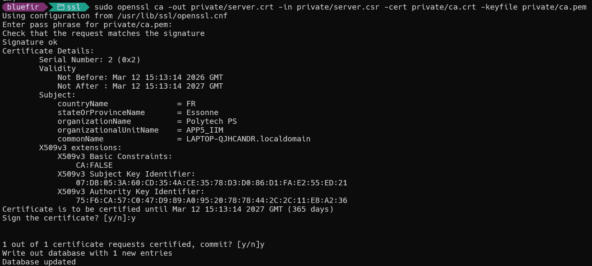

5) Le mot de passe demandé lors de la signature du certificat serveur est celui de la clé privée du CA, c'est-à-dire `ca.pem`. Il est demandé parce que cette clé a été créée avec l'option `-des3`, donc elle est chiffrée et protégée par mot de passe. OpenSSL a besoin de déverrouiller cette clé privée pour pouvoir signer le certificat du serveur.  

&nbsp;  

6) Pour afficher le certificat du serveur, on utilise la commande `openssl x509 -noout -text -in private/server.crt`. On obtient alors le détail complet du certificat signé :  
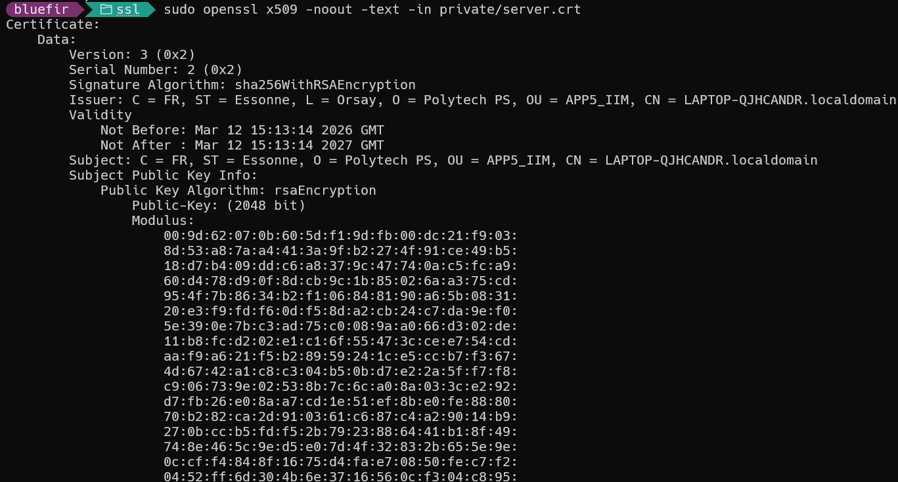


&nbsp;  
&nbsp;  
# 2 - Mise en place d'un serveur apache https
Une fois le certificat serveur généré et signé, on peut configurer Apache pour activer HTTPS sur le port 443.
Activons le module ssl pour apache2 avec `a2enmod ssl` :  
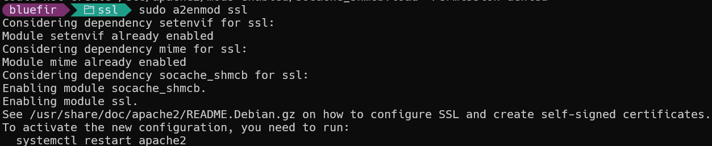
Puis activons le site par défaut en SSL avec `a2ensite default-ssl.conf` :  
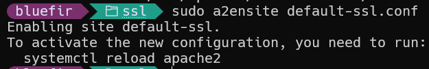
Ensuite, on redémarre le service Apache pour appliquer les changements : `systemctl restart apache2`.


7) Les deux lignes de configuration concernant les certificats dans `default-ssl.conf` sont les suivantes :
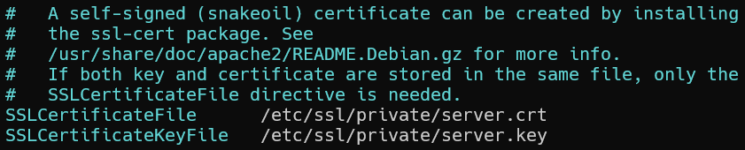
```apache
SSLCertificateFile /etc/ssl/private/server.crt
SSLCertificateKeyFile /etc/ssl/private/server.key
```


&nbsp;  

8) Pour vérifier que le service Apache2 en HTTPS est disponible sur la machine virtuelle, on peut par exemple utiliser la commande `curl -kI https://localhost`. Elle permet d'interroger le serveur localement en ignorant l'erreur de certificat auto-signé:  
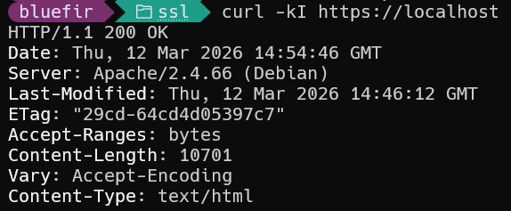

&nbsp;  

9) En accédant au site avec l'URL `https://localhost`, le navigateur remonte normalement deux erreurs. D'abord, le certificat n'est pas approuvé car il est signé par une autorité locale que le navigateur ne connaît pas. Ensuite, il y a généralement une erreur de nom, car le certificat a été généré pour le nom de domaine complet de la machine virtuelle et non pour `localhost`. C'est logique ici, puisque `localhost` ne correspond pas au nom déclaré dans le certificat.  
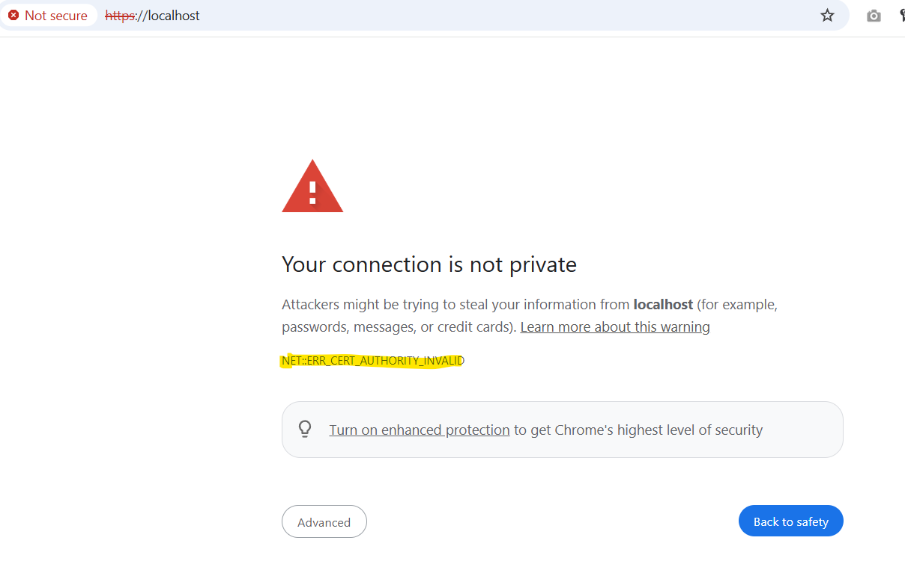
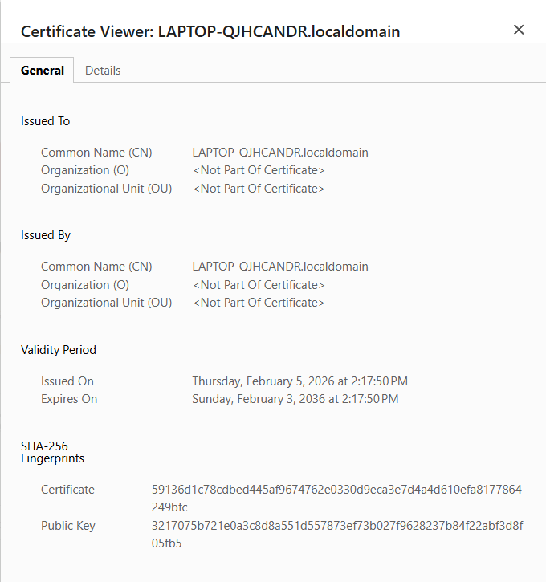
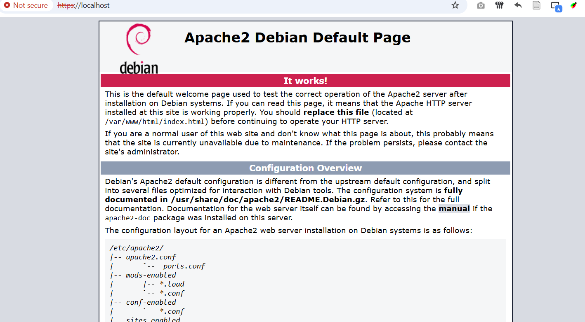


&nbsp;  

10)   Pour l'accès avec le nom de domaine officiel, l'URL utilisée est : `https://LAPTOP-QJHCANDR.localdomain/`. Comme j'utilise WSL, lamachine n'est pas ajouté comme host dans mon navigateur, donc je dois ajouter une entrée dans le fichier `hosts` de Windows pour faire correspondre ce nom de domaine à l'adresse IP de la machine virtuelle. Par exemple, si l'adresse IP de la machine virtuelle est `172.27.x.x` (obtenue avec `hostname -I`).  
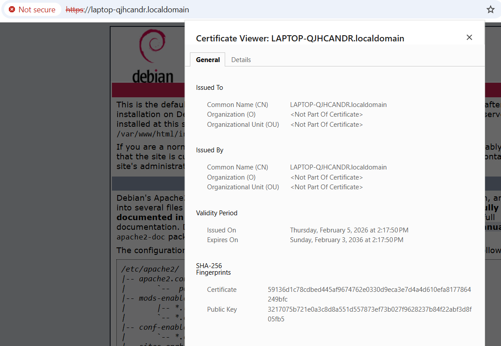

Le navigateur affiche encore normalement un avertissement de sécurité car l'autorité de certification locale n'est pas reconnue par défaut. On corrige donc une partie du problème, mais pas encore la question de confiance sur le CA.

&nbsp;  

11) Comme je n'ai pas accès aux machines virtuelles pour ce TP, je ne peux pas tester l'accès distant depuis les machines de la fac et donc je n'ai pas de configuration de proxy.  


&nbsp;  

12)  Pour supprimer les erreurs HTTPS, la solution consiste à faire reconnaître le certificat du CA local comme une autorité de confiance sur la machine cliente. Pour cela, il faut récupérer le fichier `ca.crt`, l'importer dans le navigateur ou dans le magasin de certificats du système ou navigateur comme autorité de confiance, puis accéder au site avec le bon nom DNS, c'est-à-dire exactement celui utilisé comme **Common Name** dans le certificat serveur. Une fois cela fait, le navigateur ne signale plus d'erreur de confiance, et si le nom de domaine est correct il n'y a plus non plus d'erreur de correspondance de nom. C'est donc bien l'import du certificat du CA qui permet de faire disparaître l'alerte principale. Sur Chrome, il suffit de drag and drop le fichier de certificat donc je n'ai pas de screenshot.  


&nbsp;  
&nbsp;  
# 3 - Création et utilisation d'un certificat client

On reprend ensuite le même principe pour générer un certificat client, signé lui aussi par le CA local, on exécute donc `openssl req -nodes -new -keyout private/client.key -out private/client.csr -config essai.cnf` et `openssl ca -out private/client.crt -in private/client.csr -cert private/ca.crt -keyfile private/ca.pem` :  
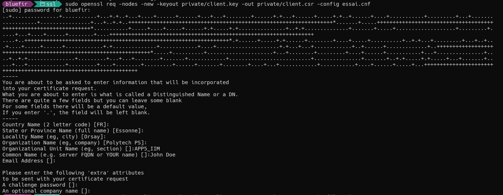
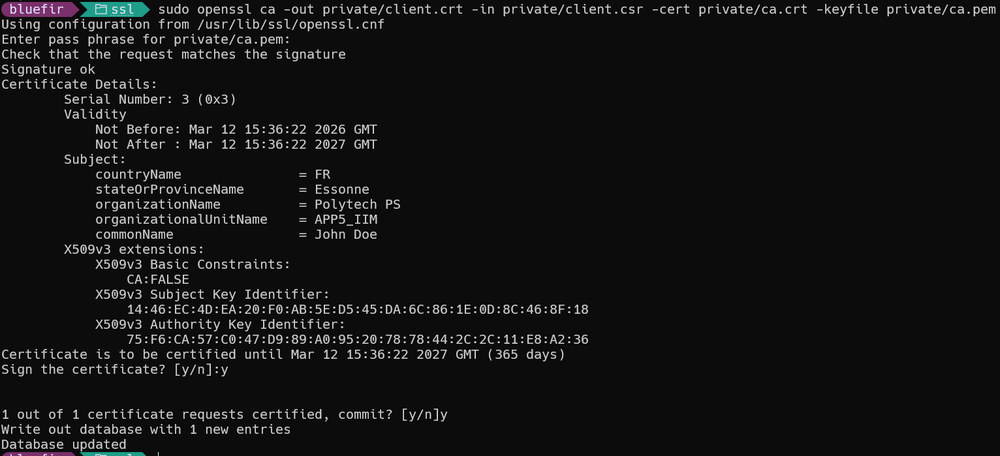

On a utilisé *John Doe* comme CA.  
Cette fois, l'idée est d'obliger l'utilisateur à présenter un certificat client valide pour accéder au site HTTPS.  

Maintenant on génère un fichier pkcs#12 à partir du certificat client et de sa clé privée avec la commande `openssl pkcs12 -export -in private/client.crt -inkey private/client.key -out client.p12`. Ce fichier contient à la fois le certificat client et la clé privée, et est protégé par un mot de passe et peut être importé dans un navigateur.
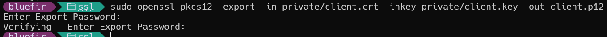

13) Après avoir ajouté dans la configuration Apache les lignes `SSLVerifyClient require`, `SSLVerifyDepth 1` et `SSLCACertificateFile /etc/ssl/private/ca.crt`, l'accès au site HTTPS échoue tant que le navigateur ne présente pas de certificat client valide. L'erreur observée est donc qu'aucun certificat client n'a été fourni, ou qu'aucun certificat acceptable n'est disponible. Selon le navigateur, cela peut apparaître comme une demande de certificat, un refus d'accès, ou un message du type *No required SSL certificate was sent*. On voit donc bien qu'ici le serveur ne se contente plus d'authentifier son identité : il vérifie aussi celle du client.
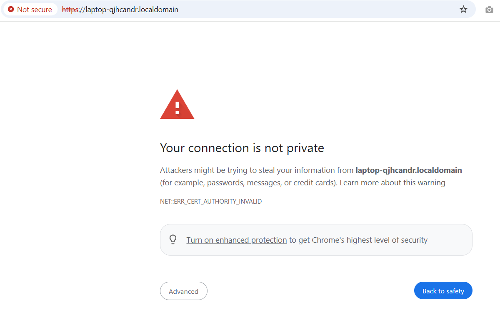

&nbsp;  

14)  Lors de l'importation du fichier `client.p12` (après avoir changé ses permissions), le navigateur demande un mot de passe. Il s'agit du mot de passe défini au moment de l'export du certificat au format PKCS#12. Ce mot de passe est nécessaire car le fichier PKCS#12 contient la clé privée du client, et celle-ci doit être protégée :  
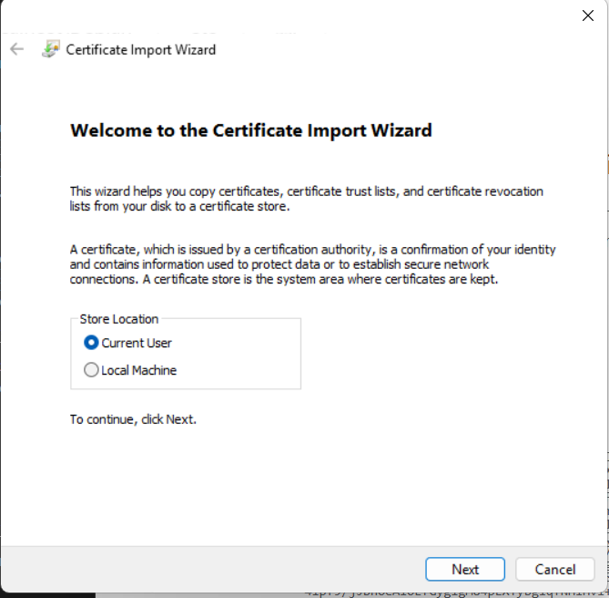
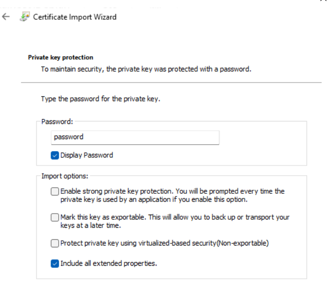
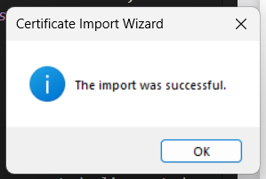

Après l'importation, le navigateur indique normalement que le certificat a bien été ajouté aux certificats personnels, puis il peut proposer de sélectionner ce certificat lors de l'accès au site. Le résultat final est qu'une fois le bon certificat client importé et présenté au serveur, l'accès au site HTTPS est autorisé. On obtient donc cette fois une authentification mutuelle puisque le serveur prouve son identité au client, et le client prouve aussi son identité au serveur :  
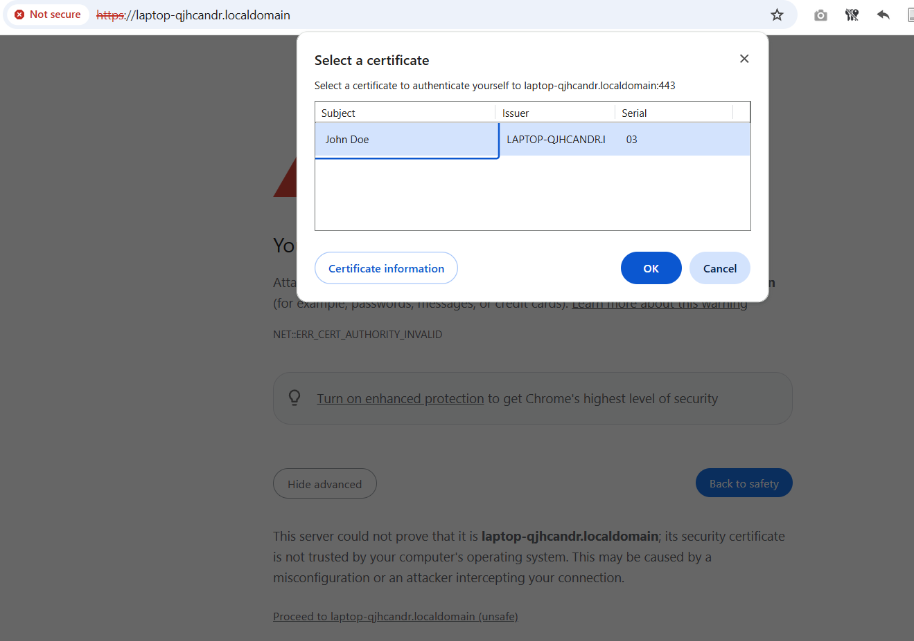
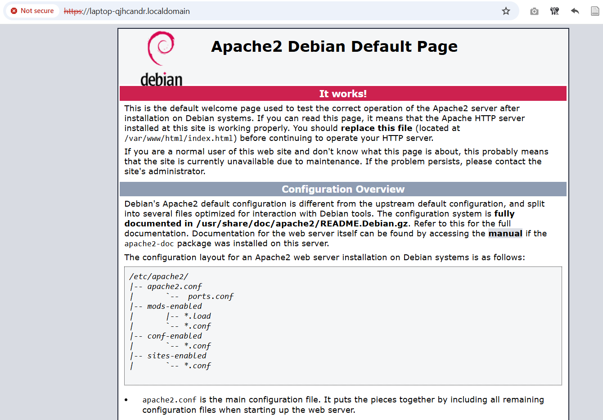

&nbsp;  
&nbsp;  
# 4 - RewriteEngine apache
Pour terminer, on configure le module de réécriture d'Apache afin de contrôler le comportement des connexions HTTP non sécurisées avec `a2enmod rewrite` :  
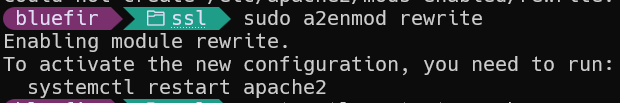

15) Avec les directives suivantes dans le fichier `/etc/apache2/sites-available/000-default.conf`:
```apache
RewriteEngine on
RewriteCond %{HTTPS} off
RewriteRule ^/(.*) - [F]
```

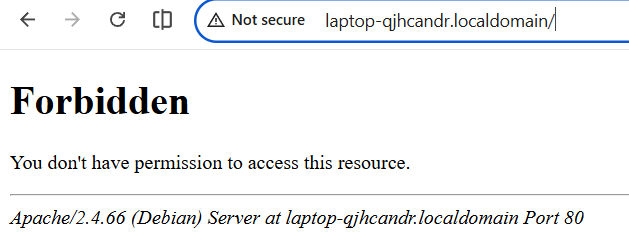
on observe que les connexions HTTP sont simplement refusées. Le résultat est donc une erreur de type **403 Forbidden** au lieu d'une redirection automatique vers HTTPS.

&nbsp;  

16) Pour forcer une connexion HTTPS au lieu de bloquer l'accès, on peut utiliser la règle de réécriture suivante :  
```apache
RewriteEngine on
RewriteCond %{HTTPS} off
RewriteRule ^/(.*)$ https://%{HTTP_HOST}/$1 [R=301,L]
```

Cette règle redirige automatiquement toute requête HTTP vers la même ressource en HTTPS, ce qui est le comportement attendu dans un déploiement classique. C'est donc une solution plus propre qu'un simple refus d'accès, puisqu'elle guide directement l'utilisateur vers la version sécurisée du site :  
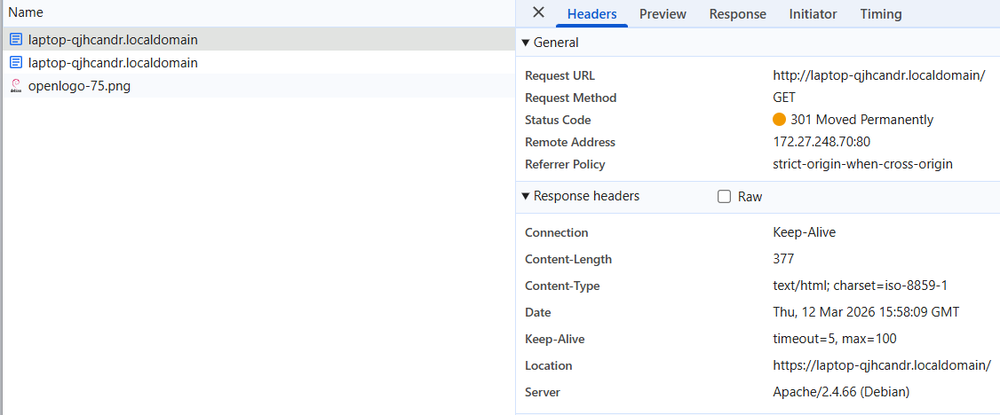
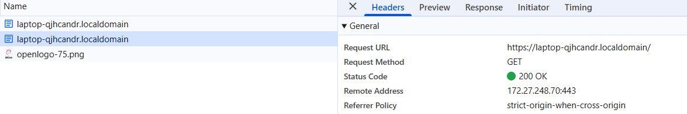
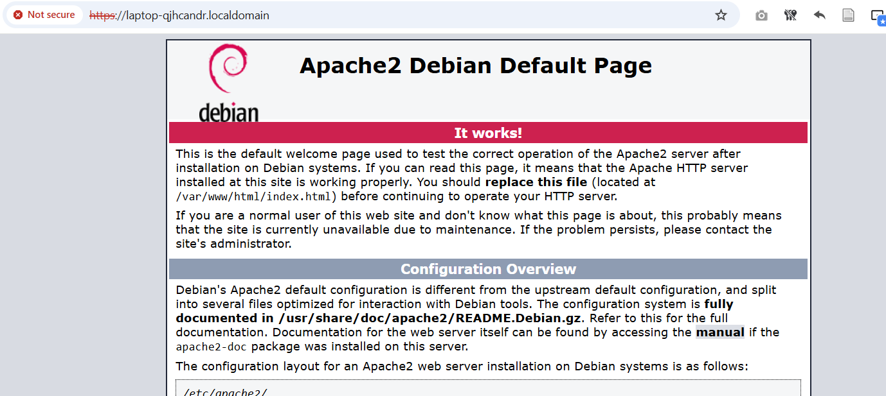


&nbsp;  
&nbsp;  
## Conclusion
Je conclus que ce TP permet de bien comprendre comment fonctionne une chaîne de confiance TLS, depuis la création d'une autorité de certification locale jusqu'à la signature de certificats serveur et client. Il montre aussi que la sécurité ne dépend pas seulement du chiffrement, mais également de la confiance accordée au certificat, de la correspondance entre le nom du serveur et le certificat, et de la bonne configuration d'Apache. Enfin, l'authentification par certificat client montre qu'il est possible d'aller plus loin qu'un simple HTTPS classique en imposant une authentification mutuelle. J'en retiens surtout que la partie la plus "visible" pour l'utilisateur n'est pas forcément le chiffrement lui-même, mais plutôt toute la gestion de confiance autour des certificats.
